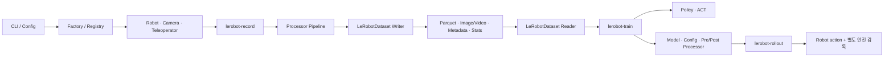

# LeRobot 해체분석과 2ARM_ROBOT 개인화

> 상태: Stage 1·2 및 ACT interchange 1차 구현 완료
> 공식 소스 기준: `huggingface/lerobot@d451fe4f1f1b00a812f95aa9534389b5e42ab155`
> 프로젝트 기준: `DAPIER@27ca01573851a8a288cddda5c7c06ec5953675ad`

## 이 문서의 목적

LeRobot을 그대로 복사하거나 무조건 도입하지 않는다. 공식 코드가 로봇 장치, 데이터, Processor, 정책, 실행 루프를 어떤 계약으로 연결하는지 확인한 뒤, JDcobot 양팔·TurtleBot3·Orbbec Astra Pro 기반 신발 정리 시스템에 필요한 부분만 선택 적용한다.

각 단계는 다음 순서로 기록한다.

1. **왜**: 지금 이 코드를 읽거나 구현하는 이유
2. **공식 코드 근거**: 파일·함수·데이터 흐름
3. **실행 검증**: 명령, 테스트, 산출물
4. **2ARM 판단**: 재사용, 어댑터 작성, 보류

## Stage 1. 최신 공식 소스와 전체 호출 흐름

### 왜

기존 학습 자료는 이전 LeRobot 커밋을 기준으로 한다. 최신 코드와 과거 구조를 섞으면 존재하지 않는 API에 맞춰 구현할 수 있으므로, 분석 기준 커밋과 실제 entrypoint부터 먼저 고정했다.

### 실행 검증

- 설치 없이 공식 저장소를 sparse checkout했다.
- 내려받은 범위: `cameras`, `configs`, `datasets`, `policies`, `processor`, `robots`, `scripts`, `teleoperators`, `tests`
- 결과: 677개 파일, 77.29 MiB
- 공식 기준 커밋: `d451fe4f1f1b00a812f95aa9534389b5e42ab155`

### LeRobot의 전체 구조



핵심은 ACT 하나가 아니라 **서로 다른 구현을 같은 key·shape·단위·수명주기 계약으로 연결하는 것**이다.

### 1. 데이터 수집 경로

공식 `lerobot-record`의 핵심 순서는 다음과 같다.

1. config로 Robot과 Teleoperator를 만든다.
2. `robot.get_observation()`으로 raw observation을 읽는다.
3. observation processor가 저장 가능한 feature로 변환한다.
4. `teleop.get_action()`으로 시범 action을 얻는다.
5. teleop/robot action processor를 거쳐 `robot.send_action()`을 호출한다.
6. 실제 학습 action과 observation을 하나의 frame으로 만들어 `dataset.add_frame()`에 넣는다.
7. episode 종료 시 `dataset.save_episode()`를 호출한다.

공식 코드 근거:

- [`lerobot_record.py#L228`](https://github.com/huggingface/lerobot/blob/d451fe4f1f1b00a812f95aa9534389b5e42ab155/src/lerobot/scripts/lerobot_record.py#L228): `record_loop`
- [`lerobot_record.py#L304`](https://github.com/huggingface/lerobot/blob/d451fe4f1f1b00a812f95aa9534389b5e42ab155/src/lerobot/scripts/lerobot_record.py#L304): observation 읽기
- [`lerobot_record.py#L316`](https://github.com/huggingface/lerobot/blob/d451fe4f1f1b00a812f95aa9534389b5e42ab155/src/lerobot/scripts/lerobot_record.py#L316): teleoperation action 읽기
- [`lerobot_record.py#L357`](https://github.com/huggingface/lerobot/blob/d451fe4f1f1b00a812f95aa9534389b5e42ab155/src/lerobot/scripts/lerobot_record.py#L357): action 전송
- [`lerobot_record.py#L364`](https://github.com/huggingface/lerobot/blob/d451fe4f1f1b00a812f95aa9534389b5e42ab155/src/lerobot/scripts/lerobot_record.py#L364): frame 추가

### 2. Dataset 저장 경로

`LeRobotDataset`은 사용자용 facade이고, 최신 코드에서는 실제 쓰기를 `DatasetWriter`에 위임한다.

```text
LeRobotDataset.create
  -> LeRobotDatasetMetadata.create
  -> DatasetWriter 생성

LeRobotDataset.add_frame
  -> DatasetWriter.add_frame
  -> feature 검증
  -> image 임시 저장
  -> numeric value episode buffer 누적

LeRobotDataset.save_episode
  -> image/video encoding
  -> parquet 저장
  -> episode/task/stats metadata 갱신
  -> episode buffer 초기화

LeRobotDataset.finalize
  -> pending writer flush
  -> parquet footer 및 resource 종료
```

`finalize()`를 생략하면 parquet footer가 완성되지 않아 데이터셋이 무효가 될 수 있다는 점이 명시돼 있다.

### 3. 학습 경로

공식 `lerobot-train`은 다음을 한 번에 조율한다.

1. train/eval dataset과 metadata를 만든다.
2. dataset feature를 근거로 policy를 만든다.
3. policy용 preprocessor/postprocessor를 만든다.
4. DataLoader에서 batch를 읽는다.
5. `policy(batch)`로 loss를 계산한다.
6. backward, gradient clipping, optimizer, scheduler를 실행한다.
7. checkpoint에 policy뿐 아니라 config와 processor도 함께 저장한다.

중요한 점은 normalization과 key 변환이 모델 코드에 박혀 있지 않고 processor artifact로 저장된다는 것이다. 학습과 실기기 추론이 같은 변환을 복원할 수 있다.

### 4. ACT 구동 원리

ACT는 한 시점에 action 하나가 아니라 `(batch, chunk_size, action_dim)` 형태의 action 묶음을 예측한다.

- `chunk_size`: 한 번에 예측하는 미래 action 수
- `n_action_steps`: 예측한 chunk 중 실제로 실행할 수
- action queue: chunk를 매 control tick 하나씩 꺼내 사용
- temporal ensemble: 매 tick 다시 예측한 겹치는 action을 지수 가중 평균
- `reset()`: episode가 바뀔 때 queue와 ensemble 상태 초기화
- 학습 시 VAE를 사용하면 action chunk와 padding mask가 필요

따라서 ACT를 개인화할 때 관절 수만 12축으로 바꾸면 끝나는 것이 아니다. `action_dim`, joint 순서, 단위, padding, control FPS, episode reset, queue 수명주기가 모두 일치해야 한다.

### 최신 구조에서 확인한 변화

- `lerobot-record`는 시범 데이터 수집 전용이다. 정책 배포는 `lerobot-rollout`으로 분리됐다.
- `LeRobotDataset` 내부 책임이 reader와 writer로 더 명확히 분리됐다.
- train checkpoint는 policy와 함께 preprocessor/postprocessor를 저장한다.
- 분산 학습에서는 `policy.forward()`를 직접 호출하지 않고 `policy(batch)`를 호출해야 hook이 정상 작동한다.

## 2ARM_ROBOT 적용 결정

| 영역 | 결정 | 프로젝트 적용 |
|---|---|---|
| CLI/config/factory 패턴 | 선택 적용 | hardware profile과 ACT export config를 명시적으로 분리 |
| Robot/Camera/Teleoperator 계약 | 어댑터 | JDcobot ROS2 topic/service와 Astra RGB-D를 감싸는 adapter 작성 |
| Dataset feature·episode·metadata | 재사용 | 기존 DYNA-lite episode를 LeRobot/ACT 계약으로 변환 |
| Processor/normalization | 재사용+확장 | 좌/우 팔 joint 순서, 단위, image/depth key 변환 |
| ACT | 공식 구현 재사용 | 12개 arm/gripper action 기준선부터 시작 |
| record loop | 기존 ROS2 recorder 유지 | 수집과 정책 배포를 분리하고 export 단계에서 연결 |
| rollout | 별도 구현/연결 | base 정지 확인 후 arm policy 활성화 |
| safety | 독립 구현 | timeout, stale observation, joint/rate limit, E-stop은 policy 밖에서 강제 |

## 현재 차단 조건

현재 mock ROS2 recorder의 Image 메시지는 width/height/encoding 같은 메타데이터만 기록하고 픽셀 payload를 저장하지 않는다. 그러므로 현재 단계에서 가능한 것은 다음까지다.

- episode/schema/quality 검증
- state/action flattening과 joint order 검증
- train-only normalization stats 계산
- episode split leakage 검증
- ACT 입력 가능 여부 preflight

실제 image-conditioned ACT 학습용 LeRobot Dataset v3 생성은 RGB 또는 RGB-D 픽셀 저장이 구현된 뒤 진행한다.

## 다음 단계

Stage 2에서는 다음 계약을 함수 단위로 해체한다.

1. Robot·Camera·Teleoperator의 connect/read/write/disconnect 수명주기
2. Dataset v3 feature schema, writer validation, metadata와 stats
3. Processor pipeline의 key·dtype·device·normalization 변환
4. ACT의 batch shape, loss, padding, action queue

## Stage 2. DAPIER episode와 공식 ACT 계약 대조

### 왜

모델 학습이 실행된다는 사실은 데이터가 올바르다는 증거가 아니다. 양팔 joint 순서, 단위, episode split, 영상 payload가 틀리면 loss는 감소해도 실제 동작은 실패한다. 따라서 ACT 설치보다 데이터 경계를 먼저 검증했다.

### 확인 결과

현재 DAPIER episode는 다음 기반을 이미 갖췄다.

- 좌·우 팔 5축과 그리퍼 1축을 분리한 명시적 stream dimension
- 관절은 radian, gripper는 normalized position으로 구분한 unit
- synchronized timestamp, checksum, camera skew, joint jump, base stationary gate
- `accepted` episode만 학습에 사용할 수 있는 quality gate
- object instance, session, recording span, attempt provenance

ACT에 전달할 numeric feature 순서는 다음으로 고정했다.

```text
observation.state / action =
  left_arm[0:5]
  + left_gripper[0]
  + right_arm[0:5]
  + right_gripper[0]
  = 12 dimensions
```

`base_velocity`는 제외한다. 이동과 조작을 분리하기로 했으므로 base 측정값과 명령값은 정책 출력이 아니라 조작 시작 전 stationary interlock에 사용한다.

## 개발 Iteration 1. ACT interchange와 preflight

### 구현한 것

- `act-export`: accepted episode를 원본 변경 없이 12차원 ACT interchange로 변환
- `act-verify`: conversion receipt의 모든 출력 SHA-256 검증
- train split frame만 사용한 state/action mean, std, min, max
- object instance, session, recording span이 둘 이상의 split에 걸치면 변환 중단
- output 경로가 이미 존재하면 덮어쓰지 않고 중단
- mock RGB/Depth에 픽셀이 없으면 `camera_pixel_payload_missing` 기록
- native Dataset v3 encoder를 실행하지 않았으므로 `native_lerobot_dataset_not_encoded` 기록

### 출력 구조

```text
act_interchange_v001/
├── metadata.json
├── stats.json
├── split_manifest.json
├── preflight.json
├── conversion_receipt.json
└── episodes/
    ├── train/*.jsonl
    ├── validation/*.jsonl
    └── test/*.jsonl
```

### 실행 검증

| 환경 | 결과 |
|---|---|
| Windows Python | 47 tests passed, 1.159 s |
| WSL Ubuntu 24.04 Python | 47 tests passed, 0.326 s |
| compileall | 통과 |
| `git diff --check` | 통과 |

검증한 실패 조건:

1. quality 불합격 episode 차단
2. train/validation/test provenance 누수 차단
3. 기존 output 덮어쓰기 차단
4. 변환 중 source file 불변성 확인
5. 변환 후 output 변조 탐지
6. episode 간 물리 단위(unit) 변경 차단
7. receipt에 없는 예상 밖 output file 탐지

### 발생한 오류와 수정

CLI 회귀 테스트를 추가하는 과정에서 새 test method가 기존 method 중간에 삽입되어 `IndentationError`가 1회 발생했다. 기능 구현이 아닌 test file method 경계 문제로 분류했고, 경계를 수정한 뒤 Windows와 Ubuntu 전체 47개 테스트를 다시 통과했다.

### 현재 정직한 완료 상태

- `act_numeric_contract_ready=true`
- `native_conversion_input_ready=false`
- `native_lerobot_ready=false`

실제 CLI smoke 결과는 5 episodes, 20 frames, 9개 output hash 통과였고 산출물 전체 크기는 46.19 KiB다. 로컬 증거는 `C:\Users\hjjeon\Documents\DAPIER\tmp\act-cli-smoke-20260820-v1`에 있다.

이는 실패가 아니라 의도한 preflight 결과다. 실제 RGB-D 픽셀 writer, image/depth dtype·shape 검증, native LeRobot Dataset v3 encoder가 구현된 뒤에만 다음 gate로 승격한다.

## 다음 개발 우선순위

1. Astra Pro RGB/Depth 픽셀 payload 저장 계약
2. native LeRobot Dataset v3 encoder를 optional dependency로 분리
3. 작은 Dataset v3 round-trip과 공식 ACT dataloader smoke test
4. offline evaluator와 action chunk/padding 검증
5. JDcobot ROS2 rollout adapter와 독립 safety supervisor
