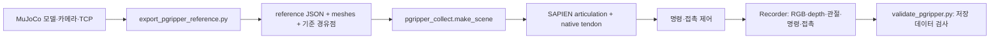
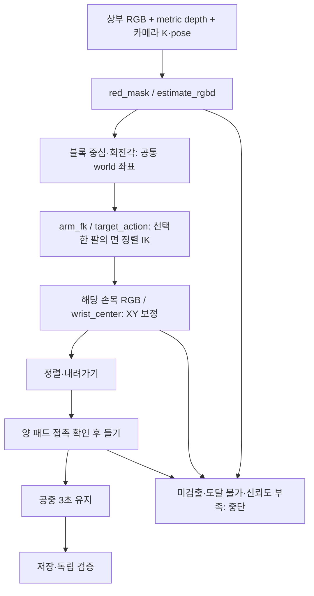

# 2026-09-09 양팔 PGripper 작업 기록과 코드 흐름

record_id: DAPIER-2026-09-09-pgripper-code-flow

나는 오늘 오른쪽 실물 텔레옵을 조정해 보관하고, 양손 PGripper를 MuJoCo와
RoboTwin/SAPIEN에서 실행했다. 인계 시연과 영상 기반 집기는 통과했지만,
학습한 ACT/PPO의 전체 작업 성공은 확인하지 못했다.
**실물 텔레옵, scripted SIM, 학습 정책 평가를 서로 다른 결과로 기록한다.**

## 오늘 확인한 범위

| 작업 | 확인한 결과 | 해석의 한계 |
| --- | --- | --- |
| 오른쪽 실물 텔레옵 | 빈 닫힘과 접촉 유지 분리, 사용자 파지 확인, 종료 후 리더·팔로워 12개 모터 토크 OFF 확인 | 왼쪽 적용·자율 집기·파지력 N 보정 아님 |
| MuJoCo 형상·카메라 | 제공 URDF 체결 변환과 사진 기반 카메라 배치를 양손에 반영 | 실측 카메라·관절 보정 아님 |
| MuJoCo 전체 expert | 왼손 집기 → 오른손 인계 → 내려놓기, 126.350초에서 84.674초로 단축 | 고정 장면·가상 접촉 기준 |
| MuJoCo 학습 | ACT/PPO 각각 60분 종료·체크포인트 저장 | ACT 0/2, 기준 시연+PPO 0/2 전체 평가 |
| RoboTwin 인계 데이터 | 10회 + 추가 6회, 총 16회·34,159프레임 검증 | XY ±1mm·yaw ±1°의 작은 변화 |
| RoboTwin 비전 집기 | 왼팔 3회·오른팔 3회, 총 6/6·3,203프레임 검증 | 알려진 빨간 4cm 큐브, 인계 없는 독립 집기 |

학습 결과는 MuJoCo 커밋 `63d7615`, RoboTwin 실행 결과는 `6ba8b27` 기준이다.
별도 작업 중인 학습 수정·데이터 변환 파일은 이 결과에 소급해서 포함하지 않는다.
원시 데이터·체크포인트·개인 보정·serial·사진 원본은 저장소에 올리지 않는다.

## 1. 실물 텔레옵: 사람의 움직임을 제한된 명령으로 전달

오른쪽 실물 검증본은 30Hz, 팔 목표 변화 35tick/주기, 집게 43tick/주기다.
빈 닫힘에는 실제 위치보다 최대 70tick 앞선 목표를 허용하고, 닫힘 요구가 남은 상태에서
**연속 샘플 간 위치 변화가 2tick 이하인 상태가 0.1초 유지**되면 접촉으로 추정해
선행량을 43tick으로 줄인다. 물체를 잡고 외부에서 흔들어도 큰 선행량으로 되돌리지 않는다.

실측 열기 약 740tick/s·닫기 약 620tick/s, 37.33초 파지와 팔을 흔드는 동안 유지한
사용자 확인을 남겼다. 출력 상한 23.5%, 유지 중 약 18.4%는 **모터 출력 비율**이며
Nm나 패드 힘 N이 아니다. 기존 과부하 보호 기준은 유지했다.
위치 정지 기반 판단은 부드러운 물체나 걸림을 정확한 접촉 센서처럼 구별하지 못한다.

검증본은 소스·설정·오른쪽 보정·로그·재시작 안내와 함께 비공개 보관했다.
66개 회귀 검사와 보관 파일 25개의 해시 검사를 통과했다.
왼쪽에는 설정을 쓰지 않았다. 이후 공통 제어 로직을 재사용하더라도
왼쪽 고유 방향·범위·영점·장착을 확인해야 하며 오른쪽 보정값을 복사하지 않는다.
이번 문서 갱신 과정에서는 장치를 다시 열지 않았다.

## 2. MuJoCo: 형상과 접촉 기반 전체 작업

[MuJoCo PGripper 기록](https://github.com/Alpenj/DAPIER/blob/63d7615/2ARM_ROBOT/sim/mobile_dual_so101/PGRIPPER_20260908.md)의
`pgripper.py`는 원본 CAD와 체결 변환을 재사용해 body·actuator·양쪽 jaw equality를 만든다.
`pgripper_handover.py`는 IK 경유점, 부드러운 관절 보간, 매 2ms 접촉 검사를 실행한다.

받는 손은 양 패드 각각 1N 이상을 0.33초 확인한 뒤 주는 손을 연다.
파지 상실, 과도한 힘·관통, 충돌은 중단 조건이다.
내려놓기는 테이블 지지 이후에만 열며 최종 양손 접촉 없는 안정 상태를 확인한다.
물체를 그리퍼에 붙이거나 실행 중 pose를 덮어쓰지 않는다.

불필요한 대기를 줄이고 오른손 단독 유지 검사를 왼손 후퇴와 겹쳤다.
접촉·지지 확인 시간을 삭제한 것은 아니다.
최종 전체 expert의 84.674초는 MuJoCo 3.8.1 실행값이며,
다른 버전이나 SAPIEN의 소요 시간과 같은 값으로 취급하지 않는다.

## 3. RoboTwin: 같은 모델을 옮기고 관측·명령을 저장

- [export_pgripper_reference.py](../robotwin/export_pgripper_reference.py): 링크·관절축·joint ref·
  질량·관성·mesh·카메라·TCP·8개 FK 대조 자세를 추출한다. MuJoCo 코드가 있는
  별도 source 경로가 필요하며 이 브랜치가 해당 코드를 자동 설치하는 것은 아니다.
- [pgripper_collect.py](../robotwin/pgripper_collect.py): RoboTwin Base_Task 장면에
  SAPIEN 모델을 구성하고 인계 전체 작업과 저장을 맡는다.
- [validate_pgripper.py](../robotwin/validate_pgripper.py): 성공 보고만 믿지 않고
  저장된 매 물리 스텝의 접촉·단계·시간 정렬과 모든 RGB·깊이·MP4 프레임을 검사한다.

20개 링크 × 8개 자세의 엔진 간 FK 대조에서 최대 위치 차이는 0.000163mm였다.
이것은 두 SIM 모델의 좌표 일치이며 실제 로봇과의 일치가 아니다.
처음 SAPIEN tendon의 힘 계수를 잘못 옮긴 문제는 constraint gradient에 맞춰 수정했다.
이후 인계 16회가 검사를 통과했다. 받는 손 접촉 제거·해제 후 접촉 상실 대조도 중단됐다.

관측은 25Hz, 적용 명령과 물리 기록은 500Hz다.
`observation/state`와 `action`은 좌 6축→우 6축, 팔 rad·집게 0..1이며,
`*_rad` 필드의 집게는 모터 rad다. 관측은 명령 **이전** 상태다.
25Hz action은 이후 20개 명령 중 첫 명령이고 전체 명령은 `expert/action_rad`에 있다.
블록 pose·접촉 등 SIM 평가 정보는 `expert` 그룹으로 구분한다.

## 4. RGB-D와 손목 RGB로 무작위 위치의 블록 집기

[pgripper_vision_pick.py](../robotwin/pgripper_vision_pick.py)는 위 장면·Recorder를 재사용한다.

`red_mask`는 빨간색 영역을 찾고 `estimate_rgbd`는 픽셀·깊이를 3차원으로 역투영한다.
알려진 테이블 높이와 4cm 큐브 윗면으로 중심·회전각을 추정한다.
`wrist_center`는 해당 팔 손목 RGB의 윤곽을 알려진 큐브 형상과 맞춰 XY를 보정한다.
손목 depth나 물체 정답 pose로 보정 목표를 만드는 방식은 아니다.

초기 수직 접근만으로는 모서리에 패드가 먼저 닿았다.
블록 회전각에서 구한 면 방향으로 jaw를 정렬해 같은 실패 seed를 다시 통과했다.
좌우 각 3회가 집기·3초 유지를 통과했고, 상부 RGB 차단은 접근 전,
손목 RGB 차단은 내려가기 전에 중단됐다. 최대 패드 힘 2.736N·관통 0.0315mm다.

무작위 범위는 x 0.175–0.230m, y ±0.055m, yaw ±8°다.
6칸 영상의 윗줄은 왼팔 3회, 아랫줄은 오른팔 3회다.
각 칸의 원본 상부 영상에서는 왼팔이 위쪽, 오른팔이 아래쪽에 보인다.
각 팔이 독립적으로 집는 실험이며 왼팔→오른팔 인계 영상과 구분한다.

### 실물 보정 없이 SIM에서 가능한 이유

현재 `observe`는 시뮬레이터의 `get_intrinsic_matrix()`와
`get_model_matrix()`에서 **정확한 가상 카메라 내부 파라미터·현재 pose**를 받는다.
depth도 같은 가상 카메라의 렌더 결과다. 양팔 설치 위치·관절 구조·TCP도 모델에 있다.

따라서 물체 정답 좌표를 IK 목표에 직접 넣지는 않았어도,
**카메라↔로봇 좌표 관계는 이미 정확히 알려진 조건**이다.
사진으로 추정한 배치라도 SIM에서는 그 배치대로 영상과 변환이 함께 생성되므로 서로 맞는다.
실물 장착이 그 값과 같다는 근거는 없으며, 코드의 `camera_driven=true`가
실측 보정 완료·센서 노이즈 강건성·일반 물체 인식을 뜻하지 않는다.
RGB-D 경로는 top 1개와 선택한 팔의 wrist RGB를 사용한다. 양 손목 동시 융합은 아니다.

## 5. 학습: 낮아진 모방 오차와 전체 작업 성공 구분

[학습·전체 평가 기록](https://github.com/Alpenj/DAPIER/blob/63d7615/2ARM_ROBOT/sim/mobile_dual_so101/PGRIPPER_LEARNING_20260909.md)을
기준으로 읽는다. 이번 RoboTwin 비전 집기 영상은 ACT/PPO가 만든 동작이 아니다.

`pgripper_learning.py`는 MuJoCo 성공 시연의 두 손목 RGB·측정 관절을 ACT 입력으로,
명령을 action chunk label로 만든다. 성공 시연 6개를 train 4개·holdout 2개로 나눈다.
`pgripper_rl.py`의 PPO는 기준 시연에 작은 residual을 더하는 4초 구간 학습이며
ACT 출력에 연결하지 않았다. `evaluate_pgripper.py`가 새 물리 실행에서 전체 작업을 판정한다.

| 평가 | 학습/진단 | 전체 작업 |
| --- | --- | --- |
| ACT | 52,163 step, holdout normalized L1 0.927746 → 0.012747 | 0/2, 시작 자세 부근 정체·110초 timeout |
| 기준 시연 + PPO | 1,347,024 transitions, 구간 성공률 초기/최종 100% | 0/2, 최종 위치 오차 4.61/4.63mm로 3mm 초과 |
| 기준 시연, residual=0 | 학습하지 않은 비교군 | 1/2, 다른 1회는 3초 연속 안착 미달 |

PPO 구간 평균 보상도 219.997 → 197.727로 낮아져 개선을 주장하지 않는다.
이 평가는 MuJoCo 시연과 별도 판정 조건을 사용하므로
SAPIEN scripted 인계 16/16과 같은 평가 모집단·성공률로 합치지 않는다.

## 다음에 확인할 것

- 실물 카메라 내부 파라미터·왜곡·RGB-depth 정렬·depth scale.
- 상부 카메라↔양팔 베이스, 좌우 손목 카메라↔그리퍼, 실제 TCP·관절 영점.
- 실측 보정 오차·가림·깊이 노이즈를 넣었을 때 비전 집기 성공 여부.
- ACT의 시작 구간 정체와 관측/action 시간 정렬, PPO 구간 목표와 전체 안착 목표 차이.
- 실물 접촉 센서 없이 파지·미끄러짐·테이블 지지를 어떤 신호로 판정할지.

코드·SIM 결과를 확인한 단계이며 자율 실물 인계나 신발 정리 완성으로 기록하지 않는다.
세부 재실행 명령과 실패 대조는 [RoboTwin 실행 기록](../robotwin/PGRIPPER_20260909.md)에 있다.
