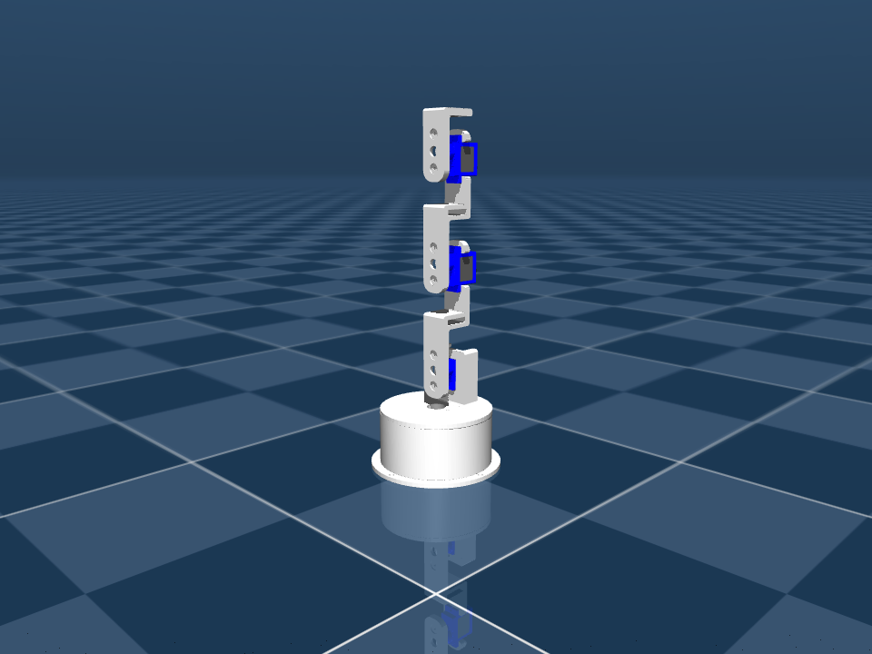
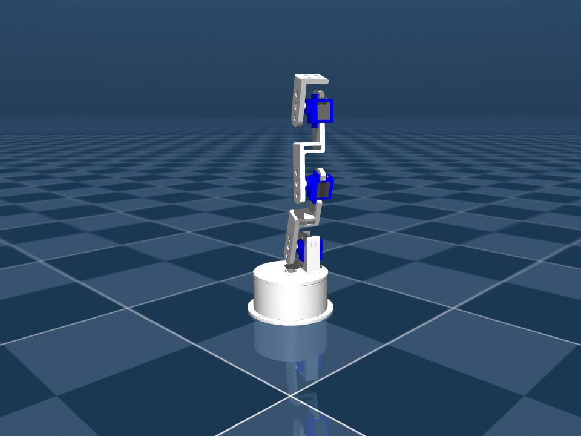
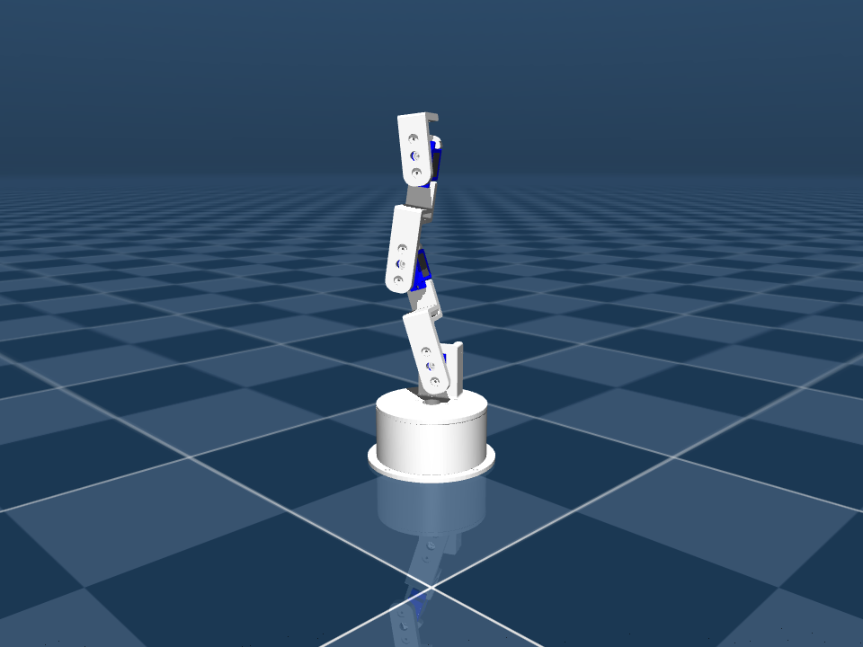

# jdcobot100 MuJoCo 실습 (URDF → MJCF 변환과 안정화)

위키독스 「로보틱스를 위한 이미테이션 러닝」 10장
[실습 3: jdcobot100 MJCF를 MuJoCo(MJCF/XML)로 변환하고 안정적으로 구동](https://wikidocs.net/372030)
을 이 저장소의 `jdcobot100_sim` 모델로 진행한 기록이다.

교재는 JD-edu 저장소의 URDF(관절명 `base_shoulder`/`shoulder_arm1`/`arm1_arm2`/
`arn2_end_arm`)를 쓰지만, 여기서는 DAPIER가 이미 갖고 있는
`jdcobot100_sim/urdf/jdcobot100.urdf`를 그대로 입력으로 썼다. 실습 2에서
정규화해 둔 관절명을 쓰기 때문에 이름만 다르고 구조는 같다.

| 교재 관절명 | 이 저장소 관절명 | 역할 |
|---|---|---|
| `base_shoulder` | `dof_base` | 베이스 요(yaw) |
| `shoulder_arm1` | `dof_shoulder` | 어깨 피치 |
| `arm1_arm2` | `dof_elbow` | 팔꿈치 |
| `arn2_end_arm` | `dof_wrist_pitch` | 손목 피치 |

## 파일

| 파일 | 역할 |
|---|---|
| `urdf_to_mjcf.py` | URDF → MJCF 변환 (교재 1~3장) |
| `tune_mjcf.py` | 변환 결과를 구동 가능한 `jdcobot100.xml`로 다듬음 (교재 6~9장) |
| `jdcobot100.xml` | 최종 로봇 모델 (커밋 대상) |
| `scene.xml` | 조명·바닥·스카이박스 (교재 5장) |
| `mjcf_load.py` | GLFW 뷰어 (교재 4장 + 마우스 조작) |
| `robot_move.py` | pose A/B 왕복 제어 (교재 10장) |
| `stability_check.py` | 화면 없이 발산 여부·추종 오차 측정 |
| `render_poses.py` | 화면 없이 자세별 PNG 렌더 |
| `experiments.sh` | 아래 표의 숫자를 전부 재생성 |
| `build/` | 중간 산출물 (git 추적 안 함) |

## 실행

DAPIER 수업용 Python 환경이 있는 PC:

```bash
cd ~/DAPIER/jdcobot100_sim/mujoco
~/DAPIER/so101_imitation_learning/.venv/bin/python urdf_to_mjcf.py   # URDF -> MJCF
~/DAPIER/so101_imitation_learning/.venv/bin/python tune_mjcf.py      # 안정화 편집 적용
~/DAPIER/so101_imitation_learning/.venv/bin/python robot_move.py     # 두 자세 왕복
```

새 PC:

```bash
python3 -m venv .venv && source .venv/bin/activate
python -m pip install -r requirements.txt
python urdf_to_mjcf.py && python tune_mjcf.py && python robot_move.py
```

전체 검증을 한 번에:

```bash
./experiments.sh
```

`mjcf_load.py` / `robot_move.py` 조작: 마우스 좌드래그 회전, 우드래그 이동,
휠 줌, `R` 리셋, `Space` 일시정지, `Esc` 종료.

## 1~3장. URDF 준비와 STL 경로

교재는 URDF를 직접 고치라고 하지만, `jdcobot100_sim/urdf/jdcobot100.urdf`는
RViz·Gazebo launch가 그대로 쓰는 파일이라 `package://` 경로를 지우면 ROS 쪽이
깨진다. 그래서 `urdf_to_mjcf.py`가 MuJoCo 전용 사본
`build/jdcobot100_mjcf_input.urdf`를 만들고 거기에만 두 가지를 적용한다.

```xml
<mujoco>
  <compiler meshdir="../../meshes/" strippath="false" balanceinertia="true" discardvisual="false"/>
</mujoco>
```

```
filename="package://jdcobot100_sim/meshes/base.stl"   ->   filename="base.stl"   (126곳)
```

`meshdir`가 기준 디렉터리, `filename`이 그 아래 상대 경로다. 이걸 착각해서
한 번 깨졌다. `build/`에 있는 사본은 `../../meshes/`가 맞지만, 최종
`jdcobot100.xml`은 `mujoco/`에 놓이므로 `../meshes/`여야 한다. 같은 모델인데
파일 위치가 바뀌면 `meshdir`도 같이 바뀐다.

변환 직후 결과:

```
nq=4 nv=4 nu=0 nbody=5 ngeom=126 nmesh=20
전체 질량 = 4e-09 kg
```

`nbody=5`인 이유: 링크는 5개지만 루트 링크(`base_sub_assembly`)가 월드에
고정 결합이라 MuJoCo가 월드에 합쳐버린다. 그래서 움직이는 body는 4개다.
`nu=0`은 아직 actuator가 없다는 뜻이고, 전체 질량 4e-09 kg은 URDF의
`mass="1e-09"` 4개가 그대로 넘어온 것이다. 여기가 교재 7장이 지적하는 지점.

## 6~7장. 왜 actuator를 붙이면 터지는가

질량을 그대로 두고 actuator만 붙이면 교재와 똑같은 경고가 나온다.

```
WARNING: Nan, Inf or huge value in QACC at DOF 1. The simulation is unstable. Time = 0.0020.
```

`stability_check.py`로 숫자를 보면 `max|qacc| = 2.98e+08`. 첫 스텝에 이미
터진다. 각가속도 = 토크 / 관성모멘트인데 관성이 1e-09이면 아무리 작은
토크에도 각가속도가 폭발한다.

교재는 링크 질량을 15~35 g으로 손으로 채워 넣으라고 한다. 여기서는 대신
`inertiafromgeom="true"`에 밀도를 주고 **실제 STL 형상에서 질량과 관성을
계산**시켰다. 손으로 찍는 것보다 재현 가능하고, 무게중심(`ipos`)도 0이 아닌
실제 위치로 잡힌다.

밀도 1000 kg/m³ (3D 프린팅 플라스틱 + 서보 하우징 수준)일 때:

| body | 질량 | diaginertia (kg·m²) |
|---|---|---|
| `shoulder_sub_assembly` | 53.3 g | 2.79e-05 / 2.18e-05 / 1.63e-05 |
| `arm_1_sub_asssembly` | 34.8 g | 3.06e-05 / 3.03e-05 / 1.76e-06 |
| `arm_2_sub_asssembly_copy_1` | 34.8 g | 3.06e-05 / 3.03e-05 / 1.76e-06 |
| `end_arm_sub_assembly` | 12.8 g | 2.79e-06 / 2.78e-06 / 6.57e-07 |
| 합계 | **135.8 g** | |

교재가 제시한 15~35 g 범위와 같은 자릿수다. 관성은 교재 예시(1e-06~4e-06)보다
한 자릿수 크게 나왔는데, 그만큼 수치적으로 더 안전하다.

`density`는 이름 없는 `<default>`에만 넣었다. 이름 있는 클래스에 넣으면
`childclass`가 안 닿는 월드 직속 geom(베이스 메시)이 빠진다.

## 8장. default 클래스는 교재 14.4의 분리 형태로

교재 8장은 `sg90` 클래스 하나에 `<geom>`, `<joint>`, `<position>`을 전부
넣는다. 그런데 교재 14장이 스스로 지적하듯, 그러면 actuator에 `class="sg90"`을
줘도 joint 쪽 `damping`/`armature`는 안 먹고, body에 `childclass="sg90"`을
따로 줘야 그제야 적용된다. 같은 이름인데 적용 대상이 다르니 헷갈린다.

그래서 처음부터 교재 14.4가 권하는 분리 형태로 갔다.

```xml
<default>
  <geom density="1000"/>

  <default class="sg90_joint">
    <joint damping="0.05" frictionloss="0.002" armature="0.0005" limited="true"/>
  </default>

  <default class="sg90_act">
    <position kp="15.0" kv="0.4" forcerange="-0.18 0.18"/>
  </default>
</default>
```

`sg90_joint`는 최상위 body의 `childclass`로 4개 관절 전부에 상속시키고,
`sg90_act`는 actuator 태그에 직접 준다.

게인은 처음에 "kp 15는 forcerange 0.18 N·m에서 오차 0.012 rad만 넘어도
포화하니 너무 세다"고 보고 kp 3까지 낮췄는데, 재 보니 그 판단이 틀렸다.
같은 목표 자세(pose_b)에 대해 3초 굴려서 비교하면:

| damping / armature / kp / kv | 최대 오차 | 오버슈트 | 정착(2%) | max\|qacc\| |
|---|---|---|---|---|
| 0.15 / 0.005 / 15 / 0.4 (**교재 8장 값**) | 0.00107 rad | 0.3 % | 0.42 s | 37 |
| 0.05 / 0.0005 / 3 / 0.15 (처음 잡았던 값) | 0.00544 rad | 1.6 % | 0.29 s | 146 |
| 0.05 / 0.0005 / 15 / 0.4 (**채택**) | 0.00107 rad | 0.3 % | 0.19 s | 393 |
| 0.05 / 0.0005 / 30 / 0.4 | 0.00053 rad | 0.2 % | 0.16 s | 557 |

포화는 실제로 일어나지만 문제가 아니었다. 큰 오차 구간에서 최대 토크를 다
쓰고(bang-bang) 목표 근처에서 선형 구간으로 들어오는 것이라, kp를 낮추면
정상상태 오차만 5배 커진다. **kp·kv는 교재 값 그대로 쓰는 게 맞았다.**

교재와 다르게 간 건 두 가지뿐이다.

| 파라미터 | 교재 | 여기 | 근거 |
|---|---|---|---|
| `armature` | 0.005 | 0.0005 | 실측 링크 관성이 3e-05 수준이라 0.005면 그 170배. 정착이 0.42 s → 0.19 s로 빨라진다. 대신 max\|qacc\|가 37 → 393으로 오르는데, 발산 기준(1e5)과는 아직 멀다. 수치적으로 더 보수적으로 가고 싶으면 0.005가 안전한 선택이다 |
| `frictionloss` | 0.015 | 0.002 | 0.015 N·m는 스톨 토크 0.18의 8 %라 목표 근처에서 데드밴드가 생긴다. 1 % 수준으로 낮춤 |
| `forcerange` | 0.16 | 0.18 | SG90 스톨 토크 1.8 kgf·cm ≈ 0.176 N·m |

`forcerange` 0.18 N·m가 실제로 충분한지는 계산으로 확인했다. 어깨 관절이
버텨야 할 중력 토크는 arm_1(35 g, 0.041 m) + arm_2(35 g, 0.115 m) +
end_arm(13 g, 0.16 m) ≈ **0.074 N·m**로 여유가 있다.

## 교재에 없던 진짜 원인: 링크끼리 파고든 접촉

질량·관성·게인을 다 맞췄는데도 `dof_base`가 목표 0.45 rad에서 0.03 rad에
멈춰 섰다. 로그를 보니 원인이 명확했다.

```
t= 3.00 qpos0=+0.0370 actfrc=+0.1800 qfrc_con=-0.1797
```

액추에이터가 최대 토크 +0.18 N·m를 내고 있는데 **구속력이 -0.1797 N·m로
정확히 상쇄**하고 있었다. 게인 문제가 아니라 접촉 문제였다. CAD에서 온
인접 링크 메시(특히 SG90 서보 하우징들)가 서로 파고든 상태라 매 스텝
접촉이 잡힌다.

교재 8장 `sg90` 클래스에 들어 있는 `<geom contype="0" conaffinity="0"/>`가
바로 이걸 막는 줄이다. 교재는 이유를 설명하지 않고 지나가는데, 실제로는
"서보 흉내"가 아니라 **자체 충돌 끄기**가 핵심이었다.

고정 베이스 4축 팔이라 자체 충돌은 필요 없으므로 `tune_mjcf.py`가 로봇
geom 63개에만 `contype="0" conaffinity="0"`을 넣는다. `<default>`에 넣으면
`scene.xml`의 `floor`까지 상속되어 바닥이 통과 가능해지므로, `<worldbody>`
범위 안에서만 치환한다. 한 번 이 실수를 해서 바닥 접촉이 조용히 꺼졌었다.

```
floor contype/conaffinity = 1 1
robot geom contype 합계 = 0
```

## 10 · 15장. `data.ctrl`에 무엇을 넣어야 하는가

교재 10장 코드는 `<position>` actuator를 쓰면서 파이썬에서 PD를 계산해
`data.ctrl`에 넣는다. `robot_move.py --style torque`로 실행하면 실제로
무슨 일이 일어나는지 찍힌다.

```
t=  2.00s  파이썬이 계산한 ctrl=[ 222.   176.6 -199.3  146.1]
            ctrlrange로 잘린 값=[ 0.524  0.524 -0.524  0.524] <- position actuator는 이걸 '목표각'으로 읽는다
```

파이썬은 "토크 222"를 보냈다고 생각하지만, MuJoCo는 그 값을 `ctrlrange`로
자른 뒤 **목표 각도 0.524 rad**로 읽는다. 그런데도 결과가 그럴듯해 보이는
이유는 정상상태에서 `qpos ≈ kp·(target−qpos)`의 고정점이
`qpos = kp·target/(1+kp)`가 되어 kp가 크면 target에 수렴하기 때문이다.
**우연히 맞는 것이지 의도한 제어가 아니다.**

교재 15장의 결론대로 `robot_move.py` 기본값은 `--style position`이고,
`data.ctrl`에 목표 각도만 넣는다. kp/kv는 XML의 `sg90_act`가 갖는다.

## 검증 결과

`./experiments.sh` 출력 (timestep 0.002 s):

| 실험 | 모델 | 총질량 | max\|qacc\| | 결과 |
|---|---|---|---|---|
| A. 변환 직후, actuator 없음 | `build/jdcobot100_raw.xml` | 4e-09 kg | 5.2e-04 | OK (움직일 수단이 없음) |
| B. 교재 6장, actuator만 추가 | `build/jdcobot100_naive_actuator.xml` | 4e-09 kg | **2.98e+08** | **FAIL** — `mjWARN_BADQACC` |
| C. 튜닝 모델 + ctrl=목표각 | `jdcobot100.xml` | 0.1358 kg | 151 | OK, 오차 1.5e-03 rad |
| D. 튜닝 모델 + ctrl=PD 토크값 | `jdcobot100.xml` | 0.1358 kg | 469 | OK지만 위 15장 이유로 우연 |
| E. 중력 하 자세 유지 (target 0) | `jdcobot100.xml` | 0.1358 kg | 0.011 | OK, 처짐 9.6e-06 rad |

자세별 추종 (2초 정착 후):

| 자세 | 목표 (rad) | 도달 (rad) | 최대 오차 |
|---|---|---|---|
| `pose_a_home` | 0, 0, 0, 0 | ~0 | 1.0e-05 rad |
| `pose_b_reach` | 0.45, 0.35, −0.40, 0.30 | 0.450, 0.351, −0.400, 0.300 | 1.1e-03 rad (0.061°) |
| `pose_c_fold` | −0.45, −0.30, 0.45, −0.25 | −0.450, −0.301, 0.450, −0.250 | 7.6e-04 rad (0.044°) |

| home | reach | fold |
|---|---|---|
|  |  |  |

남은 오차는 중력에 대한 위치 서보의 정상상태 처짐이다. 실제 SG90도
비슷하게 처지므로 적분항 없이 이대로 둔다.

## 걸렸던 것 정리

1. **`meshdir`는 XML 파일 위치 기준.** 같은 모델을 `build/`와 `mujoco/`에
   두면 각각 `../../meshes/`와 `../meshes/`로 달라진다.
2. **`mass=1e-09`은 CAD 내보내기의 기본값.** 관성이 0에 가까우면 각가속도가
   폭발한다. `inertiafromgeom` + 밀도로 형상에서 뽑는 게 손으로 찍는 것보다
   낫다.
3. **관절이 안 움직이면 게인부터 의심하지 말고 `qfrc_constraint`를 볼 것.**
   여기서는 링크끼리 파고든 접촉이 액추에이터 토크를 그대로 상쇄하고 있었다.
4. **`<default>`의 무명 클래스는 include된 파일까지 물든다.** `scene.xml`의
   `floor`가 조용히 통과 가능해졌었다.
5. **`<position>` actuator의 `ctrl`은 토크가 아니라 목표 위치.** 파이썬에서
   PD를 또 계산해 넣으면 제어 레이어가 겹친다.
6. **관절 범위는 ±0.5236 rad(±30°).** 교재 예제의 ±π를 그대로 쓰면 명령이
   관절 한계에서 잘린다. `ctrlrange`를 관절 `range`에 맞췄다.
7. **게인은 감으로 낮추지 말고 재 볼 것.** "포화하니까 kp를 낮춰야 한다"고
   판단해 kp를 15에서 3으로 내렸다가, 측정해 보니 정상상태 오차만 5배
   커졌다. 이 항목은 교재 값이 맞았다.

## 출처

- 교재: https://wikidocs.net/372030
- 교재 참고 코드: https://github.com/JD-edu/so101_imitation_learning/tree/main/105_MUJOCO_basic/107_jdcobot100_MUJOCO_load
- 실습 2(Onshape → URDF/MJCF) 기록: `onshape/jdcobot100/README.md`
