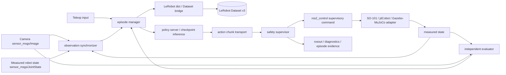

# DAPIER LeRobot–ROS2 Deconstruction Lab

> 딥러닝 강의가 끝난 PAAI 1기 수강생이 SO-101·jdCobot·LeRobot 작업을 선행연구와 취업 포트폴리오로 확장하기 위한 1차 연구·아키텍처·교육 설계 보고서

| 항목 | 기준 |
| --- | --- |
| 작성일 | 2026-08-06 |
| 저장소 | [Alpenj/DAPIER](https://github.com/Alpenj/DAPIER) |
| 작성 branch | `feat/dapier-lerobot-ros2-deconstruction-lab` |
| 기준 Git 루트 | /home/dapier-jhj/DAPIER |
| 보고서 worktree | /home/dapier-jhj/DAPIER-lerobot-ros2-lab |
| 기준 main commit | `b269f17051536a0d1417d839dc236494297a8ead` |
| 작성 PC 참고 commit | `0baa32ca7c5e4c16ab4d3797c7d803144f00ab95` — 교육용 PC의 현재 사실로 사용하지 않음 |
| 로컬 LeRobot source | /home/dapier-jhj/so101/lerobot, detached `30da8e687a6dfc617fcd94afc367ac7071c376ce`, version `0.6.0` |
| 범위 | 1차 연구, 선택 구조, 교육 설계, 후속 MVP 계약과 검증안 |
| 제외 | ROS2 패키지 구현, 실제 로봇 구동, 모델 학습, 데이터·checkpoint 다운로드, merge·push·deploy |
| 독자 | 딥러닝 수료 후 연구·프로젝트·취업 포트폴리오를 고르는 1기 수강생과 소규모 팀 |

이 문서에서 [로컬 확인]은 교육용 PC와 현재 worktree에서 직접 확인한 사실, [공식 확인]은 공개 공식 문서·저장소·원 논문에서 확인한 사실, [추론]은 그 근거를 DAPIER에 적용한 판단, [제안]은 후속 구현에서 검증할 설계 가설이다. 제조사 안전 한계와 교육용 시험 가설을 같은 숫자로 표현하지 않는다.

## 1페이지 결론

결론은 “딥러닝 모델을 하나 더 크게 학습하자”가 아니다. 딥러닝 강의가 끝난 PAAI 1기 수강생에게 가장 현실적인 다음 작업은 **SO-101·jdCobot용 이미테이션 러닝 benchmark/evaluation platform**을 먼저 만들고, 그 데이터를 자동 검사하며, 그 다음 MuJoCo 디지털 트윈으로 실제와 시뮬레이션의 차이를 측정하는 것이다. 이 순서는 현재 LeRobot 작업과 직접 연결되고, 소규모로 완료할 수 있으며, 실제 로봇 결과물·재현 가능한 실험·코드 구조를 모두 포트폴리오로 남긴다.

핵심 추천은 두 층으로 나뉜다.

1. **프로젝트 선택:** 평가 플랫폼 1위, 시연 데이터 검사 2위, 디지털 트윈 3위, 데이터 전이 4위, 자연어 Skill Router 5위로 우선순위를 둔다.
2. **구현 아키텍처:** **선택적 LeRobot kernel 재사용 + ROS2 모듈화**를 채택한다. LeRobot은 Dataset·policy·training reference kernel로 재사용하고, ROS2는 실시간 실행·하드웨어·동기화·안전·관측성의 책임을 가진다.

따라서 LeRobot Python class를 1:1로 ROS2 node화하거나 저장소 전체를 복사하지 않는다. ACT·Diffusion·SmolVLA 계열 policy, checkpoint loading, Dataset v3 writer, training loop, encoder·optimizer·normalization은 upstream을 추적하며 재사용한다. 반대로 observation synchronization, measured/commanded 구분, embodiment adapter, episode 상태기계, ROS2 QoS·timeout, action-chunk sequence·timestamp, watchdog·E-stop, 독립 success evaluator는 학생이 직접 만든다.

현재 증거는 simulation-only와 real-hardware를 분리한다. [로컬 확인] 교육용 PC에는 ROS2 Jazzy, ros_arm, jdcobot100_sim, casino_dealer, so101_ros2가 있으나 DAPIER main 기준 통합 LeRobot–ROS2 패키지는 확인하지 못했다. jdcobot100_sim은 시뮬레이션 전용이고 ros_arm은 Arduino 기반 실기체 경로다. casino_dealer의 CardBench v0는 측정 state와 absolute action 계약을 갖지만 실제 로봇·카메라·success detector·recorder·학습 policy는 아직 후속 범위다. 이 보고서는 그 빈칸을 교육용 MVP로 분해한다.

최종 포트폴리오 문장은 다음처럼 만들 수 있어야 한다.

> “LeRobot의 정책과 데이터 포맷을 재사용하면서, ROS2 경계에서 timestamp·embodiment·safety·evaluation을 직접 설계하고, 같은 episode를 replay해 정책을 공정하게 비교하는 SO-101/jdCobot benchmark를 구현했다.”

이번 작업에서 제안하는 1차 구현 후보는 observation sync + episode manager + LeRobot bridge + mock policy + safety supervisor의 simulation/mock MVP다. 실제 구현·설치·다운로드·실기체 이동은 별도 승인 후 별도 작업지시서로 분리한다.

## 평가 기준 변경

기존의 “PAAI 교육과정에 무엇을 추가할까”라는 질문을 폐기하고, 딥러닝 수료 후 수행 가능한 portfolio/research task를 평가한다. 점수는 설계 우선순위용 주관적 normalized score이며 실제 성과를 보장하지 않는다.

| 평가 기준 | 비중 | 판단 질문 |
| --- | ---: | --- |
| 현재 SO-101·jdCobot·LeRobot 작업과의 연결성 | 25% | 이미 가진 데이터·로봇·ROS2 코드와 첫 주부터 연결되는가? |
| 혼자 또는 소규모 팀으로 완성할 가능성 | 20% | 대형 checkpoint·대규모 dataset·권한에 의존하지 않고 MVP를 닫을 수 있는가? |
| 실제 로봇 결과물을 만들 수 있는가 | 20% | simulation 증거에서 승인된 real-hardware 증거로 확장할 경로가 있는가? |
| 코드 재사용 가능성 | 15% | upstream API를 사용하고 adapter·contract를 다른 로봇에도 옮길 수 있는가? |
| 취업·선행연구 포트폴리오 가치 | 20% | 결과표·실패분석·재현 명령·설계 trade-off를 공개할 수 있는가? |

이 기준에서 “대형 VLA를 새로 학습”은 GPU·데이터·시간 때문에 낮아지고, 데이터 수집·평가·시뮬레이션·비전·로봇 통합은 높아진다. 이것은 모델을 경시하는 결론이 아니라, 현재 단계에서 검증 가능한 engineering/research contribution의 기대값이 더 높다는 추론이다.

## 조사 경계와 문제 맥락

공유된 [ChatGPT 대화 링크](https://chatgpt.com/share/6a73e4f9-3ff4-83ee-b94c-bd95da4eb4eb)는 2026-08-06에 열었을 때 제목만 반환되고 본문은 제공되지 않았다. 따라서 본문은 기술 근거로 사용하지 않았고, 사용자가 제공한 작업지시서와 이번 보정 답변을 문제 맥락으로 사용했다. 기술 사실은 아래 공식 링크와 로컬 증거로 다시 확인했다.

딥러닝 강의는 이미 종료되었다. 이 보고서의 선수조건은 backpropagation·CNN/Transformer·기본 PyTorch·이미테이션 러닝 개념을 수강한 상태다. 따라서 강의식 신경망 입문을 다시 설계하지 않고, 기존 학습 내용을 로봇 시스템의 측정·평가·통합 문제에 적용한다.

## 현재 환경 매트릭스

시작 시 한 번 확인한 교육용 PC의 상태를 기록한다. 이후 설치나 데이터 다운로드로 상태를 바꾸지 않았다.

| 항목 | 한 번 확인한 값 | 의미 |
| --- | --- | --- |
| Git root | /home/dapier-jhj/DAPIER | 현재 checkout |
| branch/commit | main / b269f17051536a0d1417d839dc236494297a8ead | writer-PC의 0baa32ca와 구분 |
| OS | Ubuntu 24.04.4 LTS | ROS2 Jazzy Tier 1 조합과 맞음 |
| ROS 설치 | /opt/ros/jazzy, ROS_DISTRO=jazzy | 실제 배포판은 Jazzy |
| ros2 CLI | /opt/ros/jazzy/bin/ros2; ros2 --version은 지원하지 않는 인자로 usage 출력 | 숫자 version을 추정하지 않음 |
| Python | 3.12.3, /usr/bin/python3 | ROS binary와 interpreter 혼용 주의 |
| PyTorch | 2.13.0+cu130, CUDA available True | 현재 local 상태; LeRobot 호환성은 미검증 |
| GPU | NVIDIA GeForce RTX 5050 Laptop GPU, driver 595.84, 8151 MiB | 소규모 inference/simulation 후보 |
| CUDA toolkit | nvcc V13.3.73 | 외부 extension build 호환성 별도 확인 |
| LeRobot import/install | import 실패, pip package 없음 | installed package로 가정하지 않음 |
| LeRobot source | /home/dapier-jhj/so101/lerobot, detached 30da8e6, v0.6.0 | source reference는 있으나 dirty |
| LeRobot source dirty | .gitignore, pyproject.toml, env files, uv.lock, tests 등 수정·추가 | 이 보고서가 수정하지 않음 |
| DAPIER packages | ros_arm, jdcobot100_sim, casino_dealer, so101_ros2 | 기존 학습 자산의 출발점 |
| 실기체 승인 | 수량·운영실 규정·사용 승인 미확인 | 실기체 단계는 보류 |
| model/data license | 각 checkpoint·dataset별 미확인 | 배포 전 확인 필요 |

[추론] local PyTorch 2.13.0은 확인된 LeRobot v0.6.0 source의 declared range와 어긋날 가능성이 있다. 이 상태에서 설치·학습 성공을 주장하지 않는다. 후속 MVP는 mock policy와 이미 존재하는 simulation interface부터 시작한다.

## 현재 저장소와 계약 근거

| 경로 | 직접 확인한 성격 | 이번 설계에서의 위치 |
| --- | --- | --- |
| ros_arm | ROS2 Jazzy와 Arduino serial을 이용하는 4-axis SG90/MG90 경로, sensor_msgs/msg/JointState, radian↔servo degree 변환 | 실제 hardware adapter의 참고. 저수준 command를 ROS policy loop와 섞지 않음 |
| jdcobot100_sim | Ubuntu 24.04·ROS2 Jazzy·Gazebo Harmonic 기반 simulation-only, RViz/Gazebo/ROS2 경계 | simulation adapter와 rosbag/mock 검증의 기준 |
| casino_dealer | CardBench v0, 15 Hz, 양쪽 4 joint measured state/radian, vacuum measured kPa, absolute joint/vacuum action | contract regression fixture. 실제 driver로 오해하지 않음 |
| so101_ros2 | dapier_so101_core, dapier_so101_teleop, 문서·ADR가 존재 | 현재 ROS2 작업을 연결할 existing code |
| main 상태 | 시작 시 기존 untracked AGENTS.md, onshape/jdcobot100/jdcobot100.xml, scene.xml이 있었음 | 기존 사용자 변경을 보존하고 이 worktree에서는 건드리지 않음 |

CardBench v0의 관측과 행동을 섞지 않는 것이 핵심이다.

| 구분 | CardBench v0 계약 | ROS2/LeRobot 설계 원칙 |
| --- | --- | --- |
| observed state | left/right 4 joint positions, float32, radians, source measured; left/right vacuum pressure, float32, kPa, source measured | 읽기 전용 measured observation으로 Dataset에 기록 |
| action | left/right 4 joint targets, radians, representation absolute; left/right vacuum command, range [0,1], representation absolute | safety gate 전의 commanded intent. hardware adapter가 target embodiment로 변환 |
| metadata | language instruction, skill, target, success, optional failure reason | custom interface와 episode metadata로 분리 |
| frequency | control frequency 15 Hz | source contract로 기록하되 다른 loop의 safety limit로 과장하지 않음 |

## 접근법 비교

| 접근법 | 교육성 | 유지보수 | 성능 | 안전 | upstream 추적 비용 | 판정 |
| --- | --- | --- | --- | --- | --- | --- |
| 전체 LeRobot 래핑 | API를 node로 옮기는 작업에 치우치고 책임 경계를 설명하기 어려움 | upstream 변화마다 ROS wrapper 동기화 | serialization·process hop·Python GIL 영향 측정 필요 | ROS QoS와 hardware semantics가 wrapper 뒤에 숨음 | 높음 | 기본안 아님 |
| 전면 재구현 | 내부를 깊이 공부할 수 있으나 정책·codec·sharding 재구현에 시간 소모 | upstream bug fix·checkpoint 호환성을 잃음 | 같은 성능을 재현할 근거 부족 | 검증되지 않은 자체 runtime이 hardware에 가까워짐 | 매우 높음 | 연구 질문이 명확할 때만 제한 |
| 선택적 kernel 재사용 + ROS2 모듈화 | sync·episode·adapter·fault를 직접 만들어 왜를 설명 | upstream kernel과 ROS boundary가 분리됨 | inference는 policy server, servo는 ros2_control/MCU로 분리 | measured/commanded와 safety supervisor가 명시됨 | 중간·관리 가능 | 추천 |

추천안은 LeRobot의 reusable kernel과 ROS2의 runtime boundary를 계약으로 연결한다. 모듈화는 LeRobot의 모든 클래스를 잘게 쪼개는 뜻이 아니라, 변경 이유가 다른 책임을 분리하는 뜻이다. 정책 아키텍처를 재구현하는 것은 핵심 학습이 아니고, observation timing·action semantics·safety·evaluation은 핵심 학습이다.

## LeRobot reference kernel 경계

공식 [LeRobot v0.6.0 release](https://github.com/huggingface/lerobot/releases/tag/v0.6.0)는 dataset/training dependency와 import 경계에 breaking change가 있음을 보여준다. 특정 내부 import path를 ROS2 package의 public contract로 복사하지 않고, version-pinned adapter와 contract test를 둔다.

| LeRobot에서 우선 재사용 | ROS2/DAPIER에서 직접 구현 | 기본적으로 재구현하지 않음 |
| --- | --- | --- |
| ACT·Diffusion·SmolVLA 계열 policy 구현 | image·joint·timestamp synchronization | neural-network architecture |
| checkpoint loading/inference API | measured/commanded 분리 | video codec |
| LeRobot Dataset v3의 Parquet·MP4 writer | absolute·delta·velocity action semantics adapter | Parquet sharding |
| training loop, encoder, optimizer | episode start·success·failure·discard·rerecord state machine | distributed training |
| normalization statistics reference | ROS2 QoS·deadline·timeout·liveliness·watchdog | 대규모 pretraining |
| Dataset metadata와 validation reference | action chunk sequence·timestamp·stale rejection | dataset 전체 local fork |

Dataset v3 file/chunk metadata, Parquet, MP4 구조는 [공식 Dataset v3 문서](https://huggingface.co/docs/lerobot/v0.6.0/en/lerobot-dataset-v3)와 [Dataset v3 porting guide](https://github.com/huggingface/lerobot/blob/main/docs/source/porting_datasets_v3.mdx)를 reference로 삼는다. 직접 만드는 bridge는 public semantic contract만 의존하고 실제 writer는 LeRobot 호출로 위임한다.

## 추천 아키텍처

아래 흐름은 권장 runtime의 최소 형태다. 독립 evaluator가 episode manager와 연결되지만 safety supervisor를 우회하지 않는다.

책임 plane은 세 개다.

- **저수준 제어 plane:** MCU 또는 ros2_control이 servo/update loop와 hardware read/write를 담당한다. ROS2 policy node가 직접 PWM·모터 전류·vacuum GPIO를 조작하지 않는다.
- **supervisory runtime plane:** ROS2가 synchronization, episode, policy action chunk, safety gate, adapter, diagnostics를 담당한다. policy loop는 supervisory loop이며 제조사 servo loop가 아니다.
- **offline research plane:** training, dataset conversion, report generation은 offline process다. GPU inference는 local process 또는 분리된 policy server가 될 수 있고, 네트워크·프로세스 지연을 stale action으로 다룬다.

LLM/VLA 출력은 skill 또는 bounded action intent일 뿐이다. 어떤 출력도 safety supervisor를 거치지 않고 joint에 직접 도달할 수 없다.

## 패키지

초기 package 수는 7개로 고정한다. evaluator를 별도 package로 만들지 않고 dapier_episode 안의 독립 library/process contract로 시작하는 이유는 MVP에서 episode lifecycle과 evaluation evidence가 강하게 결합되고, 여덟 번째 package가 되면 message hop·launch·versioning 비용이 교육 목표보다 커지기 때문이다. evaluator는 독립 실행 가능해야 하므로 코드 내부 순환 참조는 금지한다.

| package | 책임 | 외부 경계 | 초기 node/process |
| --- | --- | --- | --- |
| dapier_ros2_interfaces | versioned custom msg/srv/action, episode·policy·safety metadata | 표준 message와 custom metadata schema | generated interfaces only |
| dapier_observation_sync | image·joint·teleop timestamp 정렬, frame/sequence 검사, stale observation 거부 | sensor_msgs/Image, sensor_msgs/JointState | observation_synchronizer |
| dapier_episode | episode 상태기계와 independent success evaluator plugin/runner | episode control/status, success/failure evidence | episode_manager, evaluator process |
| dapier_lerobot_bridge | ROS message ↔ LeRobot dict, Dataset v3 writer/reader, round-trip check | offline Dataset API와 bounded runtime queue | dataset_bridge |
| dapier_policy_runtime | checkpoint load, mock policy, action chunk, policy-server transport, inference timing | policy input/output metadata | policy_runtime |
| dapier_safety_supervisor | joint/speed/workspace/staleness/watchdog/E-stop gate, reject·safe-stop event | commanded action 승인/거부 | safety_supervisor |
| dapier_robot_adapters | SO-101, jdCobot, Gazebo/MuJoCo embodiment 변환과 hardware-facing mapping | ros2_control, standard trajectory/state | one adapter per backend |

dapier_episode의 evaluator는 policy implementation을 import하지 않는다. 입력은 episode id, synchronized observation, measured state, expected task metadata, optional reference trajectory뿐이다. 이 구조가 있어야 모델이 자기 점수를 계산하는 문제가 생기지 않는다.

## 계약

### ROS message와 endpoint 경계

ROS boundary에서는 표준 message를 우선한다. [ROS2 interface 개념 문서](https://docs.ros.org/en/jazzy/Concepts/Basic/About-Interfaces.html)와 [topics/services/actions 가이드](https://docs.ros.org/en/jazzy/How-To-Guides/Topics-Services-Actions.html)의 구분을 따른다. topic은 stream, service는 짧은 request/response, action은 feedback·result·cancel이 필요한 장시간 작업에 사용한다.

| 목적 | endpoint 예 | 타입 | 필수 필드/의미 | 단위·순서·frame·timestamp |
| --- | --- | --- | --- | --- |
| camera observation | /camera/color/image_raw | sensor_msgs/msg/Image | image encoding, height/width, header | camera optical frame; camera driver capture time을 source stamp로 보존 |
| measured joints | /joint_states | sensor_msgs/msg/JointState | name, position; velocity/effort optional | radians, name order를 authoritative mapping으로 사용; hardware read time |
| measured vacuum | /cardbench/vacuum_measured | versioned custom observation msg | left/right pressure, source | kPa as CardBench v0; sensor timestamp |
| commanded trajectory | /command/joint_trajectory | trajectory_msgs/msg/JointTrajectory | header, ordered joint_names, points.positions, optional velocities | radians; adapter target frame; command creation time와 target time 분리 |
| action intent | /policy/action_chunk | custom PolicyActionChunk | episode id, sequence ID, source stamp, action representation, chunk, expiry | absolute/delta/velocity explicit; embodiment-neutral until adapter |
| episode control | /episode/control | custom service EpisodeControl | start/stop/discard/rerecord, task id, seed | service는 즉시 accept/reject만 반환; 긴 실행은 action으로 승격 |
| episode execution | /episode/run | custom action RunEpisode | goal task/seed, feedback phase/latency, result success/failure reason | action goal은 episode ID를 생성하고 cancel 허용 |
| safety event | /safety/events | custom SafetyEvent | reason, rejected sequence ID, measured snapshot, severity | no command semantics; audit event only |

trajectory_msgs/msg/JointTrajectory는 ordered joint_names와 trajectory points를 제공하는 표준 command boundary로 사용한다. sensor_msgs/msg/JointState는 measured observation 전용이다. 같은 array를 command와 measured 양쪽 의미로 재사용하지 않는다.

### QoS와 timing 계약

| stream | reliability/durability | queue/deadline 가설 | liveliness·timeout | stale/sequence 규칙 |
| --- | --- | --- | --- | --- |
| camera/image | sensor-data best effort, volatile | queue 5; deadline은 실제 camera period 측정 후 설정 | automatic liveliness; deadline miss를 diagnostic으로 기록 | header stamp와 frame id 필수; observation window를 벗어나면 reject |
| measured joint/vacuum | reliable 우선, volatile | queue 10; CardBench 15 Hz는 source contract, local deadline은 측정 후 설정 | automatic; timeout 뒤 policy observation invalid | source stamp monotonic; missing joint name·duplicate sequence reject |
| policy chunk | reliable, volatile | queue 1; chunk expiry 별도 | publisher liveliness loss 또는 expiry면 safe-stop | episode ID와 sequence ID가 현재 goal과 일치해야 accept; out-of-order/stale reject |
| trajectory command | reliable, volatile | queue 1; target execution time과 supervisory timeout 분리 | adapter watchdog; timeout은 command hold/stop 정책으로 연결 | safety-approved sequence만 전달; measured state로 command를 확인하지 않음 |
| episode/evaluator | reliable; transient-local은 status 필요 시 | queue 20; deadline보다 state timeout 사용 | manager/evaluator disconnect를 failure로 기록 | episode ID와 seed로 join; late result은 해당 episode에만 귀속 |

deadline, liveliness, reliability, durability는 ROS2 QoS 정책이다. 숫자는 camera·robot driver의 실제 측정 뒤 고정한다. 처음부터 “10 ms면 안전”이라고 쓰지 않는다. [Jazzy QoS 문서](https://docs.ros.org/en/jazzy/Concepts/Intermediate/About-Quality-of-Service-Settings.html)는 이 환경에서 직접 페이지 접근이 제한되었으므로 후속 구현 시 설치된 Jazzy 문서와 runtime introspection으로 다시 확인한다. message_filters는 [ApproximateTime synchronizer 공식 튜토리얼](https://docs.ros.org/en/ros2_packages/jazzy/api/message_filters/doc/Tutorials/Approximate-Synchronizer-Cpp.html)처럼 입력 QoS를 맞추고 header timestamp를 사용한다.

각 action chunk에는 다음 metadata를 포함한다.

| 필드 | 규칙 |
| --- | --- |
| episode_id | manager가 발급한 opaque UUID; backend가 바뀌어도 보존 |
| sequence_id | 단조 증가하는 action-chunk ID; restart 시 episode와 함께 reset |
| source_stamp | policy input과 inference 완료 시각을 분리 기록 |
| valid_until | policy action expiry; 이 시각이 지나면 safety supervisor가 reject |
| representation | absolute, delta, velocity 중 하나; joint/gripper/vacuum별 명시 |
| joint_order | adapter canonical order와 command order를 별도 기록 |
| frame_id | Cartesian action일 때 frame 필수; joint action은 joint semantics |
| normalization | policy input/output normalization version과 statistics ID |

### CardBench와 embodiment adapter

CardBench v0의 action은 absolute joint targets와 absolute vacuum command이고, observation은 measured radians/kPa다. dapier_robot_adapters가 다음을 변환한다.

| 변환 | 책임 | 금지 |
| --- | --- | --- |
| LeRobot dict → embodiment-neutral action | bridge가 representation 확인 | shape만 같다고 합치지 않음 |
| embodiment-neutral → SO-101/jdCobot command | adapter가 joint order, radians/degrees, absolute/delta/velocity, gripper/vacuum semantics 변환 | CardBench measured state를 commanded state로 덮어쓰기 |
| hardware feedback → measured observation | adapter가 source stamp와 calibration version 기록 | command echo를 measured 성공으로 사용 |
| simulation model → same observation contract | Gazebo/MuJoCo adapter가 frame/unit을 맞춤 | simulation success를 real success로 표기 |

### Action chunk와 policy server

policy server가 반환하는 것은 raw joint write가 아니라 PolicyActionChunk다. runtime은 inference start/end, queue age, chunk horizon, dropped action 수를 기록한다. network policy server가 끊기면 마지막 action을 무기한 반복하지 않고 expiry/watchdog 정책으로 안전 정지한다. LLM/VLA skill router도 허용된 skill·target·workspace를 검증한 뒤 이 경로로 들어온다.

## runtime timing과 safety

ros2_control의 controller manager는 hardware read → controller update → command write의 update loop와 controller lifecycle을 관리한다. [ros2_control controller manager 문서](https://control.ros.org/jazzy/doc/ros2_control/controller_manager/doc/userdoc.html)의 real-time/jitter, command limit, fallback 관련 지침을 참고하되, 교육용 mock에서 통과했다고 실기체 안전을 보장한다고 쓰지 않는다.

권장 실행 순서는 다음과 같다.

1. MCU 또는 ros2_control이 measured state를 읽고 저수준 servo loop를 실행한다.
2. observation synchronizer가 camera/joint/teleop를 episode timestamp window로 묶는다.
3. policy runtime이 현재 observation으로 bounded action chunk를 생성한다.
4. safety supervisor가 sequence, expiry, joint/speed/workspace/staleness/watchdog를 검사한다.
5. adapter가 승인된 command를 target embodiment로 변환한다.
6. independent evaluator가 measured observation과 task state로 success/failure를 계산한다.
7. episode manager가 success·failure·discard·rerecord와 evidence를 확정한다.

이 숫자는 safety limit이 아니라 교육용 시험 가설이다.

| 항목 | 초기 시험 가설 | 확정 방법 |
| --- | --- | --- |
| observation window | 같은 episode에서 camera와 joint source stamp 차이를 먼저 측정 | bag replay p50/p95/p99를 보고 task별 window 선택 |
| policy latency | 50/100/250ms 지연을 fault injection으로 주입 | stale rejection·safe-stop 시각 비교 |
| joint/speed/workspace | 임의 안전 한계를 제조사 기준으로 쓰지 않음 | adapter spec, 운영실 승인, 저속 hardware-in-the-loop review |
| vacuum range | CardBench [0,1] representation과 실제 장치 허용값을 구분 | contract test와 장비 문서·현장 승인 |
| watchdog | command expiry와 measured feedback timeout을 독립 변수로 둠 | disconnect/stop injection에서 no-new-command와 event 확인 |

E-stop은 ROS topic 하나에 의존하지 않고 hardware/운영 절차와 별도 확인한다. policy process가 safety supervisor를 우회하는 launch 구성은 실패로 판정한다. rosout과 diagnostics는 [ROS2 logging 개념](https://docs.ros.org/en/jazzy/Concepts/Intermediate/About-Logging.html)을 참고해 evidence로 저장하되 로그가 E-stop을 대신하지 않는다.

## simulation·real·호환성 경계

### Humble과 Jazzy

| 구분 | DAPIER 공개 교육 자료에서 흔히 보이는 Humble | 이번 교육용 PC의 Jazzy | 보고서 정책 |
| --- | --- | --- | --- |
| Ubuntu | Jammy 22.04가 primary target | Noble 24.04 | 명령·container·빌드를 섞지 않음 |
| Python | ROS binary와 해당 distro interpreter | 3.12.3 | /usr/bin/python3와 Conda를 혼용하지 않음 |
| Gazebo | Humble 공식 pair는 Fortress | Jazzy 공식 pair는 Harmonic | bridge/launch를 distro별 기록 |
| package API | build/message/QoS 차이를 version matrix로 검사 | local Jazzy 결과 | Humble에서 됨을 Jazzy 증거로 바꾸지 않음 |
| evidence | public course/tutorial evidence | local simulation evidence | real-hardware evidence와 별도 label |

[REP-2000](https://www.ros.org/reps/rep-2000.html)와 [Jazzy Ubuntu binary 설치 문서](https://docs.ros.org/en/jazzy/Installation/Alternatives/Ubuntu-Install-Binary.html)를 기준으로 Ubuntu Noble/Jazzy를 기록했다. [Gazebo Harmonic ROS 설치 조합](https://gazebosim.org/docs/harmonic/ros_installation/)은 Jazzy+Harmonic을 권장하고 Humble+Harmonic을 공식 기본 조합으로 취급하지 않는다. Python package를 ROS binary와 맞추는 주의점은 [ROS2 Python package 가이드](https://docs.ros.org/en/jazzy/How-To-Guides/Using-Python-Packages.html)를 따른다.

### simulation-only와 real-hardware evidence

jdcobot100_sim에서 성공한 것은 Gazebo/MuJoCo simulation evidence다. ros_arm에서 serial command를 보낸 것은 hardware-path evidence지만 정책 성능이나 안전 성과가 아니다. real claim은 승인된 robot, calibration, workspace, E-stop, operator, slow test, independent evaluator를 모두 기록한 경우에만 한다.

Gazebo는 [ROS2 integration 문서](https://gazebosim.org/docs/harmonic/ros2_integration/)의 ros_gz_bridge를 통해 Gazebo Transport와 ROS2 message를 교환한다. MuJoCo는 [공식 overview](https://mujoco.readthedocs.io/en/stable/overview.html)의 MJCF/XML model compile semantics를 기준으로 model version을 pin한다. 두 backend의 adapter가 동일한 observation/action contract를 만족해야 backend 교체 학습이 된다.

## 10개 아이디어

### post-deep-learning 포트폴리오 우선순위

| 순위 | 작업 | 점수 | 첫 결과물 | 판단 |
| ---: | --- | ---: | --- | --- |
| 1 | SO-101·jdCobot imitation-learning benchmark/evaluation platform | 9.8/10 | 동일 seed/조건의 ACT·Diffusion 평가표와 독립 evaluator | 지금 바로 착수 |
| 2 | demonstration data 자동 검사·구간 분할 | 9.6/10 | frame/state mismatch, 낙하·무동작 의심 구간 report | 1위와 병행 |
| 3 | SO-101 또는 jdCobot MuJoCo digital twin | 9.2/10 | 동일 명령의 real/sim trajectory 비교 | 1·2위 후 |
| 4 | Open X-Embodiment·LeRobot 변환과 소규모 transfer | 8.8/10 | action adapter와 A/B fine-tuning report | 데이터 계약 후 |
| 5 | 자연어 명령 기반 bounded Skill Router | 8.4/10 | 허용 skill JSON → 기존 policy/ROS action | evaluator 안정화 후 |

위 5개는 원래 10개 후보를 삭제한 것이 아니다. 아래 10개는 아키텍처를 구성하는 연구 모듈이고, 같은 모듈 여러 개가 하나의 portfolio deliverable에 묶인다. 예를 들어 1위 benchmark는 원래 후보 2·6·8을, 2위 data QA는 1·7을, 3위 digital twin은 3·5·6을 사용한다.

### 원래 10개 후보의 재순위

| 아키텍처 우선 | 원래 후보 | post-course 결과물 매핑 | 이유 |
| ---: | --- | --- | --- |
| 1 | 8. DAPIER RobotBench 독립 성공 평가기 | portfolio 1 | 모델과 분리된 합격 기준이 있어야 비교가 성립 |
| 2 | 1. DAPIER Data Passport와 LeRobot Dataset v3 변환 품질 | portfolio 2/4 | 데이터 품질과 round-trip은 모든 후속 연구의 전제 |
| 3 | 6. jdCobot·SO-101 adapter와 policy-server 지연 | portfolio 1/3 | 실제 통합·지연·embodiment가 강한 포트폴리오 증거 |
| 4 | 7. TAPIR·SAM 2 추적과 bounded visual-servo bridge | portfolio 2 | vision을 데이터 QA로 제한해 완료 가능성을 높임 |
| 5 | 3. MuJoCo 시스템 식별 digital twin | portfolio 3 | 실기체 전에 정량적인 sim/real gap을 얻음 |
| 6 | 2. CardBench 동일 과제 정책 tournament와 ACT baseline | portfolio 1 | 공정한 비교 실험으로 완성 |
| 7 | 4. 사람 개입 실패 복구와 intervention data | portfolio 1/2 | 실패를 데이터와 evaluator에 되돌림 |
| 8 | 5. ROS2 Humble·Jazzy 호환성과 안전 fault injection | 모든 portfolio | 연구 결과를 안전한 runtime으로 묶음 |
| 9 | 9. ALOHA식 양팔 인계와 embodiment adapter | portfolio 1/4 | 가치가 높지만 hardware·sync 난도 상승 |
| 10 | 10. Isaac Lab skill 분할·합성 선택과목 | portfolio 3/4 | GPU·설정 비용이 커서 선택 과목 |

### 1. DAPIER Data Passport와 LeRobot Dataset v3 변환 품질

- **DAPIER 적용 모듈:** dapier_lerobot_bridge와 dapier_observation_sync; CardBench metadata를 Dataset v3 metadata로 round-trip한다.
- **선수지식·권장 시수:** 딥러닝 수료, Python/Parquet/ROS bag 기본; 10~14시간.
- **학생이 직접 만드는 부분:** feature schema registry, measured/commanded provenance, episode ID·seed·camera calibration manifest, ROS→LeRobot→ROS round-trip checker.
- **upstream 재사용 부분:** LeRobot Dataset v3 writer/reader, MP4/Parquet layout, normalization reference, existing converter pattern.
- **로봇 없는 최소 성공:** 20개 synthetic episode에서 누락 frame, duplicate timestamp, NaN action, 잘못된 joint order를 report하고 원본 label을 바꾸지 않는다.
- **시뮬레이션 확장:** jdcobot100_sim bag와 camera mock을 같은 schema로 저장하고 replay한다.
- **승인 후 실기체 도전:** SO-101 또는 jdCobot의 짧은 승인된 teleop session을 수집하고 source timestamp/calibration/operator를 passport에 남긴다.
- **정량 합격 기준:** synthetic 100 episode에서 schema validation 100% 재현, 정상 episode round-trip field equality 99% 이상, injected corruption 5종 모두 탐지. 교육용 기준이다.
- **결함 주입:** 17 frame camera gap, joint/state offset, wrong radians/degrees flag, missing vacuum, duplicate episode ID.
- **예상 장비·GPU 비용:** CPU와 소량 disk로 가능; 필수 GPU 없음.
- **핵심 위험:** LeRobot v0.6 내부 API 변화, dataset/model license 미확인, timestamp를 file write time으로 대체.
- **출처:** [LeRobot Dataset v3](https://huggingface.co/docs/lerobot/v0.6.0/en/lerobot-dataset-v3), [LeRobot porting guide](https://github.com/huggingface/lerobot/blob/main/docs/source/porting_datasets_v3.mdx), [RLDS](https://github.com/google-research/rlds).

### 2. CardBench 동일 과제 정책 tournament와 ACT baseline

- **DAPIER 적용 모듈:** dapier_episode, dapier_policy_runtime, dapier_safety_supervisor; CardBench v0 task contract와 independent evaluator를 기준으로 한다.
- **선수지식·권장 시수:** 이미테이션 러닝·PyTorch·실험 통계 기본; 16~20시간.
- **학생이 직접 만드는 부분:** task registry, seed/initial-condition runner, success/failure taxonomy, ACT·Diffusion 결과 parser, latency/oscillation/failure report.
- **upstream 재사용 부분:** LeRobot ACT·Diffusion implementation/checkpoint loader와 training reference, [ACT 원 논문](https://arxiv.org/abs/2304.13705)의 action chunk 개념.
- **로봇 없는 최소 성공:** deterministic mock policy와 synthetic cube state로 같은 30개 initial condition을 두 policy에 replay하고 결과표를 만든다.
- **시뮬레이션 확장:** Gazebo/MuJoCo backend에서 동일 task ID·seed·timeout으로 rollout한다.
- **승인 후 실기체 도전:** operator·E-stop·low-speed review 뒤 30회 이내 승인된 SO-101/jdCobot evaluation만 수행한다.
- **정량 합격 기준:** 각 policy가 동일 seed list·timeout·evaluator를 사용하고 report가 success count, Wilson 또는 bootstrap uncertainty, median completion time, drops, interventions, inference p50/p95를 포함한다.
- **결함 주입:** policy disconnect, stale action, object pose perturbation, camera stop, 50/100/250ms inference delay.
- **예상 장비·GPU 비용:** mock/sim은 CPU 또는 현재 RTX 5050의 소규모 inference; 여러 policy 학습은 GPU memory와 시간이 별도 산정된다.
- **핵심 위험:** evaluator leakage, task difficulty 차이, 작은 n에서 score 일반화, checkpoint version mismatch.
- **출처:** [LeRobot](https://github.com/huggingface/lerobot), [ACT](https://arxiv.org/abs/2304.13705), [Diffusion Policy](https://arxiv.org/abs/2303.04137), [robomimic releases](https://github.com/ARISE-Initiative/robomimic/releases).

### 3. MuJoCo 시스템 식별 digital twin과 sim-to-real gap

- **DAPIER 적용 모듈:** dapier_robot_adapters와 dapier_observation_sync; SO-101 또는 jdCobot 중 하나만 먼저 선택한다.
- **선수지식·권장 시수:** URDF/MJCF/FK, ROS2 bag, 기본 system identification; 20~28시간.
- **학생이 직접 만드는 부분:** joint response logger, MJCF parameter table, real/sim trajectory aligner, error report, domain-randomization experiment.
- **upstream 재사용 부분:** [MuJoCo engine](https://github.com/google-deepmind/mujoco), [dm_control](https://github.com/google-deepmind/dm_control), [MuJoCo Playground](https://github.com/google-deepmind/mujoco_playground)의 model/task organization.
- **로봇 없는 최소 성공:** command trajectory와 synthetic measured response로 rise time, overshoot, steady-state error 계산을 재현한다.
- **시뮬레이션 확장:** existing jdcobot100_sim scene와 MuJoCo MJCF가 동일 joint order/units를 제공하는지 contract test한다.
- **승인 후 실기체 도전:** 지정 workspace·저속·operator와 함께 단일 joint 또는 end-effector 사각 궤적만 비교한다. dry-run을 먼저 통과한다.
- **정량 합격 기준:** 같은 command에 대해 report가 joint별 MAE/RMSE, delay estimate, endpoint error와 uncertainty를 모두 내고 목표값은 측정 후 정한다. 10% 이내는 초기 교육용 가설일 뿐 제조사 기준이 아니다.
- **결함 주입:** actuator delay, friction mismatch, camera extrinsic offset, control-period jitter, dropped measured state.
- **예상 장비·GPU 비용:** MuJoCo CPU 가능; MuJoCo Playground/JAX GPU 실험은 현재 8 GB급에서 scene/batch를 작게 제한.
- **핵심 위험:** contact dynamics와 calibration을 과도하게 fit, sim 성과를 real 성과로 표현, asset license 혼합.
- **출처:** [MuJoCo overview](https://mujoco.readthedocs.io/en/stable/overview.html), [MuJoCo Menagerie](https://github.com/google-deepmind/mujoco_menagerie), [MuJoCo Playground](https://github.com/google-deepmind/mujoco_playground), [Gazebo Harmonic integration](https://gazebosim.org/docs/harmonic/ros2_integration/).

### 4. 사람 개입 실패 복구와 intervention data

- **DAPIER 적용 모듈:** dapier_episode와 dapier_lerobot_bridge; intervention을 success로 숨기지 않고 별도 event로 저장한다.
- **선수지식·권장 시수:** episode lifecycle, ROS2 action cancel, dataset labeling; 14~18시간.
- **학생이 직접 만드는 부분:** pause/resume/abort/recover 상태기계, intervention reason taxonomy, human takeover interval marker, rerecord workflow.
- **upstream 재사용 부분:** LeRobot episode/dataset writer, policy runtime action chunk reference.
- **로봇 없는 최소 성공:** mock environment에서 RUNNING → INTERVENED → RECOVERED/FAILED 전이를 replay하고 event order를 검사한다.
- **시뮬레이션 확장:** Gazebo에서 object drop을 주입하고 intervention 전후 observation/action을 하나의 episode evidence로 묶는다.
- **승인 후 실기체 도전:** 명시된 operator가 E-stop/hold를 사용하고 실제 intervention을 기록하는 저속 시험만 진행한다.
- **정량 합격 기준:** 모든 intervention에 start/end timestamp, reason, actor, preceding/following sequence가 있고 recovery episode와 autonomous episode가 report에서 분리된다.
- **결함 주입:** policy oscillation, object drop, camera occlusion, operator cancel, evaluator unavailable.
- **예상 장비·GPU 비용:** CPU/mock 우선, GPU는 policy replay 때만 선택.
- **핵심 위험:** 사람이 성공을 대신 만들어 policy score 오염, privacy/recording consent 누락, E-stop을 software pause로 오해.
- **출처:** [LeRobot](https://huggingface.co/docs/lerobot/index), [ACT](https://arxiv.org/abs/2304.13705), [ROS2 actions](https://docs.ros.org/en/jazzy/How-To-Guides/Topics-Services-Actions.html).

### 5. ROS2 Humble·Jazzy 호환성과 안전 결함 주입

- **DAPIER 적용 모듈:** dapier_ros2_interfaces, dapier_safety_supervisor, dapier_observation_sync.
- **선수지식·권장 시수:** ROS2 build/launch/QoS와 Linux 환경; 12~16시간.
- **학생이 직접 만드는 부분:** distro matrix, message compatibility test, QoS mismatch detector, watchdog/safe-stop test harness, reproducible launch.
- **upstream 재사용 부분:** ROS2 standard messages, message_filters, ros2_control lifecycle/limit concepts.
- **로봇 없는 최소 성공:** Jazzy simulation에서 mock publishers/subscribers를 연결하고 fault injection마다 command stream이 멈추는지 확인한다.
- **시뮬레이션 확장:** Humble artifact와 Jazzy artifact의 message hash, QoS, clock, launch 결과를 별도 report로 비교한다.
- **승인 후 실기체 도전:** ROS2-only dry-run과 hardware disconnect detection을 먼저 승인받고 command 없는 read-only 상태부터 시작한다.
- **정량 합격 기준:** target Jazzy clean build, interface hash check, 8개 fault scenario deterministic pass; Humble은 실행 증거가 없으면 확인 필요로 남긴다.
- **결함 주입:** camera stop, state stale, QoS mismatch, /clock jump, adapter disconnect, policy disconnect.
- **예상 장비·GPU 비용:** CPU/containers; GPU 불필요.
- **핵심 위험:** distro를 조용히 혼용, QoS mismatch가 데이터를 조용히 버림, safe-stop을 real E-stop으로 과장.
- **출처:** [REP-2000](https://www.ros.org/reps/rep-2000.html), [ROS2 QoS](https://docs.ros.org/en/jazzy/Concepts/Intermediate/About-Quality-of-Service-Settings.html), [message_filters](https://docs.ros.org/en/ros2_packages/jazzy/api/message_filters/doc/Tutorials/Approximate-Synchronizer-Cpp.html), [ros2_control](https://control.ros.org/jazzy/doc/ros2_control/controller_manager/doc/userdoc.html).

### 6. jdCobot·SO-101 hardware adapter와 policy-server 지연

- **DAPIER 적용 모듈:** dapier_robot_adapters, dapier_policy_runtime, dapier_safety_supervisor.
- **선수지식·권장 시수:** joint mapping, absolute/delta/velocity, radians/degrees, process/network timing; 20~24시간.
- **학생이 직접 만드는 부분:** embodiment adapter interface, canonical joint order, action normalization/denormalization, sequence/expiry, latency histogram, mock hardware backend.
- **upstream 재사용 부분:** LeRobot robot/dataset/policy interfaces, ros2_control hardware/controller lifecycle.
- **로봇 없는 최소 성공:** SO-101/jdCobot fake adapters가 같은 neutral action을 각 command로 변환하고 inverse round-trip을 검사한다.
- **시뮬레이션 확장:** Gazebo/MuJoCo adapter와 policy server에 50/100/250ms delay를 넣고 safe-stop을 확인한다.
- **승인 후 실기체 도전:** 한 embodiment·한 joint group·저속 read/command review를 따로 승인받는다. CardBench vacuum command는 actual pressure safety와 동일하지 않다.
- **정량 합격 기준:** 1000개 synthetic action 중 unit/order conversion round-trip이 허용오차 내 100%, stale chunk 100% reject, latency p50/p95/p99 report.
- **결함 주입:** wrong joint order, degrees/radians flag, missing gripper/vacuum, delayed response, out-of-range joint/vacuum, policy disconnect.
- **예상 장비·GPU 비용:** fake/sim CPU; policy server inference만 소규모 GPU 선택. actual hardware 수량·승인 미확인.
- **핵심 위험:** command/measured 혼용, adapter가 driver 우회, network delay를 평균값으로 숨김.
- **출처:** [LeRobot](https://github.com/huggingface/lerobot), [trajectory_msgs/JointTrajectory](https://docs.ros.org/en/jazzy/p/trajectory_msgs/msg/JointTrajectory.html), [ros2_control concepts](https://control.ros.org/master/doc/ros2_control/doc/index.html).

### 7. TAPIR·SAM 2 추적과 bounded visual-servo bridge

- **DAPIER 적용 모듈:** dapier_observation_sync, dapier_episode, 후속 bounded vision process.
- **선수지식·권장 시수:** camera calibration, point tracking, segmentation, time-series; 20~28시간.
- **학생이 직접 만드는 부분:** first-frame prompt contract, track quality/occlusion flag, gripper/object association, state timestamp join, offline phase segmentation.
- **upstream 재사용 부분:** [TapNet/TAPIR/RoboTAP](https://github.com/google-deepmind/tapnet)의 point tracking, [SAM 2](https://github.com/facebookresearch/sam2)의 video mask propagation.
- **로봇 없는 최소 성공:** 공개 또는 synthetic video에서 approach/grasp/lift/place 구간의 point/mask track과 confidence report를 생성한다.
- **시뮬레이션 확장:** MuJoCo/Gazebo camera와 known object pose로 track error를 ground truth와 비교한다.
- **승인 후 실기체 도전:** visual servo가 joint에 직접 연결되지 않는 bounded observation/evaluator mode에서만 검증한다.
- **정량 합격 기준:** synthetic ground-truth video에서 track retention, mask IoU, phase boundary error를 측정하고 threshold는 pilot 1 후 고정한다.
- **결함 주입:** occlusion, camera stop, frame drop, lighting shift, wrong prompt point, timestamp skew.
- **예상 장비·GPU 비용:** SAM 2 video inference는 GPU memory 필요; 현재 8 GB급에서 frame/size를 줄일 수 있다. TAPIR 환경 별도 확인.
- **핵심 위험:** tracking confidence를 success로 오해, mask/data license 혼합, visual-servo safety gate 우회.
- **출처:** [TapNet](https://github.com/google-deepmind/tapnet), [SAM 2](https://github.com/facebookresearch/sam2), [SAM 2 paper](https://arxiv.org/abs/2408.00714).

### 8. DAPIER RobotBench 독립 성공 평가기

- **DAPIER 적용 모듈:** dapier_episode 내부 independent evaluator와 report generator; policy process를 dependency로 두지 않는다.
- **선수지식·권장 시수:** task definition, state estimation, metrics/uncertainty, test design; 18~22시간.
- **학생이 직접 만드는 부분:** task registry, success/failure detector, failure taxonomy, evaluator replay CLI, aggregate metrics와 confidence interval.
- **upstream 재사용 부분:** [google-deepmind/aloha_sim](https://github.com/google-deepmind/aloha_sim)의 공개 MuJoCo task/evaluation 구조와 LeRobot episode metadata를 읽는다. 저장소의 task_suite.py, viewer.py, run_eval.py, task tests를 reference로 삼되 Gemini Robotics inference는 Trusted Tester 제한이 있으므로 public model 재현으로 표현하지 않는다.
- **로봇 없는 최소 성공:** synthetic state trace 100개에서 success·drop·timeout·intervention·evaluator unknown을 구분한다.
- **시뮬레이션 확장:** same seed와 same evaluator로 ACT/Diffusion/mock policy tournament를 실행한다.
- **승인 후 실기체 도전:** evaluator false-positive/false-negative sample review 뒤 승인된 30 episode만 실행한다.
- **정량 합격 기준:** evaluator가 policy output 없이 bag/state만으로 재실행되고 injected labels 5종을 모두 식별하며 결과에 success rate·completion time·drop·intervention·latency가 들어간다.
- **결함 주입:** object near target but not released, early termination, missing sensor, stale state, human intervention, policy disconnect.
- **예상 장비·GPU 비용:** CPU/mock으로 완성 가능; GPU 불필요.
- **핵심 위험:** task-specific heuristic을 일반 evaluator로 과장, visual cue 공유로 label leakage.
- **출처:** [robosuite benchmark](https://github.com/ARISE-Initiative/robosuite), [robomimic](https://github.com/ARISE-Initiative/robomimic), [DROID evaluation docs](https://droid-dataset.github.io/droid/).

### 9. ALOHA식 양팔 인계와 embodiment adapter

- **DAPIER 적용 모듈:** dapier_observation_sync, dapier_robot_adapters, dapier_episode; 양팔 synchronization과 handover evaluator를 분리한다.
- **선수지식·권장 시수:** bimanual coordinates, time synchronization, grasp/handover phases, action chunking; 24~32시간.
- **학생이 직접 만드는 부분:** left/right joint namespace, cross-arm frame transform, handover phase state machine, simultaneous command barrier, failure taxonomy.
- **upstream 재사용 부분:** ALOHA action-chunk reference, LeRobot bimanual data layout, robosuite multi-robot composition.
- **로봇 없는 최소 성공:** two fake 4-DOF arms와 virtual object로 handover phase/ownership transition을 deterministic replay한다.
- **시뮬레이션 확장:** Gazebo/MuJoCo two-arm scene에서 object ownership, collision proxy, camera sync를 검증한다.
- **승인 후 실기체 도전:** 양팔 수량·workspace·운영실 승인이 확인된 뒤에만 low-speed handover를 시도한다.
- **정량 합격 기준:** left/right timestamp alignment, ownership transition, no-command-after-failure event가 synthetic episode에서 재현되고 collision risk는 별도 safety review로 남긴다.
- **결함 주입:** one-arm lag, dropped camera, wrong arm namespace, gripper/vacuum mismatch, sequence crossing.
- **예상 장비·GPU 비용:** simulation CPU 가능; two-arm rendering/inference GPU 선택. 실기체 수량 미확인.
- **핵심 위험:** 양팔 collision과 사람 안전, action order ambiguity, 공개 코드 위치·license 확인 없이 복사.
- **출처:** [ALOHA paper](https://tonyzhaozh.github.io/aloha/aloha.pdf), [ACT paper](https://arxiv.org/abs/2304.13705), [robosuite](https://github.com/ARISE-Initiative/robosuite).

### 10. Isaac Lab skill 분할·합성 선택과목

- **DAPIER 적용 모듈:** dapier_robot_adapters의 simulation backend와 dapier_episode의 skill/evaluator schema; core MVP 뒤 선택.
- **선수지식·권장 시수:** GPU simulation, domain randomization, trajectory synthesis, task composition; 28~40시간.
- **학생이 직접 만드는 부분:** skill boundary, reset/randomization config, generated trajectory quality filter, sim-to-real evidence split.
- **upstream 재사용 부분:** [Isaac Lab](https://github.com/isaac-sim/IsaacLab)의 GPU simulation/teleoperation/Mimic workflow; neural policy architecture는 그대로 가져온다.
- **로봇 없는 최소 성공:** 하나의 skill을 scripted controller로 생성하고 dataset contract·evaluator를 통과시킨다.
- **시뮬레이션 확장:** Isaac Lab과 MuJoCo/Gazebo의 동일 neutral action/observation schema를 비교한다.
- **승인 후 실기체 도전:** generated skill을 real robot에 바로 보내지 않고 offline replay와 human review, adapter/safety test 뒤에 제한한다.
- **정량 합격 기준:** generated episode schema validity 100%, evaluator replay deterministic, randomization seed 재현, GPU memory/time report.
- **결함 주입:** reset failure, domain randomization extreme, missing texture, action overflow, simulator clock mismatch.
- **예상 장비·GPU 비용:** 현재 RTX 5050 8 GB는 작은 scene/batch에 한정될 가능성. Isaac Sim/Lab version·driver·license/asset 비용 확인.
- **핵심 위험:** 큰 dependency와 버전 변화, GPU OOM, simulation success를 real result로 과장, asset별 license 누락.
- **출처:** [Isaac Lab](https://github.com/isaac-sim/IsaacLab), [MuJoCo Playground](https://github.com/google-deepmind/mujoco_playground), [Isaac Lab release notes](https://github.com/isaac-sim/IsaacLab/releases).

## DeepMind 및 외부 저장소 읽기 순서

아래 저장소는 그대로 실행할 dependency와 구조·API·실험 설계를 읽을 reference를 구분했다. versions는 실행일에 다시 pin한다.

| 저장소/자료 | 읽을 부분 | 현재 판단 |
| --- | --- | --- |
| [LeRobot](https://github.com/huggingface/lerobot) | Dataset v3, ACT, Diffusion, SmolVLA, robot/policy/training 경계 | 필수 kernel reference; local source v0.6.0 dirty·환경 mismatch |
| [google-deepmind/tapnet](https://github.com/google-deepmind/tapnet) | TAPIR, RoboTAP, online point tracking, robot video evaluation | portfolio 2 bounded vision |
| [google-deepmind/mujoco_playground](https://github.com/google-deepmind/mujoco_playground) | MJX GPU simulation, manipulation task organization, sim-to-real | portfolio 3/10 선택 reference |
| [google-deepmind/mujoco](https://github.com/google-deepmind/mujoco) | MJCF/model compile, Python binding | digital twin core |
| [google-deepmind/aloha_sim](https://github.com/google-deepmind/aloha_sim) | 공개 ALOHA MuJoCo 환경, task_suite.py, viewer.py, run_eval.py, task tests | portfolio 1/3의 task registry/evaluator reference; Gemini inference는 Trusted Tester 제한 |
| [google-deepmind/dm_control](https://github.com/google-deepmind/dm_control) | suite/task/viewer/composer | task/evaluator structure |
| [google-deepmind/mujoco_menagerie](https://github.com/google-deepmind/mujoco_menagerie) | high-quality MJCF, model/license discipline | asset reference; model별 license |
| [google-deepmind/mujoco_mpc](https://github.com/google-deepmind/mujoco_mpc) | predictive control/task integration | 제어 심화 후순위 |
| [google-deepmind/gemini-robotics-sdk](https://github.com/google-deepmind/gemini-robotics-sdk) | Agent/Embodiment/Tool/Event Bus | access/권한 의존; 구조만 참고 |
| [google-deepmind/acme](https://github.com/google-deepmind/acme) | RL agent/builder abstraction | manipulation MVP 낮은 우선순위 |
| [Open X-Embodiment](https://github.com/google-deepmind/open_x_embodiment) | unified data format, RT-X action/embodiment metadata | portfolio 4 schema; 대규모 download 제외 |
| [robomimic](https://github.com/ARISE-Initiative/robomimic) | BC/BC-RNN/Transformer/Diffusion, action dict/normalization | policy comparison |
| [robosuite](https://github.com/ARISE-Initiative/robosuite) | MuJoCo tasks, controllers, teleoperation, demonstrations | simulation/task |
| [SAM 2](https://github.com/facebookresearch/sam2) | video predictor, promptable mask propagation | optional vision |
| [Isaac Lab](https://github.com/isaac-sim/IsaacLab) | GPU simulation, teleoperation, Mimic | 선택과목; version/GPU cost |
| [openpi](https://github.com/Physical-Intelligence/openpi) | VLA fine-tuning, remote policy server | 후속; policy-server boundary만 |
| [LIBERO](https://github.com/Lifelong-Robot-Learning/LIBERO) | 130 task suites, lifelong transfer, evaluation | external benchmark; old env risk |
| [DROID platform](https://github.com/droid-dataset/droid) | teleop collection, hardware/data organization | collection contract |
| [DROID policy learning](https://github.com/droid-dataset/droid_policy_learning) | RLDS loader/policy evaluation | loader reference; download 제외 |

GPT Pro 답변의 aloha_sim은 공식 URL을 직접 다시 열어 확인했다. google-deepmind/aloha_sim은 현재 Public이며 main의 README가 ALOHA MuJoCo 환경과 robot learning/evaluation task collection을 설명하고, viewer.py·task_suite.py·run_eval.py·task tests와 `pip install -e .`/no-policy viewer/evaluation 명령을 공개한다. README의 “not an officially supported Google product”는 저장소가 공개 조직에 있다는 사실과 별개이며, Gemini Robotics inference는 Trusted Testers Only라고 명시된다. 따라서 환경·작업 registry·viewer·평가 코드는 참고 가능하지만 Gemini checkpoint/model 성능의 일반 재현으로 쓰지 않는다. 반면 rgb_stacking과 dm_robotics는 이번 공개 검색에서 현재 사용할 공식 경로와 상태를 독립 확인하지 못했으므로 core dependency로 사용하지 않는다.

robomimic v0.5는 Diffusion Policy, action dictionaries/normalization, multi-dataset training, language-conditioned policy learning을 release note에서 명시한다. robosuite v1.5 계열은 MuJoCo 기반 modular framework, standardized tasks, controllers, teleoperation, multimodal sensors, demonstrations를 제공한다. 이들은 LeRobot을 대체하는 것이 아니라 policy/task/evaluation 비교를 위한 외부 기준이다.

Open X-Embodiment 공식 repository는 unified format을 제공하지만 “official Google product가 아니다”라고 명시하고 software와 materials의 Apache-2.0/CC-BY 구분을 둔다. DROID는 공개된 대규모 dataset/platform이지만 현재 작업은 sample download나 1M-scale training이 아니다. [Open X-Embodiment 원 논문](https://arxiv.org/abs/2310.08864), [DROID 원 논문](https://arxiv.org/abs/2403.12945), [LIBERO 원 논문](https://arxiv.org/abs/2306.03310)을 연구 배경으로 읽는다.

## 우선 파일럿

### 파일럿 1 — benchmark/evaluation platform

가장 먼저 dapier_observation_sync + dapier_episode + dapier_lerobot_bridge + dapier_policy_runtime(mock) + dapier_safety_supervisor를 simulation/mock으로 연결한다. deliverable은 task registry, deterministic seed list, independent evaluator, mock/ACT/Diffusion adapter, report generator다. 실제 정책 학습보다 evaluator와 replay가 먼저 닫혀야 한다.

### 파일럿 2 — demonstration data QA/phase segmentation

파일럿 1에서 만든 episode schema를 입력으로 삼아 camera/state mismatch, stale frame, object/gripper track, approach/grasp/lift/place 후보 phase를 표시한다. SAM 2/TAPIR은 optional plugin으로 두고 처음에는 joint velocity·gripper state·known object pose rule로 baseline을 만든다. model confidence가 success label을 직접 결정하지 않도록 한다.

### 파일럿 3 — one-robot digital twin

SO-101 또는 jdCobot 중 장비·model·운영 승인이 빠른 하나만 고른다. 실제 이동 전 synthetic command와 existing simulation을 비교하고, 승인 뒤 read-only/measured 또는 단일 joint 저속 시험으로 확장한다. 결과는 “sim이 real과 같음”이 아니라 측정한 gap과 다음 calibration parameter다.

### 1차 MVP 경계

이번 보고서 이후 첫 구현 작업지시서는 다음 다섯 요소만 포함한다.

1. observation synchronizer: camera/joint mock과 deterministic timestamp.
2. episode manager: start/running/success/failure/discard/rerecord.
3. LeRobot bridge: synthetic dict와 Dataset v3 round-trip interface.
4. mock policy: action chunk, sequence ID, latency injection.
5. safety supervisor: stale/expiry/range/watchdog reject와 safe-stop event.

실제 LeRobot 설치·checkpoint download·ROS package dependency 추가·실기체 이동은 이 문서의 완료 조건이 아니다.

## 6~8주 실행 로드맵

| 주차 | 목표 | 산출물·합격 증거 | real/sim 경계 |
| ---: | --- | --- | --- |
| 1 | 기존 SO-101/jdCobot/LeRobot pipeline inventory와 task contract 고정 | environment matrix, joint order/unit table, 3개 task seed | simulation/mock only |
| 2 | standard message와 custom interface 초안 | interface schema, QoS/timestamp decision record, contract tests | simulation/mock only |
| 3 | observation sync와 episode manager | deterministic replay, state transition coverage, discard/rerecord evidence | simulation/mock only |
| 4 | LeRobot bridge와 mock policy | dict↔message↔Dataset round-trip, latency/sequence log | simulation/mock only |
| 5 | safety supervisor와 independent evaluator | fault injection 50/100/250ms, camera stop, stale, disconnect safe-stop | simulation/mock only |
| 6 | benchmark pilot | same seed ACT/Diffusion/mock report, failure taxonomy, README | simulation first; real performance claim 없음 |
| 7 | data QA 또는 one-robot digital twin 선택 | phase/track report 또는 sim/real dry-run plan | real은 별도 승인 전 보류 |
| 8 | portfolio packaging | reproducible commands, plots, scoped risk/license note, follow-up work order | approved evidence만 real label |

딥러닝 수업을 다시 넣지 않는다. 필요한 model internals는 code reading과 짧은 experiment로 배우고 매주 학생이 직접 만든 경계와 측정값을 남긴다.

## 딸깍이 아닌 학습

학생이 코드를 실행했다는 것만으로 통과시키지 않는다. 아래 rubric에서 80점 이상이면서 필수 안전 항목을 모두 통과해야 한다.

| 영역 | 배점 | 직접 설명·테스트할 수 있어야 하는 것 | 합격 증거 |
| --- | ---: | --- | --- |
| synchronization | 15 | header timestamp, approximate/exact choice, frame drop, QoS mismatch | bag replay와 timestamp error report |
| measured/commanded | 15 | source와 representation을 분리하는 이유, command echo가 measured가 아닌 이유 | CardBench contract test, field provenance |
| embodiment conversion | 15 | absolute/delta/velocity, radians/degrees, joint order, gripper/vacuum | fake SO-101/jdCobot round-trip |
| policy timing | 15 | inference latency, action chunk, expiry, sequence ID, stale action | 50/100/250ms injection log |
| episode failure | 10 | success/failure/discard/rerecord/intervention state | state machine coverage |
| common observation contract | 10 | Gazebo/MuJoCo/real adapter가 같은 schema를 만드는 방법 | backend swap replay |
| independent evaluator | 10 | policy/evaluator 독립성, false positive 위험 | mock policy replacement와 label injection |
| backend replacement | 5 | LeRobot kernel 또는 policy server를 바꿔도 boundary 유지 | two policy adapters |
| safety/observability | 5 | watchdog, E-stop, diagnostics, no bypass | launch review와 safe-stop evidence |

필수 질문은 “이 모델이 얼마나 좋아졌나?” 이전에 “어떤 observation을 어떤 시각에 보고, 어떤 의미의 action을 어떤 safety gate를 거쳐 보냈으며, 실패를 누가 독립적으로 판정했나?”다. 이 질문에 답하지 못하면 좋은 checkpoint를 내려받았어도 학습으로 판정하지 않는다.

## deterministic test plan

### 자동 검증 시나리오

| ID | 시나리오 | 입력 | 기대 결과 |
| --- | --- | --- | --- |
| T1 | rosbag replay | 동일 bag·seed·config 두 번 재생 | episode state, output hash, metrics가 동일하거나 허용된 nondeterminism 명시 |
| T2 | tensor equivalence | 원본 LeRobot input tensor와 ROS2 bridge output tensor | dtype/shape/normalization/ordering을 field별 허용오차와 비교 |
| T3 | episode round-trip | ROS episode → LeRobot dict/Dataset → ROS metadata | episode ID, frame count, provenance, timestamps 보존 |
| T4 | mock policy replacement | policy A를 policy B/mock으로 교체 | evaluator·safety·episode manager 변경 없이 실행 |
| T5 | camera stop | camera publisher 중지 | observation stale event, 신규 command 차단, safe-stop |
| T6 | state stale | measured state timeout/old stamp | stale reject, safety event, episode failure/discard |
| T7 | latency injection | 50/100/250ms policy delay | expiry/sequence behavior와 safe-stop 시각 기록 |
| T8 | invalid command | out-of-range joint/vacuum, wrong unit/order | adapter 이전 또는 safety gate에서 reject; hardware write 없음 |
| T9 | policy disconnect | process kill 또는 liveliness loss | 마지막 chunk 반복 금지, watchdog event, safe-stop |
| T10 | evaluator independence | policy output 없이 measured trace replay | success/failure 계산; policy process 불필요 |

### 허용오차와 숫자의 지위

T2 tensor tolerance, T3 timestamp tolerance, T7 safe-stop time은 처음부터 제조사 안전값으로 정하지 않는다. float dtype·serialization·clock source를 확인한 뒤 measured baseline을 얻고, 교육용 acceptance threshold를 별도 config로 고정한다. 모든 숫자는 hypothesis, measured, approved 중 하나의 provenance를 가진다.

### fault injection 합격 조건

camera stop, state stale, 50/100/250ms delay, 범위 밖 joint/vacuum, policy disconnect 각각에 대해 새 승인 command가 safety supervisor를 통과하지 않고, rejected sequence ID와 원인이 기록되며, episode가 success로 조용히 끝나지 않고, mock backend에서 safe-stop 상태가 deterministic하게 관찰되어야 한다. real-hardware safe state를 의미한다고 표현하지 않고 실제 E-stop/운영 절차는 별도 review로 남긴다.

rosbag replay와 원본 tensor 비교는 LeRobot bridge 회귀 테스트이고, safe-stop은 simulation/mock runtime의 안전 가설 검증이다. 이 둘을 real-hardware certification으로 합치지 않는다.

## 안전·환경·라이선스·비용 리스크

### 안전

- hardware E-stop, operator, workspace, speed limit은 보고서가 임의로 정하지 않는다.
- policy/LLM/VLA 출력은 safety supervisor를 우회하지 않는다.
- commanded와 measured를 같은 topic/field로 재사용하지 않는다.
- stale, out-of-order, wrong unit/order, range violation은 조용히 clamp하지 말고 reject와 reason을 기록한다.
- simulation-only test 통과를 hardware-ready로 표시하지 않는다.
- vacuum command [0,1]은 CardBench representation이며 실제 pressure safety limit이 아니다.

### 환경

현재 PC는 Ubuntu 24.04/ROS2 Jazzy/Gazebo Harmonic 쪽이다. PAAI 공개 자료의 ROS2 Humble 명령을 복사하지 않는다. target distro, Python interpreter, rosdep, Gazebo bridge, /clock, QoS, message definition을 matrix로 고정한다. LeRobot source는 v0.6.0 detached/dirty이고 local torch 2.13.0과 declared dependency가 맞는지 확인하지 못했으므로 설치 성공을 약속하지 않는다.

### 라이선스

LeRobot repository는 Apache-2.0이다. Open X-Embodiment repository는 software Apache-2.0과 other materials CC-BY를 구분한다. SAM 2 code/checkpoint/demo/training은 Apache 2.0을 명시하지만 third-party font와 dataset 조건을 따로 본다. MuJoCo Menagerie는 model별 license를 확인해야 한다. LIBERO는 code MIT, dataset CC-BY-4.0이다. robomimic·robosuite·DeepMind 저장소와 openpi·DROID의 각 release/model/data license를 배포 전에 다시 기록한다. local DAPIER assets와 실제 녹화 데이터 공개 가능 여부도 확인 필요다.

### 비용

현재 RTX 5050 Laptop GPU 8,151 MiB는 소규모 inference·vision·simulation을 우선하기에 적합할 수 있지만 대형 VLA fine-tuning이나 Isaac Sim/Lab batch 학습을 보장하지 않는다. data download·checkpoint download·유료 API·cloud GPU는 이번 범위에서 사용하지 않았다. openpi base checkpoint나 DROID/OXE full dataset은 후속 예산·license·storage 승인 뒤에만 검토한다.

## 구현 착수 전 확인 목록

- [ ] 교육용 PC의 최종 Git root, branch, commit, worktree가 다시 확인되었는가?
- [ ] 보호할 기존 변경 AGENTS.md, onshape/jdcobot100/*.xml와 LeRobot dirty source를 건드리지 않았는가?
- [ ] target은 ROS2 Jazzy인가, Humble artifact도 지원할 것인가?
- [ ] Python/torch/CUDA/GPU와 LeRobot v0.6.0 dependency가 호환되는가?
- [ ] SO-101/jdCobot 실제 수량, camera, vacuum, calibration, operating rule, E-stop, 사용 승인이 있는가?
- [ ] canonical joint order, radians/degrees, absolute/delta/velocity, gripper/vacuum semantics가 문서화되었는가?
- [ ] CardBench measured/action contract와 ROS2 standard message 경계가 contract test로 고정되었는가?
- [ ] success evaluator가 policy와 독립이고 failure taxonomy가 정해졌는가?
- [ ] simulation-only, dry-run, real-hardware evidence label이 분리되었는가?
- [ ] LeRobot, DeepMind, external repo, model, dataset, asset license가 version/commit과 함께 확인되었는가?
- [ ] Claude와 GPT Pro bounded review packet을 외부 전송해도 되는지 사용자가 승인했는가?
- [ ] 외부 reviewer가 승인되지 않았다면 approval-needed를 결과에 남겼는가?
- [ ] GitHub Alpenj/DAPIER에 push할 별도 승인과 공개 파일 검토가 있는가?

## 독립 검수·실행 기록

### Ouroboros bounded execution

작업지시서의 실행 라우팅에 따라 ouroboros-orchestrator skill 지침을 읽고 probe/status를 수행한 뒤 저장소 밖 /tmp/ouroboros-seeds에 Seed를 만들었다. engine은 /home/dapier-jhj/.local/share/education-ai-skills/ouroboros, version 0.50.8.dev29+education.a41f0158, source commit a41f01585dee2482ff502518a00a26ddbf00a069, runtime은 Codex였다. Seed의 expected_artifacts는 이 보고서이고 verify_command는 heading·정확히 10개 idea·URL·Mermaid·package/contract/safety/test section을 검사한다.

| 단계 | 결과 | 증거 |
| --- | --- | --- |
| Seed v2 validate | PASS | /tmp/ouroboros-seeds/dapier-lerobot-ros2-deconstruction-lab-v2.json |
| Seed v3 validate | PASS | /tmp/ouroboros-seeds/dapier-lerobot-ros2-deconstruction-lab-v3.json |
| bounded run 1 | FAIL / artifact 없음 | session orch_554f0894e206, execution exec_ede7b5b37119 |
| bounded run 2 | FAIL / artifact 없음 | session orch_2c0227163905, execution exec_7d5135510eb5 |
| internal result | success=false, 0 succeeded/1 failed, frugality proof: insufficient_data | 두 run 모두 parent worktree에 report를 materialize하지 않음 |
| parent action | 두 bounded 실패 후 root가 조사 근거를 통합해 보고서 작성 | 내부 worktree를 main에 merge하지 않음 |

Ouroboros 내부 worktree는 /home/dapier-jhj/.ouroboros/worktrees/DAPIER-lerobot-ros2-lab/orch_554f0894e206와 orch_2c0227163905였다. 두 run의 CLI/내부 QA만으로 완료 판정하지 않았고 root가 이 문서의 diff·artifact·deterministic verifier를 독립 재실행한다. Ouroboros가 성공했다고 숨기지 않으며 실패 후 direct root integration을 수행한 사실을 남긴다.

### 독립 reviewer 계약

Claude implementation review와 GPT Pro architect review는 작업지시서상 필수지만 이번 실행에서 사용자의 외부 전송 승인을 받지 않았다. 그러므로 reviewer 결과는 다음과 같이 기록한다.

| lane | 결과 | 사유 |
| --- | --- | --- |
| Claude 구현 검수 | approval-needed | bounded packet 외부 전송 승인 없음 |
| GPT Pro 아키텍트 검수 | approval-needed | bounded packet 외부 전송 승인 없음 |
| 외부 URL 조사 | 완료 | 공개 URL 읽기 전용 조사; packet 전송 아님 |
| root deterministic verification | 이 commit 직전에 재실행 | report structure·idea count·URL·contract·safety 검사 |

외부 reviewer의 APPROVE를 받았다고 표현하지 않는다. 후속 별도 승인 시 packet에는 목표, Mermaid, 10개 요약, 출처, safety/test contract, scoped diff와 verifier 결과만 넣고 비밀·credential·개인정보·전체 저장소를 보내지 않는다.

## 출처

아래 링크는 2026-08-06에 확인한 공식 문서·공식 저장소·원 논문이다. repository가 현재 state를 바꾸므로 후속 구현 시작일에 commit/tag/release를 다시 pin한다.

| 주제 | 공식 출처 | 확인 메모 |
| --- | --- | --- |
| LeRobot release | [v0.6.0](https://github.com/huggingface/lerobot/releases/tag/v0.6.0) | tag/commit 30da8e6; breaking dependency/import 경계 |
| LeRobot docs | [LeRobot docs](https://huggingface.co/docs/lerobot/index) | policy·dataset·training reference |
| Dataset v3 | [Dataset v3 docs](https://huggingface.co/docs/lerobot/v0.6.0/en/lerobot-dataset-v3), [porting guide](https://github.com/huggingface/lerobot/blob/main/docs/source/porting_datasets_v3.mdx) | file/chunk/Parquet/MP4 |
| ROS2 interface | [Interfaces](https://docs.ros.org/en/jazzy/Concepts/Basic/About-Interfaces.html), [Topics/Services/Actions](https://docs.ros.org/en/jazzy/How-To-Guides/Topics-Services-Actions.html) | endpoint 선택 |
| ROS2 QoS | [Jazzy QoS](https://docs.ros.org/en/jazzy/Concepts/Intermediate/About-Quality-of-Service-Settings.html) | direct access 제한; local doc 재확인 |
| message synchronization | [Approximate synchronizer](https://docs.ros.org/en/ros2_packages/jazzy/api/message_filters/doc/Tutorials/Approximate-Synchronizer-Cpp.html), [message_filters API](https://docs.ros.org/en/ros2_packages/rolling/api/message_filters/message_filters.html) | timestamp/QoS |
| standard trajectory | [JointTrajectory](https://docs.ros.org/en/jazzy/p/trajectory_msgs/msg/JointTrajectory.html) | ordered joints/points |
| ROS distro | [REP-2000](https://www.ros.org/reps/rep-2000.html), [Jazzy binary install](https://docs.ros.org/en/jazzy/Installation/Alternatives/Ubuntu-Install-Binary.html) | Humble/Jazzy |
| ROS Python | [Using Python packages](https://docs.ros.org/en/jazzy/How-To-Guides/Using-Python-Packages.html) | interpreter |
| ros2_control | [controller manager](https://control.ros.org/jazzy/doc/ros2_control/controller_manager/doc/userdoc.html), [concepts](https://control.ros.org/master/doc/ros2_control/doc/index.html) | lifecycle/update |
| Gazebo | [Harmonic ROS integration](https://gazebosim.org/docs/harmonic/ros2_integration/), [ROS installation](https://gazebosim.org/docs/harmonic/ros_installation/) | Jazzy/Harmonic |
| MuJoCo | [official overview](https://mujoco.readthedocs.io/en/stable/overview.html), [DeepMind repository](https://github.com/google-deepmind/mujoco) | MJCF |
| ACT | [Learning Fine-Grained Bimanual Manipulation](https://arxiv.org/abs/2304.13705) | action chunk |
| Diffusion Policy | [Diffusion Policy paper](https://arxiv.org/abs/2303.04137) | action diffusion |
| SmolVLA | [SmolVLA paper](https://arxiv.org/abs/2506.01844) | efficient VLA |
| ALOHA | [ALOHA paper](https://tonyzhaozh.github.io/aloha/aloha.pdf) | bimanual context |
| DeepMind tracking | [TapNet](https://github.com/google-deepmind/tapnet) | TAPIR/RoboTAP |
| DeepMind simulation | [MuJoCo Playground](https://github.com/google-deepmind/mujoco_playground), [dm_control](https://github.com/google-deepmind/dm_control) | task/sim |
| ALOHA simulation/evaluation | [aloha_sim repository](https://github.com/google-deepmind/aloha_sim), [README](https://github.com/google-deepmind/aloha_sim/blob/main/README.md) | public MuJoCo task/evaluation code; main checked 2026-08-06; Gemini inference restricted |
| DeepMind assets/control | [MuJoCo Menagerie](https://github.com/google-deepmind/mujoco_menagerie), [MuJoCo MPC](https://github.com/google-deepmind/mujoco_mpc) | asset/advanced control |
| Gemini robotics | [Gemini Robotics SDK](https://github.com/google-deepmind/gemini-robotics-sdk) | structure only |
| Open X-Embodiment | [repository](https://github.com/google-deepmind/open_x_embodiment), [project site](https://robotic-transformer-x.github.io/), [paper](https://arxiv.org/abs/2310.08864) | unified format/license |
| RLDS | [google-research/rlds](https://github.com/google-research/rlds) | episode/step |
| robomimic | [repository](https://github.com/ARISE-Initiative/robomimic), [v0.5 release](https://github.com/ARISE-Initiative/robomimic/releases/tag/v0.5.0) | BC/Diffusion |
| robosuite | [repository](https://github.com/ARISE-Initiative/robosuite) | tasks/controllers |
| SAM 2 | [repository](https://github.com/facebookresearch/sam2), [paper](https://arxiv.org/abs/2408.00714) | video mask |
| Isaac Lab | [repository](https://github.com/isaac-sim/IsaacLab), [releases](https://github.com/isaac-sim/IsaacLab/releases) | GPU/version |
| openpi | [repository](https://github.com/Physical-Intelligence/openpi) | VLA/server |
| LIBERO | [repository](https://github.com/Lifelong-Robot-Learning/LIBERO), [paper](https://arxiv.org/abs/2306.03310) | lifelong benchmark |
| DROID | [platform](https://github.com/droid-dataset/droid), [policy learning](https://github.com/droid-dataset/droid_policy_learning), [docs](https://droid-dataset.github.io/droid/), [paper](https://arxiv.org/abs/2403.12945) | collection/RLDS |
| DAPIER | [target repository](https://github.com/Alpenj/DAPIER) | no push in this task |

## 최종 판단

이 보고서는 “DeepMind 코드를 공부했다”는 목록을 “현재 로봇 프로젝트에 적용 가능한 모듈과 측정 계약”으로 바꾼다. 1기 수강생에게 첫 번째 연구·취업 결과물은 새로운 대형 모델이 아니라 **정책을 같은 조건에서 평가하고, 나쁜 데이터를 찾아내고, simulation/real 경계를 수치로 설명하는 시스템**이다. LeRobot은 reference kernel로 남기고 ROS2는 책임이 다른 runtime 경계를 제공한다. 이 설계가 승인되면 다음 작업지시서는 1차 MVP 다섯 요소만 구현하며 실제 로봇과 외부 reviewer는 별도 승인 이후에만 범위에 들어온다.
