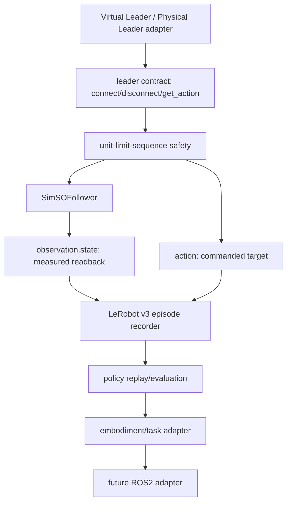

# SO-101 sim-first imitation foundation — 실행 인계

## 결론

**결정(설계 추론):** 첫 구현은 ROS2·실기체 없이 `Virtual Leader → SimSOFollower → 기록/평가`로 고정한다. `so101-nexus` 0.5.1을 통째로 포크하지 않고, 그 `LeaderProtocol`에서 확인한 최소 계약을 DAPIER가 자체 소유하는 작은 래퍼에 Virtual Leader로 구현하는 방식을 권장한다. 이후 리더 어댑터만 SO-100/SO-101 물리 리더로 교체하고, 그 다음에만 실물 follower를 별도 안전 Gate로 연다. 이 설계는 LeRobot v3/정책/프로세서/보정/기존 SO 드라이버를 재사용하면서 CardBench v0의 양팔 계약을 보존한다.

현재 작성 PC에서 MuJoCo 실행이 미검증 상태다. GUI, WSL, recording, training, 실제 하드웨어 및 sim-to-real 성공도 실행 검증하지 않았다.

## 사용자 목표와 범위

대상은 딥러닝 과정을 마친 DAPIER 1기 학생이다. 목표는 사람의 **Virtual Leader** 입력으로 SO-101 MuJoCo follower를 조작하고 모방 에피소드를 기록하는 hardware-free `sim-only` 경로이며, 수업 설계나 강사용 제안이 아니다. 증거 수준은 반드시 분리한다.

- scripted smoke 입력: 결정론적 궤적으로 연결·단위·기록 파이프라인을 점검한다. 사람 모방 demonstration이 아니다.
- human Virtual Leader 입력: 키보드/게임패드/슬라이더 등 사람이 조작한 입력을 기록한 최초의 imitation demonstration이다.
- physical Leader Arm 입력: 물리 SO-100/SO-101 리더의 측정값으로 리더 어댑터만 교체한 단계다.

범위는 source-pinned architecture와 실행 인계뿐이다. 이 AC에서 `casino_dealer` 코드·CardBench v0 폭·측정/명령 의미는 수정하지 않는다.

## 소스 고정과 근거

아래는 2026-08-07에 확인한 **소스 사실**이다(실행 결과가 아님).

| 근거 | 고정 revision / 상태 | 확인한 사실 및 정확한 로컬 경로 |
|---|---|---|
| DAPIER local main | `0baa32ca7c5e4c16ab4d3797c7d803144f00ab95`, 로컬 저장소 | [`README.md`](../README.md), [`casino_dealer/README.md`](../casino_dealer/README.md), [`cardbench_v0.json`](../casino_dealer/casino_dealer/contracts/cardbench_v0.json), [`contract.py`](../casino_dealer/casino_dealer/contract.py), [`test_contract.py`](../casino_dealer/test/test_contract.py) |
| [SO-ARM100](https://github.com/TheRobotStudio/SO-ARM100) | `7629d2ad9853d10fb903093a33ef6114099d97e5`, Apache-2.0 | [SO101 simulation README](https://github.com/TheRobotStudio/SO-ARM100/blob/7629d2ad9853d10fb903093a33ef6114099d97e5/Simulation/SO101/README.md), [scene.xml](https://github.com/TheRobotStudio/SO-ARM100/blob/7629d2ad9853d10fb903093a33ef6114099d97e5/Simulation/SO101/scene.xml), [new-calibration MJCF](https://github.com/TheRobotStudio/SO-ARM100/blob/7629d2ad9853d10fb903093a33ef6114099d97e5/Simulation/SO101/so101_new_calib.xml) |
| [so101-nexus](https://github.com/johnsutor/so101-nexus) 0.5.1 | `3619f7dce086445dc31311edd593a4de93b21c47`, Apache-2.0 | [pyproject.toml](https://github.com/johnsutor/so101-nexus/blob/3619f7dce086445dc31311edd593a4de93b21c47/pyproject.toml), [leader.py](https://github.com/johnsutor/so101-nexus/blob/3619f7dce086445dc31311edd593a4de93b21c47/src/so101_nexus/teleop/leader.py), [app.py](https://github.com/johnsutor/so101-nexus/blob/3619f7dce086445dc31311edd593a4de93b21c47/src/so101_nexus/teleop/app.py), [recorder.py](https://github.com/johnsutor/so101-nexus/blob/3619f7dce086445dc31311edd593a4de93b21c47/src/so101_nexus/teleop/recorder.py), [sim_follower.py](https://github.com/johnsutor/so101-nexus/blob/3619f7dce086445dc31311edd593a4de93b21c47/src/so101_nexus/lerobot_adapter/sim_follower.py); vendored Menagerie 모델 `4c358ef9d9d7f32ca58b40b490884a0c1726a440`은 카메라 FOV/그리퍼 프레임 로컬 변경 포함 |
| [Aloha Sim](https://github.com/google-deepmind/aloha_sim) | `d02904607cca1bf6dfb72f30b522506ac7ca0f91`, Apache-2.0 및 asset별 조건 | [task_suite.py](https://github.com/google-deepmind/aloha_sim/blob/d02904607cca1bf6dfb72f30b522506ac7ca0f91/aloha_sim/task_suite.py), [run_eval.py](https://github.com/google-deepmind/aloha_sim/blob/d02904607cca1bf6dfb72f30b522506ac7ca0f91/aloha_sim/run_eval.py): task·camera·seed·time limit과 rollout/video/success-rate 분리. Gemini 추론은 Trusted Tester 제약 |

SO-ARM100의 [Simulation/SO101](https://github.com/TheRobotStudio/SO-ARM100/tree/7629d2ad9853d10fb903093a33ef6114099d97e5/Simulation/SO101)에는 new/old calibration 각각의 URDF와 MJCF(`so101_new_calib.urdf/.xml`, `so101_old_calib.urdf/.xml`), `scene.xml`, `joints_properties.xml`, actuator 선언, mesh/part 자산이 있다. 다만 raw URDF/MuJoCo에는 LeRobot gripper 0–100 선형 매핑이 반영되지 않았다는 경고가 그대로 유효하다.

Ouroboros Seed와 deterministic verifier는 작성 PC의 저장소 밖에 둔 controller artifact이며 교육용 노트북 인계에는 필요하지 않다. 이 GitHub 문서 자체가 실행 범위의 유일한 인계 자료다.

2026-08-07 기준 확장 참고 자료인 [MuJoCo Playground](https://github.com/google-deepmind/mujoco_playground), [MuJoCo Menagerie](https://github.com/google-deepmind/mujoco_menagerie), [TapNet](https://github.com/google-deepmind/tapnet), [Open X-Embodiment](https://github.com/google-deepmind/open_x_embodiment), [LeRobot](https://github.com/huggingface/lerobot)은 이 구현의 source pin이 아닌 **unpinned dated reference**다. 첫 CPU smoke의 필수 의존성으로 추가하지 않는다. Menagerie/자산은 개별 provenance·license를 재확인하고, Open X의 absolute/delta/velocity 행동은 배열 크기 변경으로 변환하지 않는다.

## 기존 기능과 핵심 공백

**소스 사실:** so101-nexus는 six MuJoCo task, simulated follower, LeRobotDataset v3 recording, policy adapter/훈련·평가 경로를 제공하며 Python 3.12+, MuJoCo `>=3.1.3,<4`, Gymnasium 1.x 및 teleop용 `lerobot[feetech]` 0.5.x를 명시한다. recorder는 `observation.state`를 simulated follower **measured/readback**, `action`을 절대 **commanded** joint target으로 저장한다.

**핵심 공백:** Gradio physical teleop은 serial-port readiness를 하드 와이어하지만 pinned [leader.py](https://github.com/johnsutor/so101-nexus/blob/3619f7dce086445dc31311edd593a4de93b21c47/src/so101_nexus/teleop/leader.py)에서 관찰한 최소 구조적 seam인 `LeaderProtocol`은 `connect`, `disconnect`, `get_action`만 요구한다. `get_leader`는 물리 SO100/SO101 LeRobot leader만 만든다. 따라서 직렬 포트 없는 Virtual Leader adapter가 hardware-free 경로의 결손이다. 이 seam이 존재한다는 사실이 `teleop/session/recorder` 내부 import 안정성을 뜻하지는 않는다.

## 권장 아키텍처

세 선택지의 **설계 추론**은 다음과 같다. (1) nexus fork 수정은 빠르지만 upstream drift와 Gradio private API를 떠안는다. (2) DAPIER wrapper가 DAPIER-owned equivalent protocol(`connect`, `disconnect`, `get_action`)을 정의하고 public LeRobot Robot/Teleoperator·LeRobotDataset 인터페이스와 pinned `SimSOFollower` 경계만 연결하는 방식이 권장 MVP다. 비 top-level nexus module이 불가피하면 `nexus_051_adapter.py` 하나에 격리하고 0.5.1 contract test로 잠근다. nexus teleop/session/recorder 내부를 안정 API로 가정하지 않는다. (3) LeRobot-discoverable Virtual Leader plugin은 MVP 호환성이 입증된 뒤 배포 확장으로 진행한다. 세 선택지 모두 upstream 코드를 wholesale copy하지 않는다.



작은 `dapier_sim_first/` 패키지는 다음 공개 계약만 둔다. 모든 클래스를 ROS2 node로 쪼개지 않는다.

| 제안 module | public contract | 최소 contract test |
|---|---|---|
| `protocols.py` | DAPIER `Leader`, `Follower`, `Frame` protocol | fake leader의 `connect/disconnect/get_action` 구조 검사 |
| `virtual_leader.py` | scripted/human input을 `Frame`으로 변환 | provenance 분리, scripted의 `human_demo=false` |
| `nexus_051_adapter.py` | pinned `SimSOFollower`와 public LeRobot 경계 | nexus 0.5.1 feature shape·readback/command 의미 고정 |
| `embodiment.py` | `EmbodimentSpec`, ordered named-channel·unit·calibration 변환 | channel order와 degree/radian·gripper round-trip |
| `episode.py` | `EpisodeContract`, LeRobotDataset v3-compatible writer, receipt | measured observation/commanded action, stale reject |
| `evaluate.py` | `EvaluationContract`, seed/config/input digest와 metric report | schema·safety count 및 success-rate 보고 |
| `task_adapter.py` | SO-101/CardBench task·embodiment adapter | 6-channel과 CardBench 10-channel 격리 |
| `ros2_adapter.py` | 후일 IPC/message boundary | core가 ROS2 import 없이 동작하는지 검사 |

SO-101 ordered joint channel은 정확히 `shoulder_pan`, `shoulder_lift`, `elbow_flex`, `wrist_flex`, `wrist_roll`, `gripper`다. body 5개는 LeRobot degrees↔simulator radians, `gripper`는 LeRobot `RANGE_0_100`↔simulator radians로 명시 변환한다.

모든 leader/action/observation frame은 `embodiment_id`, `embodiment_revision`, `channel_names`(ordered), `values`, `units`(channel별), `calibration_id`, `monotonic_timestamp_ns`, `sequence_id`, `source`를 가진다. `source`는 `scripted`, `human_virtual_leader`, `physical_leader`, `sim_follower_readback`, `physical_follower_readback`, `policy` 중 하나다. 수신기는 embodiment/revision과 `calibration_id`를 manifest와 exact match하고, `channel_names` 순서를 exact match하며, `sequence_id`가 직전보다 strictly increasing이고 timestamp가 nondecreasing일 때만 수락한다. 수신 시 age는 두 control period 이하여야 하며 `age > 2T`는 stale로 결정론적으로 거부한다. `observation.state`는 항상 follower readback/measured, `action`은 commanded target이다.

LeRobot은 LeRobot v3 dataset, policy, processor convention, calibration schema, SO driver를 소유한다. DAPIER는 Virtual Leader, episode/evaluation contract, safety boundary, task adapter, ROS2 integration을 소유한다.

## 단계별 실행 계획과 Gate

아래 명령은 아직 존재하지 않는 모듈의 **제안 placeholder**이며 현재 실행 가능한 모듈이라고 주장하지 않는다.

**공통 Gate invariant/manifest(설계 추론):** 모든 실행은 DAPIER 밖의 새 `$RUN_ROOT=$HOME/dapier-runs/so101-foundation/<UTC-run-id>`를 사용하고, 승인된 hardware threshold는 별도 `$SAFETY_ROOT=$HOME/dapier-safety-manifests`에서 읽는다. 생성 전 `$RUN_ROOT`가 없어야 한다. immutable `run-manifest.json`은 DAPIER/upstream revision, report hash, gate, seed, control rate, exact `embodiment_id/revision`, ordered channels, units, `calibration_id=sha256:<선택한 calibration file의 64-hex>`, action bounds digest, command/input digest를 고정한다. SO-101 G1–G5는 30 Hz(`T=33.333 ms`, stale은 `age>66.667 ms`), CardBench G6는 15 Hz(`T=66.667 ms`, stale은 `age>133.333 ms`)다. seed는 G0=`0`, G1=`101`, G2=`102`, G3=`[201,202,203,204,205]`, G6=`[301,302,303,304,305]`; hardware G4/G5는 stochastic seed 대신 승인 manifest의 exact command plan digest를 쓴다. 모든 frame에서 channel order와 `calibration_id`는 exact match, `sequence_id`는 strictly increasing, `monotonic_timestamp_ns`는 nondecreasing이어야 하고 age가 두 control period 이하여야 한다. 위반 count는 Gate별 receipt에 기록한다. `receipt.json`은 gate/run-id/새 nonce/manifest hash/input hash/metrics/status를 포함하며, 기존 artifact나 과거 PASS receipt가 하나라도 있으면 실행하지 않는다. PASS receipt는 다른 run이나 Gate에서 재사용할 수 없다.

| Gate | 고정 입력 | 제안 command 또는 observable action | `$RUN_ROOT` 아래 기대 artifact | 객관적 PASS metric | 정확한 stop condition |
|---|---|---|---|---|---|
| G0 환경 smoke | seed `0`, 5개 pinned revision, SO-101 manifest | `python -m dapier_sim_first.gate g0 --manifest "$RUN_ROOT/run-manifest.json" --out "$RUN_ROOT/G0"` | `G0/environment.json`, `G0/contract.json`, `G0/receipt.json` | revision `5/5`, channel/order `6/6`, unit·conversion test `6/6`, calibration identity `1/1`, schema/rejection-rule violation `0` | import/model load 실패, revision·channel·unit·calibration 한 건이라도 mismatch, 기존 receipt 발견 시 FAIL 후 중단 |
| G1 scripted Virtual Leader recording | seed `101`, 30 Hz, 300-frame deterministic trace | `python -m dapier_sim_first.gate g1 --manifest "$RUN_ROOT/run-manifest.json" --seed 101 --rate-hz 30 --frames 300 --out "$RUN_ROOT/G1"`로 Virtual Leader가 SimSOFollower를 10초 구동 | `G1/lerobot-v3/` LeRobotDataset v3-compatible episode, `G1/provenance.json`, `G1/receipt.json` | episode `1/1`, accepted frame `300/300`, measured/action pair `300/300`, schema·order·sequence·timestamp·stale·limit violation 각각 `0`; provenance `source=scripted`, `human_demo=false` | frame 수가 300이 아니거나 위반 count가 하나라도 양수, scripted를 human imitation demonstration으로 표기하면 FAIL |
| G2 human Virtual Leader recording | seed `102`, 30 Hz, deadman을 누른 사람 입력, 300 accepted frames | operator가 Virtual Leader를 조작하고 300번째 accepted frame에서 명시 종료 | `G2/lerobot-v3/` LeRobotDataset v3-compatible episode, `G2/provenance.json`, `G2/receipt.json` | episode `1/1`, accepted frame `300/300`, required frame field/label `300/300`, schema·order·sequence·timestamp·stale·limit violation 및 dropped frame 각각 `0`; provenance `source=human_virtual_leader`, `human_demo=true` | deadman 해제·입력 장치 disconnect·limit 접근·누락/reject 발생 시 즉시 안전 정지하고 FAIL receipt 기록 |
| G3 policy replay/evaluation | G2 frozen input digest, policy/config digest, seeds 201–205 각 1 episode(총 5) | `python -m dapier_sim_first.gate g3 --manifest "$RUN_ROOT/run-manifest.json" --seeds 201,202,203,204,205 --episodes-per-seed 1 --out "$RUN_ROOT/G3"` | `G3/evaluation.json`, `G3/per-seed/*.json` 5개, `G3/receipt.json` | reproducibility용 seed/config/input digest 기록 `5/5`, episode completion `5/5`, schema·action-limit·stale violation 각각 `0`; `success_count` 정수 `0..5`와 `success_rate=success_count/5`를 반드시 보고하되 PASS 하한은 두지 않음 | digest/split 불일치, episode 누락, schema/safety violation 한 건이라도 발생하면 중단; 낮은 success rate만으로는 FAIL 처리하지 않음 |
| G4 physical Leader-to-sim | 별도 승인·서명된 `$SAFETY_ROOT/G4-leader-to-sim-safety.json`, serial identity, exact command-plan digest | operator가 signed range 안에서 physical Leader Arm을 움직이고 adapter만 교체해 sim follower 관찰 | `G4/safety-manifest.copy.json`, `G4/leader-to-sim.json`, `G4/trace/`, `G4/receipt.json` | signature/approval `1/1`, accepted sample=`safety_manifest.required_samples`, serial·channel·calibration identity exact match, order·stale·signed position/velocity/watchdog threshold violation 각각 `0` | signed safety manifest/승인/serial identity가 없거나 서명 검증 실패면 **실행 거부**; threshold·watchdog 위반 1건이면 즉시 disconnect/FAIL |
| G5 physical follower open-loop safety | 별도 승인·서명된 `$SAFETY_ROOT/G5-follower-open-loop-safety.json`, 작동하는 emergency stop, six-channel one-at-a-time plan | learned policy를 비활성화하고 승인된 target을 한 관절씩 commanded, 나머지는 hold하며 measured readback 확인 | `G5/safety-manifest.copy.json`, `G5/open-loop-trace/`, `G5/safety-evaluation.json`, `G5/receipt.json` | signature/approval `1/1`, emergency-stop preflight `1/1`, channel tested `6/6`, executed step=`safety_manifest.command_steps`, 동시에 이동한 channel 초과 violation `0`, stale·signed position/velocity/current/error threshold violation 각각 `0` | manifest/서명/별도 승인/현장 감독/emergency stop 중 하나라도 없으면 **실행 거부**; readback 소실·E-stop·threshold 위반 1건이면 즉시 command 차단·전원 안전 절차·FAIL |
| G6 CardBench bimanual simulation | seeds 301–305 각 1 episode, CardBench v0 contract | `python -m dapier_sim_first.gate g6 --manifest "$RUN_ROOT/run-manifest.json" --seeds 301,302,303,304,305 --episodes-per-seed 1 --rate-hz 15 --out "$RUN_ROOT/G6"` | `G6/cardbench-evaluation.json`, `G6/per-seed/*.json` 5개, `G6/receipt.json` | episode `5/5`, state scalar width `10/10`(left/right measured 4+4, vacuum pressure 1+1), action width `10/10`(left/right commanded target 4+4, vacuum command 1+1), rate `15 Hz`, overhead image present `5/5`, schema·order·stale·measured/commanded semantic violation 각각 `0`; success_count/rate 보고 | 폭·rate·overhead·source semantics mismatch 또는 violation 1건이면 즉시 FAIL; SO-101 6-vector coercion 발견 시 중단 |

## CardBench 양팔 카지노 딜러 확장

**로컬 사실:** CardBench v0는 15 Hz다. state scalar width는 정확히 10으로 `left_arm` measured joint 4 + `right_arm` measured joint 4 + left/right measured `vacuum` pressure 1+1이다. action width도 정확히 10으로 left/right commanded absolute joint target 4+4 + left/right normalized vacuum command 1+1이다. 필수 overhead image와 success/failure_reason을 가진다. 이 보고서는 `casino_dealer` 코드, 폭, measured/commanded semantics를 변경하지 않는다.

따라서 6-element SO-101 vector를 CardBench에 억지로 넣지 않는다. `EmbodimentSpec(name, joint_channels, gripper_channels, state_units, action_units, calibration_id)`로 SO-101 single-arm과 CardBench dual-arm을 별도 선언하고 named-channel adapter에서만 task policy와 기체를 연결한다. CardBench bimanual sim은 Aloha Sim의 task/evaluation 분리에서 구조만 참고하며 ALOHA 모델이나 Gemini policy를 복사·실행하지 않는다.

## 교육용 노트북 환경 매트릭스

| 선택 | 장점 | 충돌/미검증 경계 | 결정 |
|---|---|---|---|
| Ubuntu 22.04 + ROS2 Humble + Python 3.10 | 기존 DAPIER ROS 기준에 안정적 | so101-nexus는 Python 3.12+이므로 같은 interpreter에 넣지 않음 | nexus sim은 독립 Python 3.12 process/venv, ROS2는 후일 IPC/adapter 경계로만 연결 |
| Ubuntu 24.04 + ROS2 Jazzy + Python 3.12 후보 | OS/ROS 기본 Python이 nexus 요구와 정렬될 가능성 | nexus 0.5.1 + LeRobot 0.5.x + MuJoCo + ROS2 Jazzy의 완전한 조합은 미검증 | 후보 matrix일 뿐 호환을 주장하지 않고 G0 및 별도 ROS adapter Gate 필요 |
| Python 3.12+ nexus venv | pinned nexus 요구 충족 후보 | OS/ROS와 dependency lock 충돌 가능 | sim-only core를 ROS2 독립 venv로 검증하고 silent upgrade 금지 |

## 위험과 대응

- private API: `LeaderProtocol`에서 확인한 최소 구조를 DAPIER-owned protocol로 정의하고, nexus의 비 top-level adapter나 recorder/session 호출이 불가피하면 0.5.1 pin+contract test로 한 모듈에 격리한다.
- 단위·보정: degrees/radians 및 RANGE_0_100/radians 변환표, joint order, calibration identity 없이는 기록을 폐기한다.
- 데이터 품질: scripted와 human/physical provenance를 분리하고 TAPIR 계열 시각 점검은 후속 단계다.
- sim fidelity: 성공률은 sim-to-real 증명이 아니다. 물리 leader/follower Gate를 독립 통과해야 한다.
- 라이선스: Apache-2.0도 asset별 조건을 포함한다. 복사 전 license/provenance를 검토한다.
- 안전: stale-command rejection, rate/limit, deadman, emergency stop, 명시적 하드웨어 승인 전에는 움직임을 만들지 않는다.

## 취업·연구 포트폴리오 증거

우선순위가 있는 프로젝트 기회는 정확히 다섯 개다.

1. **메인 — sim-first policy benchmark/data foundation:** G0–G3 artifact와 source pin, reproducible split, failure taxonomy를 제시한다.
2. **확장 — demonstration-data quality inspection:** provenance, timestamp gap, calibration/unit anomaly, 영상 추적 품질을 검사한다.
3. **확장 — SO-101 digital twin:** physical leader/follower와 sim readback/commanded 오차를 버전별로 비교한다.
4. **확장 — Open X/LeRobot conversion:** RLDS의 action 의미를 named-channel contract로 명시 변환하고 검증한다.
5. **확장 — natural-language skill routing:** 언어 instruction을 CardBench skill/target과 안전한 실행 Gate로 라우팅한다.

포트폴리오 증거는 코드량이 아니라 pinned source, schema, 기록 provenance, deterministic Gate 결과, 실패/중단 기록이다.

## 교육용 노트북 Codex CLI 실행 인계

별도 하드웨어 승인이 없는 한 아래는 G0만 구현하는 미래 교육용 노트북 인계다. 이 authoring 작업에서는 아래 외부 쓰기를 실행하지 않았다. DAPIER checkout root에서 시작하며 첫 repository update action은 정확히 다음 명령이다.

```bash
git status --short
git fetch origin
git switch docs/so101-sim-to-real-foundation
git pull --ff-only origin docs/so101-sim-to-real-foundation
export REPORT=project-planning/2026-08-07-so101-sim-to-real-foundation.md
export RUN_ROOT="$HOME/dapier-runs/so101-foundation/$(date -u +%Y%m%dT%H%M%SZ)-g0"
test -f "$REPORT" && sed -n '1,220p' "$REPORT"
git rev-parse HEAD
python3 --version
uv --version || true
lsb_release -a || cat /etc/os-release
printenv ROS_DISTRO || true
ros2 doctor --report || true
codex --help
test ! -e "$RUN_ROOT"
mkdir -p "$RUN_ROOT"
# dataset/video/log/benchmark는 모두 $RUN_ROOT 아래만 허용한다.
# DAPIER 저장소 안에는 생성하지 않는다.

# 제안 invocation: 위 help에서 현재 설치본의 `exec` 지원을 확인한 뒤 사용한다.
codex exec --cd "$PWD" '
Read only project-planning/2026-08-07-so101-sim-to-real-foundation.md as scope authority.
이 문서를 먼저 읽고 재범위화하지 말라. G0만 구현·검증하고 G1 이상으로 진행하지 말라.
설치 전에 OS, Python, uv, GPU/render, ROS2 유무와 pinned source 상태를 조사하라.
생성 dataset/video/log/benchmark는 저장소 밖의 RUN_ROOT에만 기록하라.
기존 PASS receipt를 재사용하지 말고 매 실행 새 manifest/nonce/receipt를 만들라.
casino_dealer contract·코드·measured/commanded 의미를 변경하지 말라.
serial 연결이나 물리 hardware movement 전에 멈추고 별도 승인을 요청하라.
'
```

`codex --help`에서 현재 설치본의 invocation 문법이 다르면 prompt 내용과 범위를 바꾸지 말고 문법만 맞춘다. 환경 발견 전 설치하지 않으며, stale PASS를 복사하지 않는다. `$RUN_ROOT`는 DAPIER 밖이어야 하고 generated dataset/video/log/benchmark를 DAPIER 내부에 만들지 않는다. 설치, 녹화, 모델 다운로드, ROS2 결합, serial 접속 및 hardware movement는 발견 결과와 별도 승인 없이는 실행하지 않는다.

## 실행 상태와 증거 경계

이 문서는 **소스 사실**(위 고정 corpus와 로컬 contract), **설계 추론**(권장 wrapper/embodiment/Gate), **실행 미검증**(모든 Gate 결과)으로 나뉜다. 작성 시점의 Windows host는 Python 3.14.4 및 uv 0.10.2만 감지되었고 WSL 열거는 access denied였다. 그러므로 이 PC에서 MuJoCo, so101-nexus, GUI, WSL, dataset recording, training, physical hardware, simulator 또는 sim-to-real이 성공했다는 주장은 없다. 실제 증거는 교육용 노트북에서 해당 Gate가 만든 새 artifact와 metric으로만 승격된다.

### 2026-08-07 Ubuntu PC G0 실행 추가 기록

- `record_id`: `DAPIER-2026-08-07-so101-g0`
- 구현 commit: `00b211a6fc8f965a83337786582320e34629d4f1`
- 실행 기록: [`dapier_sim_first/README.md`](../dapier_sim_first/README.md)

오늘 수업에서 이 문서를 작업 계약으로 다시 읽고, 설치나 다운로드 전에 현재
PC를 읽기 전용으로 확인했다. Ubuntu 24.04.4 LTS, ROS 2 Jazzy, system Python
3.12.3이므로 위 환경 매트릭스의 두 번째 후보 행과 기본 축이 일치한다. 기존
`$HOME/so101/lerobot` venv에는 MuJoCo 3.8.1과 수정 중인 LeRobot 0.6.0이
있지만 `so101-nexus` 0.5.1은 설치되어 있지 않다. 따라서 전체
nexus/LeRobot/MuJoCo/ROS 2 조합의 호환성을 주장하지 않는다.

새 외부 run
`$HOME/dapier-runs/so101-foundation/20260806T233431Z-g0`에서 G0를 직접
실행해 `PASS`를 확인했다. revision manifest exact match `5/5`, model load
`1/1`, channel/order `6/6`, unit conversion `6/6`, calibration identity `1/1`,
schema/rejection-rule violation `0`이다. revision `5/5`는 이 문서가 고정한
다섯 SHA와 manifest 값이 일치한다는 뜻이며 다섯 upstream checkout이 모두
로컬에 존재한다는 주장이 아니다. 모델은 기존 로컬
`pick_cube.xml`을 MuJoCo에서 읽기 전용으로 load했고 GUI/render는 실행하지
않았다.

같은 run을 다시 실행하자 기존 artifact/receipt 재사용으로 exit code `2`가
발생해 중단되는 것도 확인했다. G1 이상, 새 dataset/video/log/benchmark,
정책, ROS 2 adapter, serial과 hardware control은 진행하지 않았다. 기존
joint-sweep dataset 5 episodes/450 frames도 읽어 보니 success는 `0/5`라서
물건 집기 성공이나 sim-to-real 결과로 승격하지 않는다.
