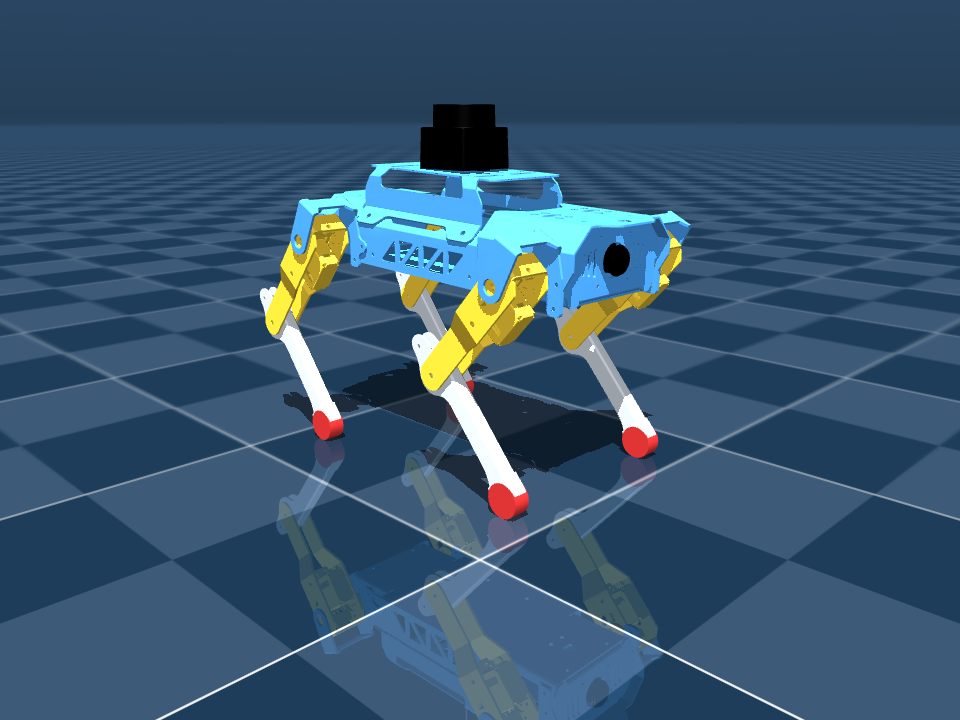
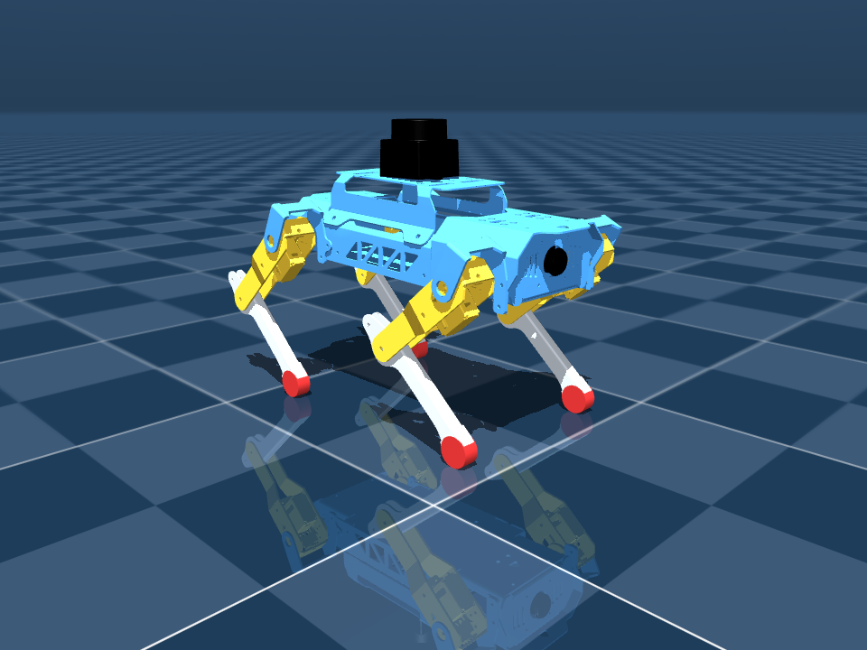
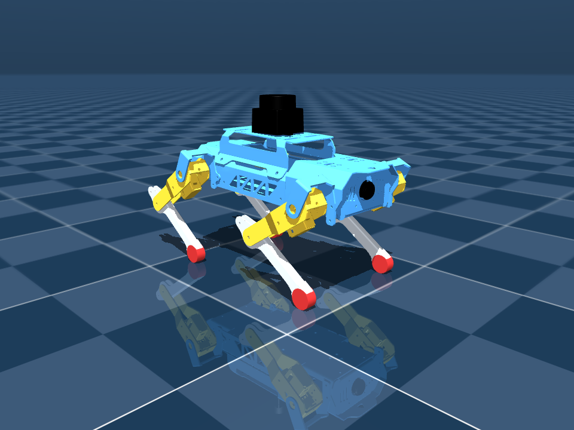

# Puppy 4족 로봇 MuJoCo 실습 (평면 2R 닫힌 형태 역기구학)

위키독스 「로보틱스를 위한 이미테이션 러닝」 10장
[실습 4: Puppy 4족 로봇 URDF→MuJoCo(MJCF XML) 변환](https://wikidocs.net/372089)
을 이 저장소 기준으로 진행한 기록이다.

[실습 3(jdcobot100)](../../jdcobot100_sim/mujoco/README.md), [실습 5(SO101)](../../so101/mujoco/README.md)와
같은 흐름이지만 **로봇 종류가 달라서 요구사항이 정반대**다.

| | 실습 3·5 (로봇암) | 실습 4 (Puppy) |
|---|---|---|
| 베이스 | fixed base — 월드 고정이 정답 | **floating base** — `freejoint` 없으면 허공에 매달린다 |
| 접촉 | 자체 충돌을 끄는 게 목표 | **발-바닥 접촉이 실습의 목적** |
| 자세 지정 | 관절각을 그대로 준다 | 관절각으로는 안 된다 (아래 4절) |
| 서보 사양 | STS3215 데이터시트 있음 | 없음. URDF의 effort 한계(0.5 N·m)만 있다 |

> **정직성 메모.** 이 실습을 시작할 때 교재가 제공하는 `answer/readme.md`의
> 앞부분을 읽었다. 거기에 "4족은 free joint가 필요 / 발은 충돌이 살아 있어야
> 함 / `rgba`가 검정이라 화면이 어둡다"가 적혀 있고, 아래 "걸렸던 것" 1·2·3번이
> 그와 겹친다. **역기구학 유도(2~6절)와 kp 계산(7절)은 직접 한 것이고 답안에는
> 없다.**

## 실행

```bash
cd ~/DAPIER/puppy/mujoco
./experiments.sh          # 자산 확인 → 변환 → 보강 → IK 검증 → 유도 → 측정 → 스크린샷
./run.sh                  # 앉기↔서기 (몸통 높이만 주면 IK가 관절각을 푼다)
./run.sh --profile step   # 계단 입력으로 바꿔 보기
```

이 PC에는 EGL/OSMesa가 없어 `MUJOCO_GL=glfw`를 쓴다(`experiments.sh`가 자동 설정).

자산은 vendoring하지 않는다. `setup_assets.py`가 교재 체크아웃을 찾아
`UPSTREAM_ASSETS.sha256`으로 URDF 1개 + STL 11개를 검증한 뒤 `meshes/`
심볼릭 링크를 만든다.

## 1. 변환 직후 — 로봇이 허공에 뜬다

```
nq=8 nv=8 nu=0 nbody=18 ngeom=26 nmesh=11
전체 질량 = 327.5 g
free joint 개수 = 0
-> 베이스가 월드에 고정되어 있다. 4족 로봇이 허공에 뜬 채로 다리만 허우적거린다.
```

URDF 루트 `base_footprint`가 고정 결합이라 MuJoCo가 fixed base로 컴파일한다.
`<freejoint/>`를 붙여야 하고, 그 전에 `<compiler fusestatic="false"/>`를 줘야
베이스 body가 월드에 합쳐지지 않고 살아남는다.

## 2. 핵심 관찰 — 다리가 평면에 갇힌다

`joint1`과 `joint2`의 회전축이 **둘 다 `1 0 0`** 이고 사이에 낀 고정 변환도
전부 x축 회전이다. 따라서 다리 전체가 하나의 평면(시상면)을 벗어나지 못한다.
**평면 2링크(2R) 문제**이므로 각도를 훑을 필요 없이 닫힌 형태로 풀린다.

x축 둘레 회전을 (y, z) 2벡터에 쓰면

```
R(a)·(y, z) = (y cos a − z sin a,  y sin a + z cos a)
```

모델에서 뽑은 상수(하드코딩 아님):

| 기호 | 의미 | 값 |
|---|---|---|
| `φ₁` | 링크1 고정 회전 | −0.752000 rad = −43.0864° |
| `d₂` | 링크2 부착 오프셋 | (+0.0525236, −0.0528775) |
| `e = d₃ + R(φ₃)d₄` | 링크2 프레임에서 본 발까지 | (−0.0537033, −0.0522891) |
| `L₁ = ‖d₂‖` | 첫 링크 길이 | 0.074530 m |
| `Lₑ = ‖e‖` | 둘째 링크 길이 | 0.074955 m |
| `δ = ∠e − ∠d₂` | 기준 방향 차 | −1.580780 rad = −90.5720° |

## 3. 순기구학 — 회전을 밖으로 몰아낸다

```
p(θ₁, θ₂) = R(φ₁+θ₁)·d₂ + R(φ₁+θ₁+θ₂)·e
          = R(φ₁+θ₁)·[ d₂ + R(θ₂)·e ]                        ... (1)
```

괄호 안을 `w(θ₂) = d₂ + R(θ₂)e`로 두면 식 (1)은 "`w`를 만들고 → 통째로 돌린다"로
읽힌다. **`θ₁`은 길이에 전혀 관여하지 않는다.**

## 4. 길이가 `θ₂`만의 함수 — 제2 코사인 법칙

회전은 길이를 바꾸지 않으므로 `‖p‖ = ‖w(θ₂)‖`. 제곱해서 전개하면

```
‖p‖² = L₁² + Lₑ² + 2·L₁·Lₑ·cos(θ₂ + δ)                       ... (2)
```

그냥 **제2 코사인 법칙**이다. `δ`는 두 링크의 기준 방향이 어긋난 것을 보정하는
상수일 뿐이다.

## 5. 역기구학 — 두 줄

목표 발 위치 `p*`에서 `r = ‖p*‖`를 알 수 있으므로 식 (2)를 뒤집는다.

```
θ₂ = ±arccos( (r² − L₁² − Lₑ²) / (2·L₁·Lₑ) ) − δ              ... (3)
θ₁ = atan2(p*) − atan2(w) − φ₁,   w = d₂ + R(θ₂)e             ... (4)
```

식 (3)의 `±`는 무릎이 앞으로 굽는 해와 뒤로 굽는 해다. 네 다리가 서로 다른
쪽으로 굽으면 안 되므로 **부호를 전체에서 하나로 통일**하고, 관절 한계(±2 rad)를
벗어나는 해는 버린다.

> 이걸 빼먹고 "관절각 크기가 작은 쪽"을 고르게 했더니 앞다리 `θ₁=+1.02`,
> 뒷다리 `−0.26`이 나와 로봇이 이상하게 섰다. 다른 부호 조합에서는
> `θ₂=+3.06` rad이 나왔는데 관절 한계가 ±2 rad이라 물리적으로 불가능한 값이다.

## 6. 도달 범위도 해석적으로

식 (2)에서 `cos ∈ [−1, 1]`이므로 `‖p‖ ∈ [|L₁−Lₑ|, L₁+Lₑ] = [0.000424, 0.149485]` m.
발을 자기 힙 바로 아래에 놓으면 다리 하나가 허용하는 몸통 높이는
`h_max = √(r_max² − d_y²) − z_hip`이고, 네 다리 구간의 **교집합**이 전체 범위다.

| 다리 | 힙 (y, z) | 단독 상한 |
|---|---|---|
| lf / rf (앞) | (−0.077869, +0.010651) | 0.13883 m |
| **lb / rb (뒤)** | (+0.077869, **+0.015988**) | **0.13350 m** |

**뒷다리 힙이 5.337 mm 높아 상한을 뒷다리가 정한다.** 전체 가능 범위는
0 ~ **0.13350 m**이고, 한계+1 mm를 요구하면 `solve_stance`가 정상적으로 거부한다.

## 7. 왜 "네 다리에 같은 각도"로는 수평이 안 되나

교재 5단계는 네 다리에 똑같은 관절각을 준다. 그런데 위 표대로 힙 부착 높이가
앞뒤로 5.337 mm 다르다. 식 (1)은 힙 위치와 무관하게 "힙 기준 발 위치"만
주므로, 같은 각도 → 같은 힙 기준 발 위치 → **절대 발 높이가 힙 차이만큼
어긋난다.** 실측으로 몸통이 pitch −3.4°로 기울었다.

목표를 **발 위치**로 주고 식 (3)(4)로 풀면 그 차이가 자동으로 흡수된다.

| 방식 | 기립 시 pitch | 앉은 자세 pitch |
|---|---|---|
| 교재식 (네 다리 같은 각도) | −3.4° | — |
| 이분법으로 발 높이 맞춤 | −0.88° | −2.33° |
| **닫힌 형태 IK** | **−0.002°** | **−0.02°** |

부호도 교재와 반대다. 교재 값(`joint1=+0.25, joint2=−0.90`)을 그대로 쓰면
다리가 몸통 쪽으로 접혀 몸통 높이가 0.017 m밖에 안 나온다.

## 8. kp도 계산으로 — 자코비안 전치

발에 수직력 `f`가 걸릴 때 관절 토크는 `τ = Jᵀf`이고 `J`는 MuJoCo가
`mj_jacGeom`으로 정확히 준다. 무게 327.5 g → 3.2131 N을 네 발이 나누면 발당
**0.8033 N**.

| joint | τ (N·m) | 처짐 0.5°에 필요한 kp | effort(0.5 N·m) 대비 |
|---|---|---|---|
| `*_joint1` | **0.00000** | 0.0 | 0.0 % |
| `lf/rf_joint2` | 0.04037 | 4.6 | 8.1 % |
| `lb/rb_joint2` | 0.03787 | 4.3 | 7.6 % |

**`joint1` 토크가 정확히 0으로 나온다.** 발을 힙 바로 아래에 놓았으니 수직력의
작용선이 `joint1` 축을 지나가 모멘트 팔이 0이다. 손으로 예측한 것이 자코비안으로
그대로 확인된다.

→ `kp = 0.04037 / 0.008727 = 4.6 → 5`. 선형 구간은 `|오차| < forcerange/kp =
0.108 rad`(6.19°)이고 그보다 큰 오차에서는 포화다.

마찰계수도 같이 나온다. 발이 힙 바로 아래면 수평력이 거의 없으므로
`μ_required = 0.0011`. 현재 발 friction 1.0은 918배 여유이고, 실제로 앉기↔서기
전환 중 수평 이동이 0.32 mm뿐이다.

## 9. 유도하지 못한 것 — damping / armature

서보 데이터시트가 없어 실습 5처럼 유도할 수 없었다. 대신 수치 기준과 측정으로
골랐다. 위치 서보를 스프링으로 보면 고유주기가 `T = 2π√(M_eff/kp)`이고,
`T/Δt ≈ 60`으로 여유가 많다.

`armature`를 0~0.02, `damping`을 0~0.2까지 훑어도 **한 번도 발산하지 않았다.**
`armature`는 `max|qacc|`를 357 → 9.8로 낮추는 효과만 있고, `damping`은 진동이
없는 이 영역에선 정착만 느려진다. `armature=0.0015`, `damping=0.02`로 뒀다 —
**유도값이 아니라 측정으로 고른 값이다.**

## 10. 검증 결과

`./experiments.sh`로 전부 재현된다.

| 검증 항목 | 방법 | 결과 |
|---|---|---|
| 해석 FK vs MuJoCo | 무작위 500자세, 식 (1) vs `mj_forward` | 최대 오차 **1.454e-16 m** |
| IK 왕복 | 각도 → FK → IK → 각도, 500회 | 실패 **0건**, 최대 **5.329e-15 rad** |
| 기립 해의 수평도 | `solve_stance` → 네 발 z 편차 | **~1e-17 m** |
| 정적 처짐 | 3초 기립 유지 | **0.249°** (설계 목표 0.5°) |
| 전환 중 추종 | 앉기↔서기 2초 램프 | 최대 **0.962°**, 몸통 진폭 29.4 mm |
| 접지·미끄러짐 | 발 접촉 수 / 수평 이동 | 내내 **8점 접촉**, 이동 **0.32 mm** |

1e-16은 부동소수점 기계 정밀도다. 식 (1)은 근사가 아니라 MuJoCo가 내부에서
하는 계산과 정확히 같은 식이다.

자세별 스크린샷 (몸통 높이만 지정, 관절각은 IK가 풂):

| stand (0.100 m) | mid (0.085 m) | sit (0.070 m) |
|---|---|---|
|  |  |  |

빨간 점이 발 끝(`*_foot` site), 노란 점이 발 중심이다.

## 11. 걸렸던 것 정리

1. **`freejoint`가 없으면 4족이 허공에 매달린다.** `<compiler fusestatic="false"/>`도
   같이 줘야 베이스 body가 살아남는다.
2. **발 site가 아니라 geom 표면 기준으로 높이를 잡을 것.** 발은 반지름 9.5 mm
   실린더라 site를 0에 맞추면 그만큼 바닥을 파고든다(초기 침투 9 mm).
3. **모든 geom의 `rgba`가 `0 0 0 1`(완전 검정)** 이라 뷰어에 실루엣만 보인다.
4. **교재 stand/sit 관절값의 부호가 반대다.** 그대로 쓰면 몸통 높이가 0.017 m.
5. **해가 여러 개면 고르는 기준을 명시할 것.** 무릎 방향 통일 + 관절 한계 검사.
6. **관절축이 나란히 같으면 그 사슬은 평면 문제다.** 각도를 훑기 전에 축부터 볼 것.
7. **해석적 한계를 반올림해서 시험하면 안 된다.** `verify_ik.py`가 상한을
   `round(hi, 4)`로 시험했는데, `hi = 0.13349684…`를 4자리로 반올림하면
   `0.1335`가 되어 **실제 한계보다 3.157 µm 크다**. 뒷다리가 도달 불가로
   `ValueError`를 냈다. 풀이가 틀린 게 아니라 **시험점이 범위 밖이었다.**
   `hi`를 그대로 넣으면 통과한다(발 z 편차 2.78e-17 m).

(1·2·3번은 교재 `answer/readme.md`에도 적혀 있는 내용이다. 4~7번과 2~8절의
유도는 답안에 없다.)

## 12. 다음

- 이 IK를 보행(trot)으로 확장 — 발 궤적을 시간 함수로 주면 그대로 돌아간다
- `obstacles.xml`을 `scene.xml`에 include해 장애물 통과
- 11장 SO-ARM101 MuJoCo 이미테이션 러닝

## 출처

- 교재: https://wikidocs.net/372089
- 교재 참고 코드: https://github.com/JD-edu/so101_imitation_learning/tree/main/105_MUJOCO_basic/108_puppypi_mujoco_load
