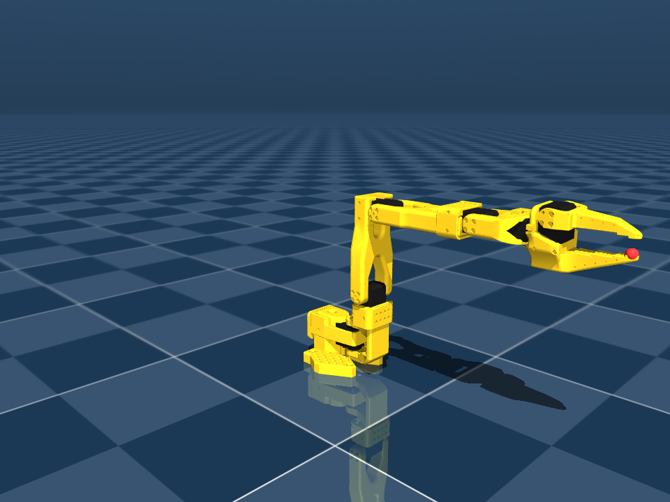
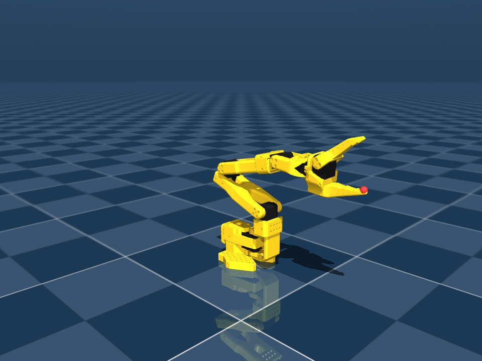
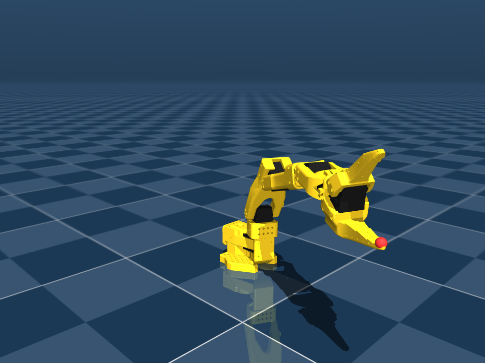

# SO101 MuJoCo 실습 (URDF → MJCF 변환과 파라미터 유도)

위키독스 「로보틱스를 위한 이미테이션 러닝」 10장
[실습 5: LeRobot SO101 URDF를 MuJoCo XML로 변환하고 동작](https://wikidocs.net/372090)
을 이 저장소 기준으로 진행한 기록이다.

[실습 3(jdcobot100)](../../jdcobot100_sim/mujoco/README.md)과 같은 흐름이지만
출발점이 다르다. jdcobot100은 CAD에서 갓 나온 URDF라 `mass=1e-09`부터 고쳐야
했고, SO101은 LeRobot이 배포하는 검증된 URDF라 실측 질량·관성이 이미 들어 있다.
그래서 이번 실습의 무게중심은 **"URDF가 표현하지 못하는 것"을 무엇으로 채울
것인가**에 있다.

## 교재 대비 달라진 점 (먼저 읽을 것)

교재 실습 5 본문은 관절명을 `base_shoulder` / `shoulder_arm1` / `arm1_arm2` /
`arn2_end_arm` 네 개로 설명하는데, 이건 **실습 3의 jdcobot100 관절명이다.**
실습이 제공하는 `so101_new_calib.urdf`에는 그런 관절이 없다.

```
mj_name2id(JOINT, 'base_shoulder') = -1   <- 없음
mj_name2id(JOINT, 'shoulder_arm1') = -1   <- 없음
mj_name2id(JOINT, 'arm1_arm2')     = -1   <- 없음
mj_name2id(JOINT, 'arn2_end_arm')  = -1   <- 없음
```

교재 2단계의 예제 XML도 jdcobot100의 body 트리를 그대로 담고 있고, 3~5단계의
파이썬 코드도 전부 저 이름을 쓴다. 즉 **본문 코드를 그대로 실행하면 전부
실패한다.** 공교롭게도 교재의 「문제 해결」 2번이 "mj_name2id가 -1을 반환"인데,
바로 그 문제를 본문이 갖고 있다.

실제 SO101 관절은 6개다. `inspect_names.py`가 이걸 찍어 준다.

| joint | range (rad) | range (deg) |
|---|---|---|
| `shoulder_pan` | −1.91986 .. +1.91986 | −110.0 .. +110.0 |
| `shoulder_lift` | −1.74533 .. +1.74533 | −100.0 .. +100.0 |
| `elbow_flex` | −1.69000 .. +1.69000 | −96.8 .. +96.8 |
| `wrist_flex` | −1.65806 .. +1.65806 | −95.0 .. +95.0 |
| `wrist_roll` | −2.74385 .. +2.84121 | −157.2 .. +162.8 |
| `gripper` | −0.17453 .. +1.74533 | −10.0 .. +100.0 |

`wrist_roll`이 ±2.7 rad을 넘기 때문에, 교재가 예시로 든 `ctrlrange="-1.57 1.57"`을
그대로 쓰면 이 축의 가동 범위가 절반 넘게 잘린다. `tune_mjcf.py`는 각 축의
물리 `range`를 그대로 `ctrlrange`로 넣는다.

## 실행

```bash
cd ~/DAPIER/so101/mujoco
./experiments.sh            # 자산 확인 → 변환 → 튜닝 → 유도 → 검증 → 스크린샷
./run.sh                    # 뷰어에서 두 자세 왕복
./run.sh --interpolate      # 계단 입력 대신 선형 보간
```

새 PC:

```bash
python3 -m venv .venv && source .venv/bin/activate
python -m pip install -r requirements.txt
./experiments.sh
```

화면이 없는 환경에서는 `MUJOCO_GL=glfw`를 쓴다. 이 PC에는 EGL/OSMesa가 없어서
LeRobot 문서가 안내하는 `MUJOCO_GL=egl`은 동작하지 않는다.

## 자산은 복사하지 않는다

이 저장소는 SO101 upstream 자산을 vendoring하지 않고 해시만 기록한다
(`../integrations/lerobot_v0_6_so101_mujoco/UPSTREAM_ASSETS.sha256`).
16 MB짜리 STL 13개를 또 복사하는 대신 `setup_assets.py`가 기존 체크아웃을 찾아
해시를 검증하고 `meshes/` 심볼릭 링크를 만든다. `meshes`와 `build/`는 git에
올리지 않는다.

검증하면서 알게 된 것: **교재가 제공하는 STL 13개는 저장소가 이미 기록해 둔
LeRobot upstream STL과 SHA256까지 완전히 같은 파일이다.** 교재용으로 따로
만들어진 메쉬가 아니다.

```
[2/3] STL 13개 SHA256 검증 통과 (upstream 매니페스트와 완전 일치)
```

## 1단계. URDF → MJCF

jdcobot100과 달리 손댈 게 거의 없다. LeRobot의 `so101_new_calib.urdf`에는 이미

```xml
<mujoco>
  <compiler meshdir="meshes/" strippath="false" fusestatic="false"/>
</mujoco>
```

가 들어 있고 mesh filename도 `package://` 없이 파일명만 쓴다. 교재가 경고하는
`package://ros_arm/meshes/...` 문제는 이 파일에 없다.

다만 `meshdir`이 **URDF 파일 위치 기준**이라, 사본을 `build/`에 두면
`meshes/`가 아니라 `../meshes/`가 되어야 한다. 실습 3에서 똑같이 걸렸던
함정이다.

변환 결과:

```
nq=6 nv=6 nu=0 nbody=9 ngeom=17 nmesh=13
전체 질량 = 0.6320 kg
```

| link | 질량 |
|---|---|
| `base_link` | 147.0 g |
| `shoulder_link` | 100.0 g |
| `upper_arm_link` | 103.0 g |
| `lower_arm_link` | 104.0 g |
| `wrist_link` | 79.0 g |
| `gripper_link` | 87.0 g |
| `moving_jaw_so101_v1_link` | 12.0 g |

실측값이 들어 있으므로 실습 3에서 쓴 `inertiafromgeom` 우회는 **쓰면 안 된다.**
`nu=0`은 아직 actuator가 없다는 뜻이고, 여기서부터가 이번 실습의 본론이다.

## 2단계. 자체 충돌만 끄고 외부 접촉은 살린다

actuator를 붙이고 홈 자세를 유지시키자 `shoulder_pan`이 목표 0에서 **1.26 rad
(72°)까지 밀려났다.** 접촉을 보니 원인이 명확했다.

```
contact base_link <-> shoulder_link  dist=-0.02640
contact base_link <-> shoulder_link  dist=-0.02776
contact base_link <-> shoulder_link  dist=-0.02237
qfrc_constraint[shoulder_pan] = -187.11 N.m
```

CAD 메쉬상 `base_link`와 `shoulder_link`가 22~28 mm 파고들어 있어서 매 스텝
구속력이 걸린다. 실습 3의 jdcobot100과 같은 종류의 문제다.

교재 정답(`answer/so101.xml`)은 `<geom contype="0" conaffinity="0"/>`으로 접촉을
통째로 끈다. 조용해지긴 하는데 **바닥·물체 접촉까지 같이 죽는다.** 이 저장소는
`integrations/lerobot_v0_6_so101_mujoco`에서 이 팔로 큐브를 집는 작업
(`pick_cube.xml`)을 하므로 그렇게 두면 안 된다.

그래서 자체 충돌만 껐다.

```xml
<geom contype="1" conaffinity="0"/>
```

MuJoCo의 접촉 조건은 `(contype₁ & conaffinity₂) || (contype₂ & conaffinity₁)`이다.

| 조합 | 계산 | 결과 |
|---|---|---|
| 로봇(1,0) ↔ 로봇(1,0) | (1&0) \|\| (1&0) = 0 | 접촉 없음 |
| 로봇(1,0) ↔ 바닥·큐브(1,1) | (1&1) \|\| (1&0) = 1 | 접촉 있음 |

```
floor contype/conaff   = 1 1
robot conaffinity (합) = 0
자체 접촉 ncon         = 0
```

## 3단계. 파라미터를 스윕이 아니라 유도로 정한다

`damping` / `armature` / `forcerange` / `kp` / `kv`는 감으로 고르거나 스윕으로
찾는 대신 **STS3215 데이터시트와 모델의 중력 토크에서 직접 계산할 수 있다.**
`derive_params.py`가 그 계산을 하고, `verify_derivation.py`가 결과를 시뮬레이션과
대조한다.

데이터시트 (Feetech STS3215, 12 V): 스톨 토크 30 kgf·cm, 무부하 속도
0.222 s/60°, 감속비 1:345.

### forcerange ← 스톨 토크

```
30 kgf·cm × 9.80665 / 100 = 2.9420 N·m
```

### damping ← 토크-속도 특성의 기울기

DC 모터의 토크는 정지에서 스톨 토크, 무부하 속도에서 0인 직선이다. 그 기울기가
곧 점성 계수다.

```
ω_nl = 60° / 0.222 s = 4.717 rad/s
b    = 2.9420 / 4.717 = 0.6237 N·m·s/rad
```

upstream LeRobot MJCF가 쓰는 값은 0.60이다. **3.7% 차이**로 맞는다.

### armature ← 감속기를 통해 본 로터 관성

감속비 N의 기어 너머에서 보면 로터 관성이 N²배로 확대된다. 로터를 강철
원기둥(⌀8 × 15 mm)으로 근사하면

```
m       = π r² l ρ            = 5.88 g
J_rotor = ½ m r²              = 4.705e-08 kg·m²
J_eq    = N² J_rotor = 345² × 4.705e-08 = 0.0056 kg·m²
```

upstream MJCF의 `so101_new_calib` 클래스가 쓰는 값이 **0.005**다. 자릿수가
아니라 값 자체가 맞는다. (교재 정답이 쓴 0.028은 upstream의 다른 클래스
`sts3215`에서 온 값이고, 아래에서 보듯 오버슈트를 키운다.)

### kp ← 허용 처짐과 최대 중력 토크

position actuator의 정상상태 조건은 `kp × 처짐 = 중력토크`다. 따라서 허용
처짐을 정하면 kp가 결정된다. 작업 공간 4000점을 훑어 관절별 최대 중력 토크를
구했다.

| joint | 최대 중력토크 | 처짐 0.1°에 필요한 kp |
|---|---|---|
| `shoulder_pan` | 0.0000 N·m | 0.0 |
| `shoulder_lift` | **0.8630 N·m** | **494.5** |
| `elbow_flex` | 0.4526 N·m | 259.3 |
| `wrist_flex` | 0.1171 N·m | 67.1 |
| `wrist_roll` | 0.0061 N·m | 3.5 |
| `gripper` | 0.0035 N·m | 2.0 |

가장 무거운 축 기준으로 **kp = 500**(494 반올림).

kp를 더 올리면? 의미가 없다. `forcerange`가 2.94 N·m라 **kp가 실제로 작동하는
건 |오차| < 2.94/kp인 선형 구간뿐**이고, 그보다 큰 오차에서는 kp와 무관하게
항상 최대 토크(bang-bang)다. reach 자세로 이동을 시작하는 순간 요구 토크는

| kp | 요구 토크 | 한계 대비 | 선형 구간 |
|---|---|---|---|
| 150 | 165.0 N·m | 56배 | \|오차\| < 0.0196 rad |
| 500 | 550.0 N·m | 187배 | \|오차\| < 0.0059 rad |
| 998.22 | 1098.0 N·m | 373배 | \|오차\| < 0.0029 rad |

kp를 998로 올리면 정적 강성만 조금 좋아지고 포화 구간이 길어져 오버슈트가
커진다.

### kv ← 임계감쇠, 단 상수로는 불가능

`kv = 2ζ√(kp·M_eff) − b`인데 `M_eff`가 축마다 다르다.

| joint | M_eff | 임계 kv |
|---|---|---|
| `shoulder_pan` | 0.043286 | 8.63 |
| `shoulder_lift` | 0.044310 | 8.74 |
| `elbow_flex` | 0.036609 | 7.89 |
| `wrist_flex` | 0.028997 | 6.95 |
| `wrist_roll` | 0.028041 | 6.82 |
| `gripper` | 0.028016 | 6.82 |

상수 `kv` 하나로는 6축을 다 맞출 수 없다. 그래서 `kv` 대신
**`dampratio="1"`**을 쓴다. MuJoCo가 축별 `M_eff`로 계산해 준다.
(MuJoCo는 joint `damping`을 빼 주지 않으므로 실제로는 약간 과감쇠가 된다.)

### 유도하지 못한 값

`frictionloss`만 유도하지 못했다. 무부하 전류나 기어 효율 사양이 없으면
쿨롱 마찰 토크를 계산할 근거가 없다. upstream 값 0.052를 그대로 썼다.

### 최종

```xml
<default class="STS3215">
  <geom contype="1" conaffinity="0"/>
  <joint damping="0.62" frictionloss="0.052" armature="0.006"/>
  <position kp="500" dampratio="1" forcerange="-2.94 2.94"/>
</default>
```

## 4단계. 유도가 맞는지 검증

`verify_derivation.py`는 유도의 두 주장을 시뮬레이션으로 직접 잰다.

**주장 A — 정상상태 처짐 = 중력토크 / kp.** 중력 토크가 최대인 자세에서:

| joint | 중력토크 | 예측 처짐 | 실측 처짐 | 차이 |
|---|---|---|---|---|
| `shoulder_pan` | 0.0000 N·m | 0.000000 | 0.000000 | 0.000000 |
| `shoulder_lift` | 0.8631 N·m | 0.001726 | 0.001726 | 0.000000 |
| `elbow_flex` | 0.4519 N·m | 0.000904 | 0.000904 | 0.000000 |
| `wrist_flex` | 0.1162 N·m | 0.000232 | 0.000232 | 0.000000 |
| `wrist_roll` | 0.0042 N·m | 0.000008 | 0.000008 | 0.000000 |
| `gripper` | 0.0005 N·m | 0.000001 | 0.000001 | 0.000000 |

소수점 6자리까지 일치한다. 최대 처짐 **0.0989° ≤ 목표 0.1°** — 설계 목표를
계산으로 맞춘 것이지 스윕으로 우연히 맞춘 게 아니다.

**주장 B — 큰 오차 구간은 포화라 kp가 의미 없다.** 이동 시작부터 정착까지
액추에이터가 최대 토크에 붙어 있던 시간이 **7.2%**, 마지막으로 포화가 풀린
시각이 **0.274 s**였다. 그 전까지는 kp가 무엇이든 같은 토크가 나간다.

## 5단계. 게인 비교

`gain_sweep.py` (reach 자세, 3초, timestep 0.002 s):

| 설정 | 중력처짐 | 추종오차 | 오버슈트 | 포화비율 |
|---|---|---|---|---|
| **채택: 유도값** (b .62 / arm .006 / kp 500 / dampratio 1) | 0.00108 rad | 0.00077 rad | **1.3 %** | 7.2 % |
| 교재 정답 = upstream (b .60 / arm .028 / kp 998.22 / kv 2.731) | 0.00054 rad | 0.00038 rad | 12.4 % | 13.1 % |
| 교재 정답 + kv 15 | 0.00054 rad | 0.00038 rad | 9.6 % | 12.8 % |
| 유도값이되 armature 0.028 | 0.00108 rad | 0.00077 rad | 5.0 % | 10.1 % |
| 유도값이되 kp 150 | 0.00360 rad | 0.00256 rad | 0.3 % | 6.0 % |
| 유도값이되 kv 상수 2.731 | 0.00108 rad | 0.00077 rad | 2.5 % | 7.2 % |

교재 정답 쪽이 처짐·추종오차는 2배 작다. 대신 오버슈트가 **12.4 %**로
9배 크고 포화 시간도 2배다. 처짐은 어차피 양쪽 다 0.1° 안쪽이라 실질적인
차이가 없고, 오버슈트는 실물에서 그대로 충돌 위험이 된다. 그래서 유도값을
택했다.

`kv` 2.731을 15로 올려도 오버슈트가 12.4 → 9.6 %밖에 안 줄어드는 것이
"감쇠 부족이 아니라 포화 때문"이라는 주장 B의 방증이다.

## 6단계. 제어와 site

| 자세 | 목표 (rad) | 최대 오차 | `ee_site` (m) |
|---|---|---|---|
| `pose_a_home` | 0, 0, 0, 0, 0, 0 | 0.00108 rad | (+0.3915, −0.0000, +0.2254) |
| `pose_b_lift` | 0, −1.20, 1.00, 0.30, 0, 0.80 | 0.00090 rad | (+0.2633, −0.0000, +0.1911) |
| `pose_c_pick` | 0.50, 0.60, −0.90, 0.50, 0, 1.00 | 0.00146 rad | (+0.3891, −0.1913, +0.1978) |

| home | lift | pick |
|---|---|---|
|  |  |  |

빨간 점이 `ee_site`다. `gripper_frame_link` 원점에 두었으므로 그대로 TCP
기준점이 된다 (교재 6단계).

두 자세 왕복에서 계단 입력과 선형 보간(`--interpolate`)의 도달 오차:

| 도달 시각 | 계단 입력 | 선형 보간 (ramp 1.5 s) |
|---|---|---|
| 2.52 s | 0.02933 rad | 0.01314 rad |
| 5.00 s | 0.00104 rad | 0.00066 rad |
| 7.51 s | 0.00307 rad | 0.00177 rad |
| 10.01 s | 0.00767 rad | 0.00166 rad |

교재가 "부드럽게 이동하고 싶을 때" 정도로 언급하고 넘어간 보간이 실제로는
도달 오차를 2~4배 줄인다. 계단 입력은 매 전환마다 반드시 포화 구간을 지나기
때문이다.

`--deadband`도 넣어 두었는데 (교재 2단계의 backlash 근사), `<position>`
actuator에 쓰면 목표가 계단처럼 끊겨 오히려 떨림이 생긴다.
`run_single_joint.py --deadband 0.05`로 확인할 수 있다.

## 파일

| 파일 | 역할 |
|---|---|
| `setup_assets.py` | upstream URDF·STL을 찾아 SHA256 검증 후 연결 |
| `urdf_to_mjcf.py` | URDF → MJCF 변환 (교재 1단계) |
| `tune_mjcf.py` | actuator·default·site 추가 → `so101.xml` (교재 2·6단계) |
| `derive_params.py` | **데이터시트에서 파라미터 유도** |
| `verify_derivation.py` | **유도 결과를 시뮬레이션과 대조** |
| `gain_sweep.py` | 게인 비교표 생성 |
| `inspect_names.py` | joint/actuator/site 이름 확인 (교재 3단계) |
| `run_single_joint.py` | 단일 관절 사인파 (교재 4단계) |
| `run_two_poses.py` | 두 자세 왕복 + `ee_site` 출력 (교재 5·6단계) |
| `render_poses.py` | 화면 없이 자세별 PNG |
| `stability_check.py` | 화면 없이 발산·추종 오차 측정 |
| `experiments.sh` | 위 전부를 순서대로 실행 |
| `so101.xml` / `scene.xml` | 최종 모델 / 씬 (커밋 대상) |

## 걸렸던 것 정리

1. **교재 실습 5 본문의 관절명은 SO101이 아니라 jdcobot100의 것이다.** 본문
   코드를 그대로 쓰면 `mj_name2id`가 전부 −1이다. `inspect_names.py`를 먼저
   돌리는 습관이 그대로 방어책이 된다.
2. **`meshdir`은 XML 파일 위치 기준.** 실습 3과 같은 함정을 또 밟았다.
3. **관절이 밀려나면 게인이 아니라 `qfrc_constraint`를 볼 것.** SO101도
   jdcobot100과 마찬가지로 CAD 메쉬가 서로 파고들어 있었다.
4. **접촉을 통째로 끄지 말 것.** `contype=1 / conaffinity=0`이면 자체 충돌만
   빠지고 바닥·큐브 접촉은 살아 있다. 이후 pick/place 작업에 필요하다.
5. **`ctrlrange`는 관절 `range`에서 가져올 것.** 교재의 `-1.57 1.57`은
   `wrist_roll`(±2.7 rad 이상)을 절반 넘게 잘라 먹는다.
6. **게인은 스윕하기 전에 유도해 볼 것.** damping·armature·forcerange·kp는
   데이터시트와 중력 토크에서 바로 나오고, 유도값이 스윕값보다 좋았다.
7. **`kv` 상수 대신 `dampratio`.** 축마다 `M_eff`가 다르면 상수 `kv`로는
   전부 임계감쇠를 맞출 수 없다.

## 다음

- 11장 SO-ARM101 MuJoCo 리더-팔로워 이미테이션 러닝
- 여기서 만든 `so101.xml`을 `integrations/lerobot_v0_6_so101_mujoco`의
  `pick_cube.xml` 씬과 붙여 보기 (자체 충돌만 꺼 두었으므로 큐브 접촉은 살아 있다)

## 출처

- 교재: https://wikidocs.net/372090
- 교재 참고 코드: https://github.com/JD-edu/so101_imitation_learning/tree/main/105_MUJOCO_basic/109_so101_mujoco_load
- STS3215 사양: [FeeTech 제품 페이지](https://www.feetechrc.com/525603.html) · [RobotShop](https://www.robotshop.com/products/feetech-12v-30kgcm-magnetic-encoding-servo-sts3215)
- 실습 3 기록: [`../../jdcobot100_sim/mujoco/README.md`](../../jdcobot100_sim/mujoco/README.md)
