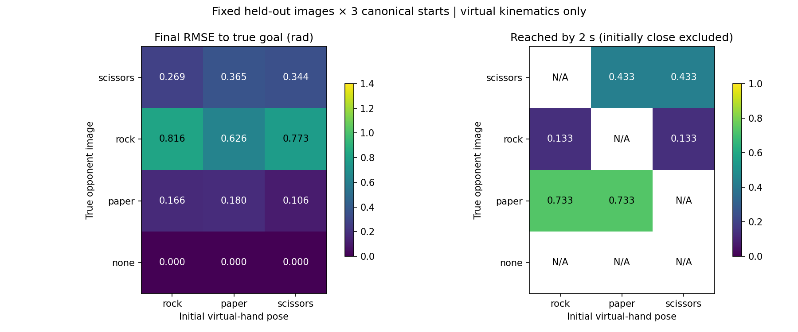
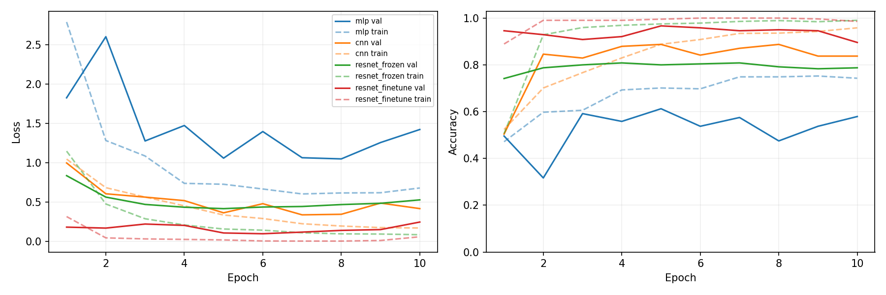
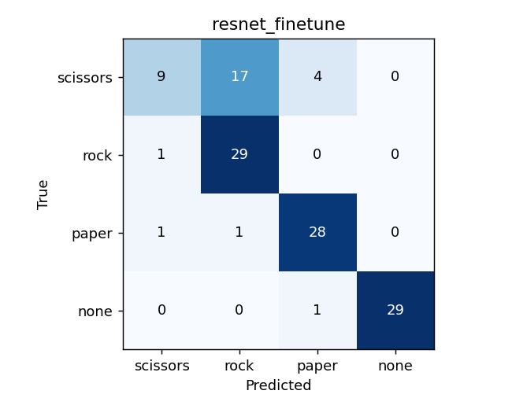
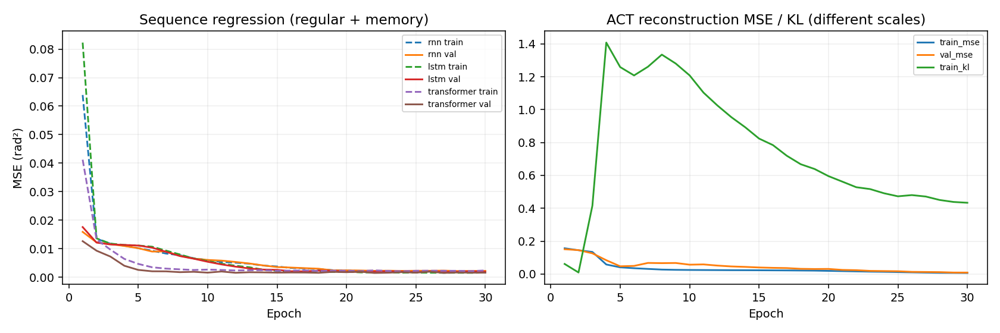
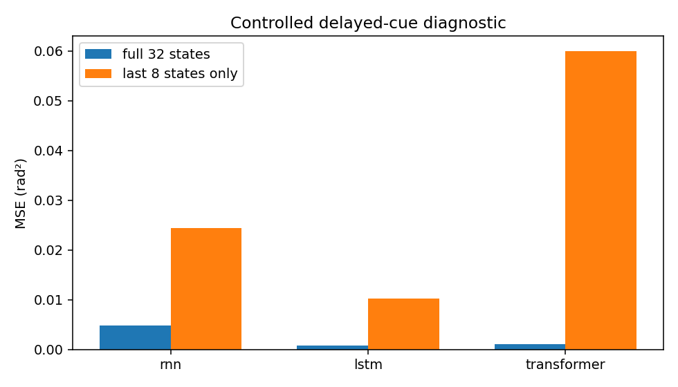
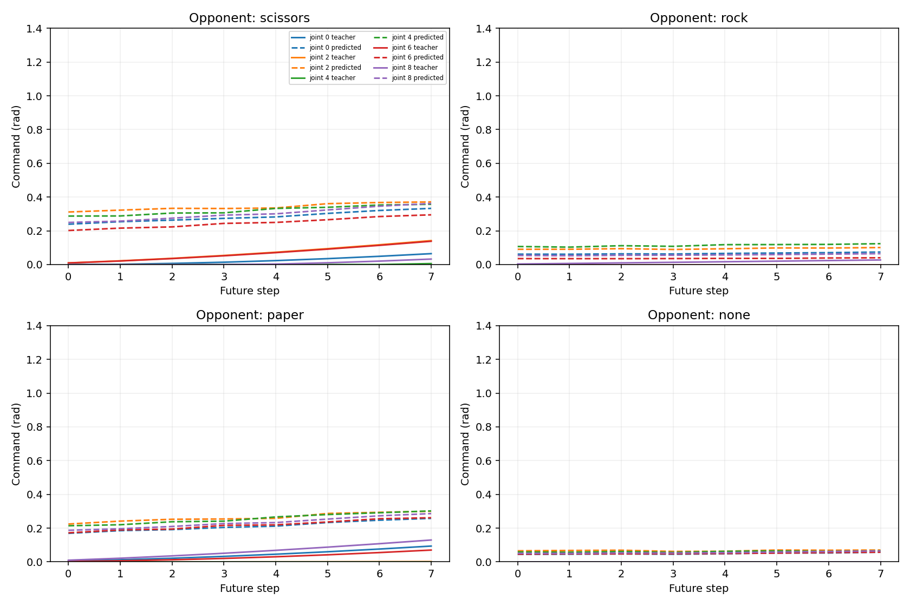
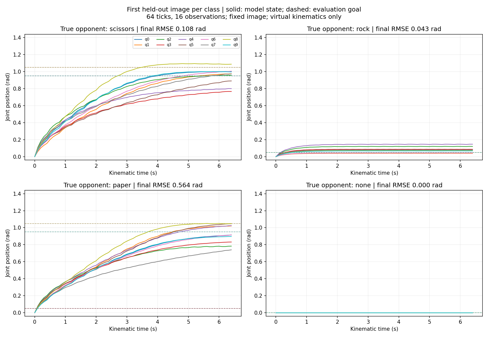

# 딥러닝 실습 결과와 수행 과정

record_id: `DAPIER-2026-09-09-rps-virtual-hand`

## 동작 오류 수정 후 결과 · feedback-prior-v4

웹캠에서 상대 패를 바르게 인식해도 손이 거의 움직이지 않고 주먹·가위 자세가 불완전한 문제를 확인했다. 기존 v2 모델을 분석한 뒤 교사 구성, 학습 시 잠재변수 사용, 손가락 투영을 수정했다. 아래 수치는 수정한 설정으로 **20 Epoch 학습을 완료한 실행 `61dbebe471924c68ad73568ab479761c`**의 결과다. 뒤의 최초 실험 수치와 구분했다.

- 느린 교사에서는 현재 관절값을 그대로 복사한 검증 MSE가 0.005588로, v2 모델의 0.009253보다 낮았다. 움직이지 않는 예측에 유리한 정답 구성을 확인했다.
- ACT 교사를 현재 상태에서 목표로 접근하는 `a=q+gain×(goal−q)`로 바꾸고 gain=0.7~1.0을 사용했다. 각 사진을 0·보·주먹·가위·임의 자세의 다섯 시작과 연결하고 0·2·6·20시점에서 청크를 추출했다. 이미지당 20개 창이며 독립 촬영 수는 여전히 1,200장이다.
- 교사만 바꾼 v3 중간 검증에서는 분류 95%인데 정분류·응답 사례의 관절 RMSE가 0.4369 rad였다. posterior 훈련 MSE 약 0.008과 prior 검증 MSE 약 0.14의 차이를 확인하고 실행을 중단했다. 이는 검증 20장·60전환의 중간 진단이며 최종 테스트 지표가 아니다.
- 학습 표본마다 50% 확률로 잠재변수를 z=0으로 두어 실제 실행 조건도 학습했다. 나머지는 posterior 표본을 쓰고 KL은 전체 표본에 적용했다. 미래 정답·정답 라벨은 추론에 전달하지 않았다.
- 손 그림은 실제 관절값의 sin/cos 성분으로 굽힘 깊이를 투영하고 검지·중지의 벌어짐과 엄지 겹침을 조정했다. 분류 이름으로 정답 그림이나 관절값을 대체하지 않았다.

| 수정 모델의 오프라인 지표 | 결과 |
|---|---:|
| ACT 검증 prior 청크 MSE | 0.045101 rad² |
| ACT 테스트 z=0 청크 MSE | 0.149103 rad² |
| ACT 테스트 prior 샘플 청크 MSE | 0.164725 rad² |
| ViT 테스트 보조 분류 정확도 | 64.17% |

테스트 청크는 120장 × 5개 시작 × 4개 시점 = 2,400개다. 교사와 창 분포가 달라졌으므로 v2와 청크 MSE를 같은 정답 분포의 개선율로 비교하지 않았다. RNN·LSTM·Transformer의 시퀀스 교사는 v2를 보존했으며, 새 실행의 20 Epoch 수치는 evidence/problem2/sequence_metrics.json에 기록했다.

### 같은 조건의 360개 자세 전환 비교

테스트 사진 120장 각각에 가상 손의 주먹·보·가위 시작을 적용했다. 고정 이미지에서 앞 4개 명령 실행 후 재관찰하는 방식을 16회 반복했다. 정답은 오차 계산에만 사용했다. 아래 ‘정분류·응답 RMSE’는 실제 라벨을 맞히고 신뢰도 0.7 이상으로 명령을 실행한 경우의 최종 오차다. 이 비율과 전체 분류 정확도를 함께 보고해 선택된 부분집합의 결과를 전체 성공률처럼 쓰지 않았다.

| 실제 상대 입력 | 정분류·응답 최종 RMSE v2 → v4 (rad) | 2초 내 도달 v2 → v4 | v4 분류 정확도 |
|---|---:|---:|---:|
| scissors | 0.3600 → 0.0324 | 0.0% → 43.3% | 56.7% |
| rock | 0.3701 → 0.0073 | 0.0% → 13.3% | 23.3% |
| paper | 0.0371 → 0.0075 | 10.0% → 73.3% | 80.0% |
| none | — → — | — → — | 96.7% |

전체 360전환의 평균 최종 RMSE는 0.2553 → 0.3038 rad였다. 처음부터 목표의 0.2 rad 이내인 사례를 제외한 2초 내 도달률은 3.3% → 43.3%였다. 2초는 20틱의 기구학 시간이며 카메라·HTTP 대기 시간은 포함하지 않았다. 0.2 rad는 임의 진단 기준이며 공식 합격 기준이나 사람 상대 게임 승률이 아니다.

두 실행이 모두 정분류하고 응답한 **동일한 87전환(29장)**만 짝지으면 최종 RMSE는 **0.121702 → 0.008272 rad**였고 87개 모두 감소했다. 공통 조건부 표본의 동작 개선이며 전체 인식 정확도 개선을 뜻하지 않는다. v2는 CPU, v4는 CUDA에서 평가했다. 전체 360전환의 최종 오차는 오히려 **0.2553 → 0.3038 rad**로 커졌다. 특히 바위 입력의 분류 정확도가 **23.33%**여서, 인식 오류가 포함된 전체 성능은 개선됐다고 결론짓지 않았다.

현재 자세 복사·잠재변수 사용·각도 투영에 대한 CPU 및 UI 회귀 검사를 통과했다. 고정 사진 자동 평가와 실제 웹캠 동작 확인은 구분했다. 이번 수정 모델의 새로운 사람·배경에서의 성능과 실물 로봇 구동은 검증하지 않았다. 테스트 회차는 이미 개발 중 관찰했으므로 최종 미사용 일반화 평가셋으로 주장하지 않았다.

## 최초 완료 실험 기록 · v2, 30 Epoch

아래는 동작 오류가 보고되기 전의 최초 실험과 그 한계다. 그림과 집계 자료는 `evidence/problem2/v2/`에 보존했다.

직접 촬영한 1,200장으로 문제 1의 네 모델을 각각 10 Epoch 학습하고, 가상 손 궤적을 연결한 문제 2의 네 모델을 최초 완료 설정에서 30 Epoch 학습했다. 아래 값은 합성 smoke 검사의 수치가 아니라 실제 촬영 이미지와 명시된 가상 관절 데이터를 사용해 계산한 값이다. 문제 1 웹캠 게임은 직접 실행해 동작을 확인했고, 문제 2의 수치는 고정 테스트 이미지와 가상 기구학 평가다.

## 문제 1 · 모델 비교

| 모델 | Val Accuracy | Test Accuracy | Test CE Loss | forward ms | 이론 forward FPS | 선택 Epoch |
|---|---:|---:|---:|---:|---:|---:|
| mlp | 61.25% | 60.00% | 0.8227 | 0.206 | 4851.7 | 5 |
| cnn | 88.75% | 74.17% | 0.5257 | 0.227 | 4402.1 | 8 |
| resnet_frozen | 80.83% | 60.83% | 0.9781 | 1.474 | 678.3 | 4 |
| resnet_finetune | 96.67% | 79.17% | 1.0379 | 1.504 | 664.8 | 5 |

검증 정확도로 ResNet18 파인튜닝을 선택했다. 테스트 120장에서 95장(79.17%)을 맞혔다. 동결 방식 60.83%보다 높지만, 검증 96.67%와 차이가 크다. 테스트 가위 30장 중 9장만 맞히고 17장은 바위로 예측했다. 보·바위·없음보다 가위의 회차 변화에 약하다. 테스트 한 회차의 연속 프레임을 독립적인 120명 표본처럼 해석하지 않는다.

CNN은 파라미터 155,524개로 MLP 12,616,580개보다 작고, 테스트 정확도도 74.17% 대 60.00%로 높았다. 공간 구조를 사용하는 선택이 이번 데이터에서 유리했다는 관찰이며 모든 데이터에 대한 보장은 아니다. 파인튜닝은 정확도가 가장 높아도 Test CE Loss가 CNN보다 높다. 틀린 예측을 강하게 확신하는 경우 손실이 커질 수 있으므로 정확도만으로 확률 품질을 판단하지 않는다.

속도는 batch 1, 준비 10회 후 50회 forward를 GPU 동기화하여 측정한 평균이다. FPS는 1000/ms 계산값이며 웹캠 실제 갱신율이 아니다. 전처리·전송·확률 반환까지의 pipeline_ms는 MLP 0.735, CNN 0.712, 동결 1.994, 파인튜닝 1.979ms이고 카메라·HTTP 시간은 포함하지 않는다.

## 문제 2 · 다음 관절 상태 예측

당시 교사는 `mixed-open-start-v2`다. 1,200개 이미지 에피소드를 회차 기준 840/240/120개로 나누고, 일반 움직임 창은 에피소드마다 5개, 지연 기억 창은 1개를 만든다. 일반 테스트 MSE는 600개 창 × 10관절, 기억 과제는 120개 창 × 10관절 평균이다. 겹치는 창을 독립된 에피소드로 세지 않는다.

| 모델 | 다음 상태 MSE (rad²) | 32시점 기억 MSE | 마지막 8시점 기억 MSE |
|---|---:|---:|---:|
| rnn | 0.001381 | 0.004801 | 0.024366 |
| lstm | 0.001847 | 0.000841 | 0.010300 |
| transformer | 0.001447 | 0.001135 | 0.059982 |

일반 움직임에서는 RNN의 오차가 가장 작고, 지연 기억 과제에서는 LSTM이 가장 작다. Transformer가 모든 조건에서 이기지는 않았다. 마지막 8시점만 남기면 초기 cue가 없어져 모든 모델의 기억 오차가 증가했다. 특히 Transformer의 큰 증가는 정보 손실과 길이·위치 분포 변화를 함께 포함한다. 별도로 짧은 입력에 맞춰 학습한 모델 비교는 아니다.

## 문제 2 · ViT와 ACT/CVAE

| 평가 조건 | 실제 결과 |
|---|---:|
| ViT 보조 이미지 분류 Test Accuracy | 75.83% |
| ACT prior z=0 청크 MSE (rad²) | 0.010636 |
| ACT prior N(0,I) 샘플 청크 MSE (rad²) | 0.020622 |
| 선택된 ACT 검증 청크 MSE (rad²) | 0.009253 |

청크 평가는 120개 테스트 에피소드에서 각 5개 시점을 사용한 600개 청크 × 8시점 × 10관절 평균이다. ViT 보조 정확도는 같은 사진이 5개 시점에 반복되므로 독립 사진 수는 120장이다.

z를 샘플링하는 구조는 실제로 구현했지만, 샘플링 결과의 정답 MSE가 기본 z=0보다 높았다. 따라서 기본 실행은 z=0으로 두고 샘플링은 관찰 옵션으로 제공한다. 여러 움직임을 생성할 수 있다는 것과 더 정확한 명령을 낸다는 것은 서로 다른 주장이다.

## 화면과 같은 방식으로 움직여 본 결과

정답 라벨은 아래 오차 계산에만 사용한다. 각 고정 테스트 사진에서 0 자세로 시작해 8개 명령 중 앞 4개씩, 총 16번 관찰·64틱(기구학 시간 6.4초)을 실행한다. z=0, 신뢰도 0.7, 응답률 0.35는 화면과 동일하다. 실제 벽시계 시간에는 추론·통신 대기가 추가된다.

| 실제 상대 입력 | 사진 수 | ViT 정답 비율 | 명령 실행 비율 | 초기 → 최종 평균 RMSE (rad) | 최종 RMSE ≤ 0.2 |
|---|---:|---:|---:|---:|---:|
| scissors | 30 | 36.7% | 60.0% | 1.001 → 0.738 | 6.7% |
| rock | 30 | 90.0% | 86.7% | 0.050 → 0.085 | 90.0% |
| paper | 30 | 80.0% | 93.3% | 0.776 → 0.160 | 80.0% |
| none | 30 | 96.7% | 0.0% | 0.000 → 0.000 | 100.0% |

전체 평균 RMSE는 0.4569에서 0.2457 rad로 줄었다. 0.2 rad 이내 비율은 처음부터 50.0%였고 최종 69.17%다. 바위 입력의 목표는 열린 보 자세라 시작부터 목표에 가깝고, 없음은 움직이지 않는 것이 목표다. 따라서 이 비율을 그대로 게임 승률이나 새로 성공한 비율이라고 쓰지 않는다. 없음 30장은 모두 자세를 유지했다.

보 입력에 대응하는 가위 자세는 비교적 잘 도달하지만, 가위 입력의 목표인 주먹 자세는 여전히 약하다. 가위 분류부터 틀리는 경우와 액션 누적 오차를 함께 확인해야 한다. 새로운 사람·배경에서의 웹캠 성능이나 실물 로봇 성공은 검증하지 않았다.

## 최초 구현과 확인 과정

1. 시험지의 8개 문항과 제출 조건을 읽고, 문제 1은 분류·문제 2는 연속 관절 회귀로 역할을 나눴다.
2. 네 클래스 촬영, 세션 분할, 네 모델 학습, 저장·재로딩, 웹캠 안정화 게임을 구현하고 10 Epoch씩 실행했다.
3. 문제 2의 가상 교사, RNN/LSTM/Transformer, 직접 만든 패치·ViT·CVAE 청크 추론을 연결했다.
4. 첫 10 Epoch에서 ACT 검증 오차가 아직 하강 중인 것을 확인해 동일 조건의 30 Epoch 실행을 추가했다.
5. 오프라인 MSE가 작아져도 화면처럼 반복 실행하면 충분히 움직이지 않는 문제를 확인했다. 코드 점검에서 임의 굽힘 시작만 학습했는데 화면은 0에서 시작한다는 차이를 찾았다.
6. 교사의 절반에 화면과 같은 열린 시작을 포함하고 30 Epoch 재학습했다. 기존 기록은 보존하고 버전을 구분했다. 서로 다른 교사의 청크 MSE는 동일한 정답 분포 비교가 아니다.
7. 분할·창 정렬·패치 순서·CVAE gradient·미래 정답 누출 방지·관절 범위·중지와 늦은 응답·모바일 표시를 검사했다. 최종 실제 촬영 기반 학습과 고정 사진 폐루프를 완료했다.

테스트 결과를 중간에도 열어 진단했으므로 이 테스트셋은 완전히 미사용인 최종 평가셋으로 남아 있지 않다. 수정의 근거는 검증 곡선과 시작 상태의 코드 불일치이며, 수치들은 개발 과정의 held-out 회차 진단으로 보고한다. 강한 일반화 주장을 하려면 모델을 고정하고 새 회차를 수집해 평가해야 한다.

| ACT 실행 | 교사 | Epoch | 검증 청크 MSE | 테스트 청크 MSE | 고정 사진 최종 평균 RMSE |
|---|---|---:|---:|---:|---:|
| 임의 시작 v1 / 144d4338 | 임의 시작 v1 | 10 | 0.041852 | 0.041986 | 0.373932 |
| 임의 시작 v1 / 50b9b72e | 임의 시작 v1 | 30 | 0.002970 | 0.004065 | 0.351278 |
| 열린/임의 혼합 v2 / cd9a3686 | 열린/임의 혼합 v2 | 30 | 0.009253 | 0.010636 | 0.245710 |

같은 v1의 10→30 Epoch 비교는 학습 길이 변경 실험이다. v2는 시작 상태 분포까지 바꾸므로 같은 의미의 비교가 아니다. 고정 사진 폐루프 설정은 세 실행 모두 같지만 이미 관찰한 개발 진단이다. 증강을 제거한 대조 실험·복수 seed 반복·새 사용자 평가는 아직 수행하지 않았다.

## 검증 증거와 남은 한계

- 문제 1: 임시 합성 1 Epoch의 네 모델 학습·저장·보고서 생성 검사 통과, 실제 네 모델 10 Epoch 완료, 사용자 웹캠 게임 동작 확인.
- 문제 2: 임시 합성 1 Epoch의 전체 경로 검사 통과, 수정한 열린 시작의 CPU 검사 통과, 최초 v2 네 모델 30 Epoch 완료, 테스트 120장 폐루프 완료.
- UI: 실제 Chromium 데스크톱 1440px·모바일 390px에서 가로 넘침·JS 예외 없음, 자동 카메라 호출 없음. 테스트 대역으로 WAIT·중지·초기화·4개 실행 후 재관찰·늦은 응답 무시 확인.
- 실물 장치는 열거나 움직이지 않았다. 가상 모델은 관절별 1차 응답만 표현하며 충돌·접촉·토크·실제 관절 제한의 실측치를 표현하지 않는다.
- 모델 구조와 출력은 구현했지만 가위 입력 인식과 목표 도달은 개선이 필요하다. 완벽히 이기는 게임이나 실물 전이 성공으로 제출하지 않는다.

원시 이미지·가중치·전체 실행 기록은 로컬 제출 묶음에만 보관한다. 공개 evidence에는 원시 사진이 없는 학습 곡선·혼동행렬·관절 궤적·집계 지표·학습 로그를 둔다. 실행 명령과 구조는 README를 함께 참고한다.
